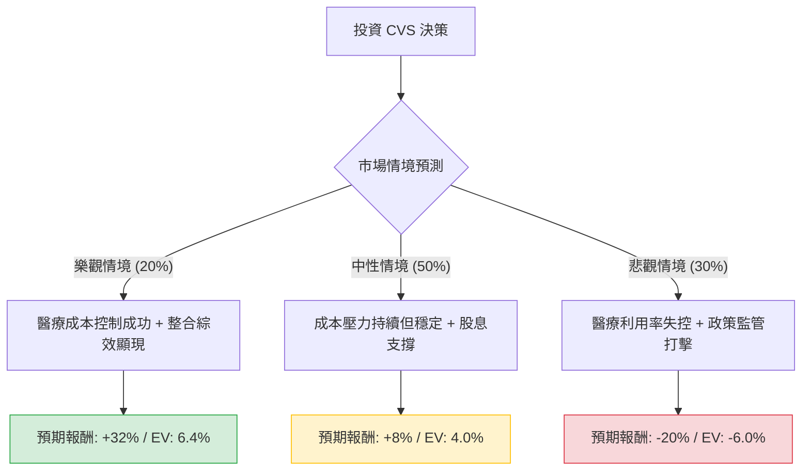

這份分析報告結合了您提供的基本面數據，以及針對 **CVS Health (CVS)** 最新市場動態（特別是 2024 年第一季財報後的劇烈波動與醫療保險成本壓力）的網路搜尋資訊。

---

### 一、 市場現況與最新動態分析

在進行決策樹分析前，必須納入以下關鍵背景資訊：
1.  **醫療成本壓力（Medicare Advantage）**：CVS 旗下的 Aetna 保險業務正因 Medicare Advantage（聯邦醫療保險優惠計畫）的醫療利用率高於預期，導致成本大幅上升。
2.  **財報指引下調**：CVS 在最近的財報中大幅下調了 2024 全年的 EPS 指引（從原本的 $8.30+ 下調至約 $7.00 左右），這是導致股價近期疲軟的主因。
3.  **估值低廉**：目前 Forward P/E 僅約 9.27 倍，PEG 0.79，顯示市場已反映了大部分利空，且股息率（3.51%）具備吸引力。
4.  **轉型風險**：CVS 正在從零售藥局轉型為整合型醫療服務商（收購 Oak Street Health 與 Signify Health），整合進度將決定長期成敗。

---

### 二、 決策樹分析（Decision Tree）

以下為 CVS 未來一年的投資決策樹模型：

#### 節點詳細說明：

| 節點名稱 | 發生機率 (P) | 預期報酬 (R) | 期望值 (P * R) | 核心假設 |
| :--- | :--- | :--- | :--- | :--- |
| **樂觀情境** | 20% | +32.4% | **+6.48%** | 醫療利用率回歸正常，EPS 回升至 $8 以上，股價重回 Target Price ($95)。 |
| **中性情境** | 50% | +8.5% | **+4.25%** | 成本壓力緩解但未消失，股價隨大盤緩步回升至 $78 附近，領取 3.5% 股息。 |
| **悲觀情境** | 30% | -20.0% | **-6.00%** | Medicare 成本持續侵蝕利潤，PBM 監管法案通過，股價跌破 52W 低點至 $57。 |
| **總計** | **100%** | | **+4.73%** | **加權總期望報酬率** |

---

### 三、 計算過程與核心假設

#### 1. 期望值計算 (Expected Value Calculation)
*   **公式**：$EV = \sum (Probability_i \times Return_i)$
*   **計算**：
    *   $0.20 \times 32.4\% = 6.48\%$
    *   $0.50 \times 8.5\% = 4.25\%$
    *   $0.30 \times (-20.0\%) = -6.00\%$
*   **總期望報酬率** = $6.48\% + 4.25\% - 6.00\% = \mathbf{4.73\%}$
*   **考慮股息後的總回報**：$4.73\% + 3.51\% = \mathbf{8.24\%}$

#### 2. 核心假設說明
*   **市場假設**：假設未來 12 個月內美國經濟維持軟著陸，不會出現深度衰退導致消費者支出崩潰。
*   **財務假設**：
    *   **Forward P/E (9.27)**：目前處於歷史低位，下行空間受限，但上行需依賴獲利能力的修復。
    *   **Target Price ($95.17)**：分析師平均目標價，作為樂觀情境的參考點。
*   **產業趨勢**：
    *   **PBM (藥品福利管理)**：面臨國會審查，這是一個潛在的黑天鵝風險（納入悲觀情境）。
    *   **醫療利用率**：這是目前最大的變數。若 Aetna 能透過調漲保費（2025年計畫）來抵銷成本，則中性情境成立機率高。

---

### 四、 最終結論

#### **判斷：謹慎適合投資 (Cautious Buy / Hold)**

**理由如下：**

1.  **期望值為正，但安全邊際有限**：計算出的總期望回報（含股息）約為 **8.24%**。雖然為正值，但相較於標普 500 指數的歷史平均回報，吸引力不算極高，反映了當前醫療保險業務的不確定性。
2.  **估值極具吸引力**：P/S 僅 0.24，PEG 0.79，顯示股價已被過度拋售。對於價值投資者而言，目前的價格（$71.86）提供了不錯的切入點。
3.  **股息支撐**：3.51% 的股息率加上穩健的現金流（P/FCF 12.36），為股價提供了下行保護。
4.  **短期陣痛，長期轉型**：CVS 正在經歷從零售到醫療服務的轉型陣痛期。短期內（1-2 季）股價可能因醫療成本數據反覆而震盪，但長期整合綜效若能發揮，具備倍數增長的潛力。

**建議操作：**
*   **分批進場**：由於 SMA20 與 SMA50 仍呈負值，顯示技術面偏弱，建議分批佈局，不要一次性投入。
*   **關注指標**：未來需密切關注 Aetna 的醫療成本率（Medical Benefit Ratio, MBR）以及 2025 年 Medicare Advantage 的定價策略。

**風險提示**：若下一季財報顯示醫療利用率進一步惡化，或美國政府對 PBM 產業發起實質性的拆解行動，則應重新評估悲觀情境的機率。