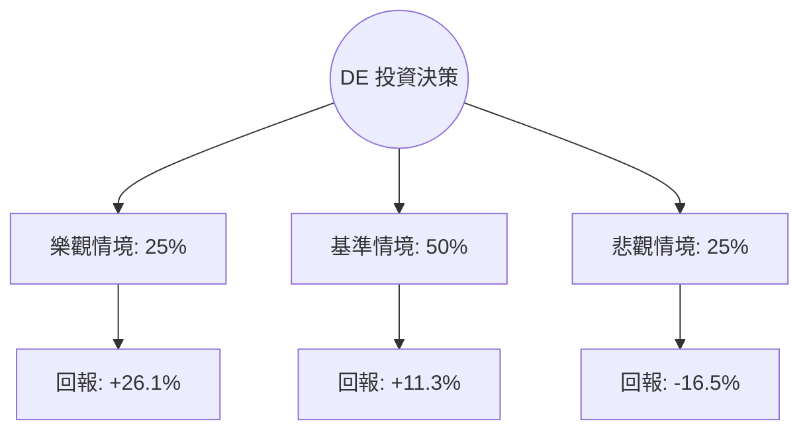

# Deere & Company (DE) 量化投資分析報告

作為量化投資分析師，針對 Deere & Company (DE) 目前的市場表現與基本面數據，我將透過機率思考框架，拆解未來 6-12 個月的期望值路徑。

---

### 1. 核心驅動因素與風險 (Drivers & Risks)

#### **關鍵催化劑 (Catalysts)**
1.  **精準農業技術 (Precision Ag) 的利潤率擴張**：DE 持續從硬體銷售轉向「解決方案」模式。隨著自動駕駛拖拉機與精準噴灑技術的滲透率提升，其軟體訂閱與高毛利零件收入將抵消部分週期性硬體銷量的下滑。
2.  **聯準會降息循環**：DE 的客戶（農民）高度依賴融資購買設備。利率下降將直接降低融資成本，刺激處於觀望狀態的資本支出需求，並減輕 DE 自身金融部門（Deere Financial）的利息壓力。
3.  **庫存去化完成**：目前市場正處於農業機械週期的底部，DE 積極縮減產量以消化經銷商庫存。若 2025 年上半年庫存回到健康水位，產能利用率的回升將帶動經營槓桿效應。

#### **主要風險點 (Risks)**
1.  **農產品價格疲軟**：玉米、大豆等大宗商品價格若持續低迷，將直接削弱農民的購買力。目前農場淨收入預期下行，是壓制股價估值的核心因素。
2.  **貿易政策與關稅風險**：DE 具有全球供應鏈，若地緣政治導致鋼鐵成本上升或出口受阻（特別是針對關鍵海外市場的報復性關稅），將嚴重侵蝕毛利率。
3.  **高債務槓桿壓力**：Debt/Eq 高達 2.33，在經濟下行週期中，高槓桿會放大財務風險，限制其回購股份或維持股息增長的能力。

---

### 2. 情境設定與機率賦予 (Scenario Modeling)

基於當前 Forward P/E 23.18x 與市場對 2025 年盈餘谷底的共識，設定以下三種情境：

#### **樂觀情境 (Bull Case)**
*   **發生條件**：全球糧食需求超預期增長帶動糧價反彈；聯準會降息節奏快於預期；精準農業軟體收入佔比顯著提升。
*   **預估機率**：25%
*   **目標價格與預期回報**：**$680 (+26.1%)**。基於 EPS 恢復增長且市場給予 28x 的領先估值倍數。

#### **基準情境 (Base Case)**
*   **發生條件**：2025 年如預期為「過渡年」，盈餘觸底但未進一步惡化；庫存去化順利；農民情緒保持中性。
*   **預估機率**：50%
*   **目標價格與預期回報**：**$600 (+11.3%)**。接近分析師平均目標價 $644.85 的保守修正值，反映週期底部的估值修復。

#### **悲觀情境 (Bear Case)**
*   **發生條件**：全球經濟衰退導致大宗商品崩盤；貿易戰升級導致成本激增；DE 2025 年指引再度下修。
*   **預估機率**：25%
*   **目標價格與預期回報**：**$450 (-16.5%)**。回測 52 週低點支撐，反映 P/E 壓縮至歷史低位區間（約 18x）。

---

### 3. 期望值計算與決策樹 (EV Calculation & Decision Tree)

#### **決策樹結構**

#### **總期望值計算**
*   `EV = (0.25 * 0.261) + (0.50 * 0.113) + (0.25 * -0.165)`
*   `EV = 0.06525 + 0.0565 - 0.04125 = 0.0805`
*   **總期望報酬率：8.05%**

#### **風險回報比分析**
*   **上行潛力 (Upside)**：$680 - $539 = $141
*   **下行空間 (Downside)**：$539 - $450 = $89
*   **風險回報比 (Risk/Reward Ratio)**：1 : 1.58。這顯示每承擔 1 單位的風險，可獲得 1.58 單位的潛在回報，具備正向不對稱性。

---

### 4. 決策總結 (Decision Summary)

| 情境 | 發生機率 (%) | 預期報酬率 (%) | 關鍵驅動/觸發因素 |
| :--- | :--- | :--- | :--- |
| **樂觀 (Bull)** | 25% | +26.1% | 糧價反彈、降息超預期、技術溢價體現 |
| **基準 (Base)** | 50% | +11.3% | 週期觸底、庫存去化完成、估值回歸 |
| **悲觀 (Bear)** | 25% | -16.5% | 深度衰退、貿易戰、農民收入崩潰 |
| **整體期望值** | **100%** | **+8.05%** | **加權平均預期回報** |

**最終結論：**
1.  **投資建議**：**持有 (Hold) / 逢低買入 (Accumulate)**
2.  **核心邏輯**：DE 目前正處於典型的農業週期下行末端。雖然短期內（未來 1-2 季）盈餘指引疲軟，但 8.05% 的正期望值與 1.58 的風險回報比顯示，市場已消化大部分利空。當前股價低於分析師目標價，具備安全邊際，適合長線佈局其技術轉型紅利。
3.  **風控建議**：若股價跌破 **$430**（52W 低點附近）或農產品價格出現連續兩個季度的雙位數跌幅，應視為悲觀情境觸發，建議執行止損或減碼以保護資本。

【結束指令】