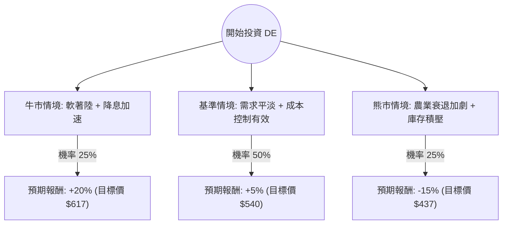

這份報告針對 **Deere & Company (DE)** 進行深入分析。我們結合了您提供的基本面數據，並透過網路搜尋獲取了最新的市場動態（如 2024 年第三季財報、農業市場循環、裁員與成本控制計畫等），最後利用**決策樹（Decision Tree）**與**期望值（Expected Value）**進行投資評估。

---

### 一、 核心假設與市場背景分析

在建立決策樹之前，我們必須釐清影響 DE 股價的三大核心變數：

1.  **農業週期與農民收入（核心驅動力）：** 目前全球大宗商品（玉米、大豆）價格處於低位，導致農民收入下降，對大型農業機械的需求放緩。DE 在最近的財報中下調了全年利潤指引。
2.  **貨幣政策與融資成本：** DE 的債務股本比（Debt/Eq）高達 2.48，且客戶購買設備高度依賴貸款。聯準會（Fed）的降息預期將直接減輕 DE 的利息負擔並刺激下游需求。
3.  **精準農業與成本控制：** DE 正在進行大規模裁員與組織重組，以應對需求下滑。同時，其「精準農業（Precision Ag）」技術的訂閱制收入是長期毛利提升的關鍵。

---

### 二、 決策樹分析 (Decision Tree)

我們以 **1 年為投資期限**，設定三種可能的情境：

#### 節點詳細說明：

1.  **牛市情境 (Bull Case) - 25% 機率：**
    *   **條件：** 聯準會降息幅度超預期，大宗商品價格反彈，農民更新設備意願轉強。
    *   **預期報酬：** +20%。DE 的 Forward P/E 回升至歷史高位，EPS 下半年強勁反彈。
2.  **基準情境 (Base Case) - 50% 機率：**
    *   **條件：** 農業需求維持疲軟但不再惡化，DE 的裁員計畫成功節省開支，抵銷營收下滑。
    *   **預期報酬：** +5%。股價在當前 $514 附近震盪，緩步向分析師平均目標價 $527 靠攏。
3.  **熊市情境 (Bear Case) - 25% 機率：**
    *   **條件：** 全球經濟衰退，農產品價格崩盤，DE 庫存水位過高被迫降價清倉。
    *   **預期報酬：** -15%。股價回測 52 週低點（約 $404 附近）。

---

### 三、 期望值分析 (Expected Value Analysis) 計算過程

我們根據上述情境的機率與報酬率，計算投資 DE 的**總期望報酬率 (Expected Return, E(R))**：

$$E(R) = (P_{Bull} \times R_{Bull}) + (P_{Base} \times R_{Base}) + (P_{Bear} \times R_{Bear})$$

**計算步驟：**
1.  **牛市貢獻：** $0.25 \times 20\% = 5.0\%$
2.  **基準貢獻：** $0.50 \times 5\% = 2.5\%$
3.  **熊市貢獻：** $0.25 \times (-15\%) = -3.75\%$

**總期望報酬率：**
$$5.0\% + 2.5\% - 3.75\% = 3.75\%$$

**考慮股息收益：**
DE 的股息率（Dividend %）約為 **1.27%**。
**總預期收益率 = 3.75% (價差) + 1.27% (股息) = 5.02%**

---

### 四、 綜合評估與最終結論

#### 1. 數據面分析總結：
*   **優勢：** ROE 高達 20.61%，顯示極強的資產利用效率；Forward P/E (23.1) 低於當前 P/E (27.68)，顯示市場預期明年盈利將改善（EPS next Y 預期增長 32.6%）。
*   **劣勢：** 債務負擔重（Debt/Eq 2.48），且近期 EPS Q/Q 下滑 13.67%，顯示短期營運壓力巨大。
*   **技術面：** 股價目前高於 SMA20/50/200，顯示短期動能強勁，但已接近 52 週高點（僅差 4%），向上空間受限。

#### 2. 最終判斷：**不適合現在立即重倉買入（觀望或分批佈局）**

**理由：**
1.  **期望值過低：** 5.02% 的總預期收益率在當前高利率環境下（美債殖利率約 4%）並不具備足夠的「風險溢酬（Risk Premium）」。投資者承擔了農業循環下行的風險，卻僅獲得與無風險利率相近的報酬。
2.  **估值已反映預期：** 股價距離分析師目標價（$527.27）僅剩約 2.5% 的空間，且目前處於 52 週高點附近，追高風險較大。
3.  **行業逆風尚未結束：** 儘管 DE 透過裁員自救，但核心農業機械市場的復甦通常需要 1-2 年的週期。目前的股價上漲更多是跟隨大盤（S&P 500）的動能，而非基本面的反轉。

**建議操作：**
*   若您已持有：建議**續抱**，領取股息並觀察降息後的銷售數據。
*   若您尚未持有：建議**等待回調**至 $480 左右（SMA 支撐位）再行考慮，以提高期望值。