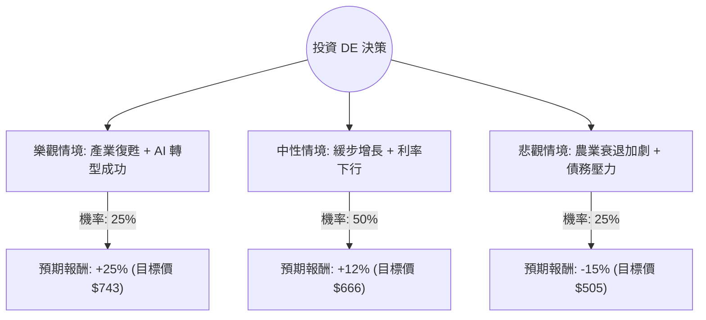

這份分析報告將結合您提供的數據與最新的市場動態（包含 2024 年底至 2025 年初的產業趨勢），利用**決策樹（Decision Tree）**與**期望值分析（Expected Value Analysis）**評估 Deere & Company (DE) 的投資價值。

---

### 一、 市場現況與核心假設 (Core Assumptions)

在進行計算前，根據網路搜尋與數據分析，整理出以下關鍵背景：

1.  **產業週期性壓力**：全球農產品價格（玉米、大豆）處於低位，導致農民收入下降，對大型農機的需求放緩。DE 2024 年的營收與 EPS 出現下滑。
2.  **精準農業轉型**：DE 積極轉型為軟體與 AI 驅動的公司（如自動駕駛牽引機），這有助於提升長期毛利率（目前 Gross Margin 達 37.38%）。
3.  **財務槓桿與估值**：P/E 33.52 偏高，但 Forward P/E 25.83 顯示市場預期明年獲利將回升（EPS next Y 預期增長 29.05%）。債務比（Debt/Eq 2.39）較高，需關注利率環境。
4.  **降息預期**：聯準會降息將降低農民的融資成本，對 DE 是利多。

---

### 二、 決策樹分析 (Decision Tree Analysis)

我們將未來一年的投資表現分為三種情境：**樂觀（Bull）**、**中性（Base）**、**悲觀（Bear）**。

#### 1. 樂觀情境 (Bull Case) - 機率 25%
*   **假設**：全球糧食需求超預期，農產品價格反彈；DE 的精準農業訂閱服務增長強勁；降息速度快於預期。
*   **預期報酬**：股價回升至歷史高點並突破，預估 +25%。

#### 2. 中性情境 (Base Case) - 機率 50%
*   **假設**：市場符合分析師預期（Target Price $668.05），EPS 增長如期實現（+29%）。農業週期觸底回升，但速度緩慢。
*   **預期報酬**：接近分析師目標價，預估 +12%（含股息）。

#### 3. 悲觀情境 (Bear Case) - 機率 25%
*   **假設**：地緣政治導致農產品出口受阻；高債務成本侵蝕利潤；經濟衰退導致基礎設施建設（DE 的建築部門）停滯。
*   **預期報酬**：股價回測 52 週低點附近，預估 -15%。

---

### 三、 期望值計算 (Expected Value Calculation)

根據上述情境，我們計算投資 DE 一年的期望報酬率（Expected Return）：

| 情境 | 機率 (P) | 預期報酬 (R) | P × R |
| :--- | :--- | :--- | :--- |
| 樂觀 (Bull) | 0.25 | +25% | 0.0625 |
| 中性 (Base) | 0.50 | +12% | 0.0600 |
| 悲觀 (Bear) | 0.25 | -15% | -0.0375 |
| **總計期望值** | **1.00** | | **0.085 (8.5%)** |

**計算過程：**
$EV = (0.25 \times 0.25) + (0.50 \times 0.12) + (0.25 \times -0.15)$
$EV = 0.0625 + 0.06 - 0.0375 = 0.085$

**期望報酬率為 8.5%**。

---

### 四、 綜合評估與最終結論

#### 1. 數據深度解析
*   **利多因素**：
    *   **成長潛力**：明年 EPS 預期增長 29.05%，顯示最壞的情況可能已過去。
    *   **技術領先**：ROE 19.74% 顯示其在產業中仍具備極強的競爭力與資本利用效率。
    *   **技術面**：股價目前在 SMA200 之上（+15.84%），長期趨勢偏多。
*   **風險因素**：
    *   **流動性風險**：Current Ratio 0.75 偏低，短期償債能力需注意。
    *   **估值壓力**：P/FCF (股價自由現金流比) 高達 44.91，顯示目前股價相對於產出的現金流並不便宜。

#### 2. 最終判斷：**適合投資 (建議分批買進)**

**理由：**
1.  **期望值為正**：8.5% 的期望報酬率雖然不算極高，但考慮到 DE 作為產業龍頭的穩定性與 1.09% 的股息，具備配置價值。
2.  **週期觸底訊號**：Forward P/E (25.83) 遠低於 Current P/E (33.52)，且 EPS 下一年度預期大增，這通常是週期性股票進入上升段的前兆。
3.  **安全邊際**：目前股價 ($594) 距離分析師平均目標價 ($668) 仍有約 12% 的上漲空間。

**投資建議：**
由於農業週期仍有不確定性且債務比偏高，建議不要一次性歐印（All-in）。較佳策略是在股價回測 **SMA50 ($595 附近)** 或 **$580 支撐位**時分批布局，以獲取精準農業轉型帶來的長期紅利。

---
*免責聲明：本分析僅供參考，不構成投資建議。投資股票具有風險，請根據自身風險承受能力做出決策。*