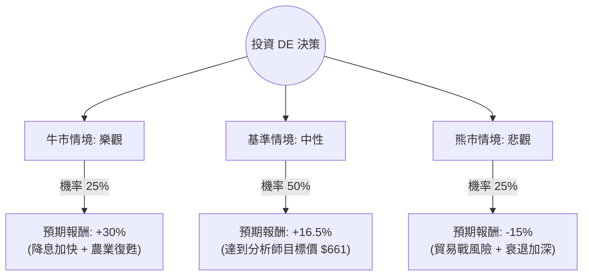

這份分析報告將針對 **Deere & Company (DE)**，結合您提供的財務數據與最新的市場動態（包含 2024 年第四季財報與 2025 年展望），利用**決策樹（Decision Tree）**與**期望值分析（Expected Value Analysis）**進行評估。

---

### 1. 市場現況與核心假設

在建立模型前，我們先整合最新的外部資訊：
*   **產業週期**：全球農業設備需求正處於「下行週期」。由於農產品價格回落及高利率環境，農民購買力下降。
*   **最新財報 (Q4 2024)**：DE 營收與獲利雖優於預期，但對 2025 年的淨利指引（約 50-55 億美元）低於 2024 年，顯示短期壓力仍大。
*   **成長動能**：精準農業（Precision Ag）技術提升了毛利率（37.38%），且預計明年 EPS 增長率達 29.06%，顯示公司正透過技術轉型抵銷銷量下滑。
*   **估值**：目前 P/E 32 倍偏高，但 Forward P/E 降至 24.66，顯示市場預期獲利將回升。

---

### 2. 決策樹分析 (Decision Tree)

我們以 **1 年投資期限**為基準，設定三種情境：

#### 決策樹節點詳細說明：

| 情境節點 | 機率 (P) | 預期報酬 (R) | 說明 |
| :--- | :--- | :--- | :--- |
| **牛市情境 (Bull)** | 25% | +30% | 聯準會大幅降息減輕農民貸款壓力，精準農業軟體訂閱超預期，股價挑戰 $730。 |
| **基準情境 (Base)** | 50% | +16.5% | 符合分析師平均目標價 $661.23。公司成功控管庫存，獲利能力維持在歷史高位。 |
| **熊市情境 (Bear)** | 25% | -15% | 關稅政策導致農產品出口受阻，農業週期底部拉長，股價回測 $480 支撐位。 |

---

### 3. 期望值計算過程 (Expected Value Calculation)

**核心假設：**
1.  **現價**：$567.58
2.  **目標價**：$661.23 (隱含漲幅 16.5%)
3.  **股息收益**：約 1.14% (計算時併入總報酬)

**計算公式：**
$EV = (P_{Bull} \times R_{Bull}) + (P_{Base} \times R_{Base}) + (P_{Bear} \times R_{Bear})$

**步驟：**
1.  **牛市貢獻**：$0.25 \times 30\% = 7.5\%$
2.  **基準貢獻**：$0.50 \times 16.5\% = 8.25\%$
3.  **熊市貢獻**：$0.25 \times (-15\%) = -3.75\%$

**總期望報酬率 (Total EV)：**
$7.5\% + 8.25\% - 3.75\% = \mathbf{12.0\%}$

---

### 4. 綜合基本面評估

*   **財務健康度**：ROE (19.74%) 表現優異，顯示管理層資本利用效率高。雖然 Debt/Eq (2.39) 看似偏高，但這主要是因為 Deere Financial (金融部門) 的融資特性，其流動比率 (0.75) 需持續關注。
*   **技術面**：目前股價在 SMA200 (12.13%) 之上，顯示中長期趨勢偏多，但短期 SMA20 (-6.23%) 顯示正在經歷回檔修正。
*   **成長潛力**：EPS Next Year 預期增長 29.06%，這是支撐目前較高 P/E 的關鍵因素。

---

### 5. 最終結論

#### **判斷：適合投資 (分批佈局)**

**理由：**
1.  **正向期望值**：經過風險加權後的期望報酬率為 **12.0%**，優於多數保守型投資工具，且高於目前的通膨與無風險利率。
2.  **獲利結構轉型**：DE 不再只是純硬體製造商，其精準農業技術帶來的利潤率（Oper. Margin 21.14%）與軟體服務收入，使其在週期下行時比競爭對手更具韌性。
3.  **估值合理化**：雖然目前 P/E 較高，但 Forward P/E (24.66) 顯示隨著 2025 年獲利回升，估值將回到合理區間。
4.  **分析師共識**：Recom 為 2.19（介於買入與持有之間），目標價 $661 提供了一定的安全邊際。

**投資建議：**
由於目前處於農業週期底部且短期技術指標（SMA20）偏弱，建議**不要一次性投入**。可在 $540 - $560 區間分批建倉，以應對可能出現的短期市場波動（熊市情境）。