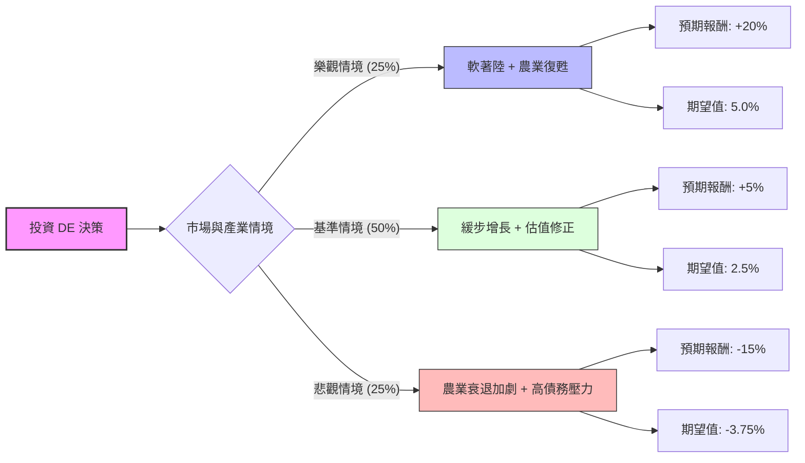

這份分析報告結合了您提供的基本面數據，以及針對 **Deere & Company (DE)** 的最新市場動態（2024 年第四季財報、2025 年展望、農業週期趨勢）進行的綜合評估。

---

### 一、 市場現況與核心假設

在建立決策樹之前，我們先彙整關鍵資訊：
1.  **估值過高壓力**：目前股價約 $602.92，已大幅超越分析師平均目標價 $527.27。P/E 32.58 處於歷史高位區間。
2.  **農業週期下行**：2024 年農業設備需求疲軟，DE 的 EPS 今年衰退 9.6%。雖然預期明年 EPS 增長 32.6%，但這取決於農產品價格回升。
3.  **財務體質**：ROE 20.6% 表現優異，但 Debt/Eq 2.48 偏高，對利率環境敏感。
4.  **最新動態**：DE 近期股價強勢（半年漲幅 25.9%），主因是市場預期聯準會降息將減輕農民貸款負擔，以及公司在「精準農業」技術上的領先地位。

---

### 二、 決策樹分析 (Decision Tree)

我們以 **未來 12 個月的投資報酬率 (ROI)** 為評估基準：

#### 節點詳細說明：

1.  **樂觀情境 (Bull Case) - 25% 機率**：
    *   **假設**：聯準會連續降息，農產品價格因供應短缺回升，農民購買力大增。DE 的精準農業技術帶動毛利進一步擴張。
    *   **預期報酬**：股價突破歷史新高，挑戰 $720 關卡（約 +20%）。

2.  **基準情境 (Base Case) - 50% 機率**：
    *   **假設**：全球農業需求維持平穩，DE 達成 2025 年 EPS 增長目標。但由於目前股價已反映多數利多（高於目標價），估值擴張空間有限。
    *   **預期報酬**：股價隨大盤緩步上漲，或在 $580 - $630 區間震盪（約 +5%）。

3.  **悲觀情境 (Bear Case) - 25% 機率**：
    *   **假設**：農產品價格持續低迷，高債務成本侵蝕利潤，且市場對高 P/E 的工業股進行估值修正。股價回歸分析師目標價 $527 甚至更低。
    *   **預期報酬**：股價回測 $510 附近（約 -15%）。

---

### 三、 期望值計算 (Expected Value Analysis)

根據上述決策樹，我們計算投資 DE 的總體期望報酬率：

$$EV = (P_{Bull} \times R_{Bull}) + (P_{Base} \times R_{Base}) + (P_{Bear} \times R_{Bear})$$

*   **計算過程**：
    *   樂觀：$0.25 \times 20\% = 5.0\%$
    *   基準：$0.50 \times 5\% = 2.5\%$
    *   悲觀：$0.25 \times (-15\%) = -3.75\%$
*   **總期望報酬率**：
    $$5.0\% + 2.5\% - 3.75\% = 3.75\%$$

---

### 四、 核心假設與風險評估

1.  **估值風險**：目前的 P/E (32.58) 遠高於其 5 年平均值（約 18-22）。這意味著市場已經提前透支了未來的增長預期。
2.  **利率敏感度**：DE 的金融服務部門（John Deere Capital）依賴低成本融資。若通膨回升導致降息放緩，對其利潤影響巨大。
3.  **技術領先地位**：DE 在自動化耕作與 AI 識別雜草技術上具有護城河，這是支撐其高估值的唯一長期理由。

---

### 五、 最終結論

#### **判斷：目前「不適合」立即買入（建議觀望或逢高減碼）**

**理由如下：**

1.  **期望值過低**：計算出的總體期望報酬率僅為 **3.75%**，遠低於目前美股大盤（S&P 500）的歷史平均回報，且風險回報比（Risk/Reward Ratio）不具吸引力。
2.  **股價已過熱**：目前股價 ($602.92) 顯著高於分析師平均目標價 ($527.27)，且位於 52 週高點附近。技術指標（SMA20/50/200 均正向偏離）顯示短期內有回檔修正的壓力。
3.  **安全邊際不足**：在農業週期尚未明確反轉向上、且 EPS 今年仍為負增長的情況下，支付 32 倍的市盈率缺乏安全邊際。

**建議操作：**
*   **空手者**：等待股價回落至 **$530 - $550** 區間（接近目標價與支撐位）再行考慮。
*   **持股者**：目前 Perf Month (+17.7%) 漲幅驚人，可考慮在 $610 以上分批獲利了結，規避潛在的估值修正風險。