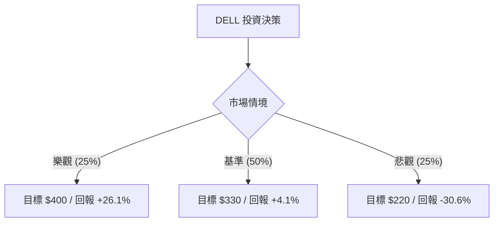

# DELL 量化投資分析報告：基於期望值模型與決策樹分析

作為量化投資分析師，針對 Dell Technologies (DELL) 目前的市場表現與基本面數據，我們觀察到一個典型的「高動能、高預期」案例。目前股價（$317.05）已大幅偏離分析師平均目標價（$228.32），顯示市場情緒已將未來的 AI 增長提前定價。以下是基於概率思考的深度分析。

---

### 1. 核心驅動因素與風險 (Drivers & Risks)

#### **關鍵催化劑 (Catalysts)**
1.  **AI 伺服器訂單爆發與 Blackwell 效應**：DELL 是 NVIDIA 最重要的合作夥伴之一。隨著 Blackwell (GB200) 系統開始出貨，DELL 在大型企業與主權 AI 雲端的市佔率有望進一步提升，帶動 ISG（基礎設施解決方案）部門利潤率擴張。
2.  **PC 換機週期與 AI PC 滲透**：隨著 Windows 10 終止支援以及 Copilot+ PC 的推廣，企業端 PC 換機需求預計在 2025 年達到高峰，這將提振 CSG（客戶解決方案）部門的營收與現金流。
3.  **標普 500 指數納入後的機構增持**：DELL 重回標普 500 指數後，被動基金與長線機構投資者的配置需求將提供股價下行支撐。

#### **主要風險點 (Risks)**
1.  **估值倍數回歸風險**：目前 P/E 約 35 倍，遠高於其歷史均值（約 10-15 倍）。若 AI 帶來的利潤增長無法抵消硬體業務的低毛利本質，市場可能進行估值修正。
2.  **供應鏈與競爭壓力**：儘管 SMCI 面臨治理問題，但 HPE 與聯想在 AI 伺服器市場的競爭依然激烈，可能導致價格戰並壓縮毛利率（目前毛利率僅 19.97%）。
3.  **宏觀支出放緩**：若高利率環境持續壓抑企業非 AI 類型的 IT 資本支出，DELL 的傳統伺服器與儲存業務將面臨壓力。

---

### 2. 情境設定與機率賦予 (Scenario Modeling)

我們以未來 12 個月為時間維度，設定以下三個互斥且窮盡的情境：

#### **樂觀情境 (Bull Case)**
*   **發生條件**：AI 伺服器毛利顯著改善，Blackwell 供應充足，且 AI PC 帶動平均售價 (ASP) 提升 15% 以上。
*   **預估機率**：25%
*   **目標價格與預期回報**：**$400 (+26.1%)**。基於 Forward P/E 25x 與 EPS 超預期增長。

#### **基準情境 (Base Case)**
*   **發生條件**：AI 業務穩定增長，抵消傳統業務的平淡表現；利潤率維持現狀，符合市場共識。
*   **預估機率**：50%
*   **目標價格與預期回報**：**$330 (+4.1%)**。反映目前股價已基本消化大部分利多，進入高位震盪。

#### **悲觀情境 (Bear Case)**
*   **發生條件**：AI 需求放緩或競爭加劇導致毛利萎縮，且市場情緒轉向，估值向分析師平均目標價回歸。
*   **預估機率**：25%
*   **目標價格與預期回報**：**$220 (-30.6%)**。回歸至分析師共識目標價與安全邊際支撐位。

---

### 3. 期望值計算與決策樹 (EV Calculation & Decision Tree)

#### **決策樹結構**

#### **總期望值計算**
*   **EV** = (0.25 * 26.1%) + (0.50 * 4.1%) + (0.25 * -30.6%)
*   **EV** = 6.525% + 2.05% - 7.65% = **0.925%**

#### **風險回報比分析**
*   **上行潛力 (Upside)**：26.1%
*   **下行空間 (Downside)**：30.6%
*   **風險回報比 (Risk/Reward Ratio)**：1 : 1.17
*   **分析**：目前期望值接近於零（0.925%），且下行空間略大於上行潛力。這顯示在 $317 這個價位，DELL 的投資吸引力主要來自於「動能」而非「價值不對稱」。

---

### 4. 決策總結 (Decision Summary)

| 情境 | 發生機率 (%) | 預期報酬率 (%) | 關鍵驅動/觸發因素 |
| :--- | :--- | :--- | :--- |
| **樂觀 (Bull)** | 25% | +26.1% | Blackwell 伺服器利潤超預期，AI PC 換機潮爆發 |
| **基準 (Base)** | 50% | +4.1% | AI 業務穩健，傳統 IT 支出持平，估值維持高位 |
| **悲觀 (Bear)** | 25% | -30.6% | 競爭加劇導致毛利受損，估值倍數向均值回歸 |
| **整體期望值** | **100%** | **+0.925%** | **加權平均預期回報（接近中性）** |

**最終結論：**
1.  **投資建議**：**持有 (Hold) / 觀望**
2.  **核心逻辑**：DELL 目前處於極度超買區（SMA200 偏離度達 100%），且期望值僅為 0.925%，顯示風險與回報處於平衡狀態，缺乏明顯的贏面（Edge）。目前的股價已透支了未來一年的大部分利多，新進場資金的容錯率極低。
3.  **風控建議**：
    *   **出場訊號**：若收盤價跌破 SMA20 ($253 附近) 或季度毛利率跌破 18%，應果斷減碼。
    *   **保護措施**：建議持有者可透過賣出價外看漲期權 (Covered Call) 獲取權利金，以對沖潛在的估值回歸風險。【結束指令】