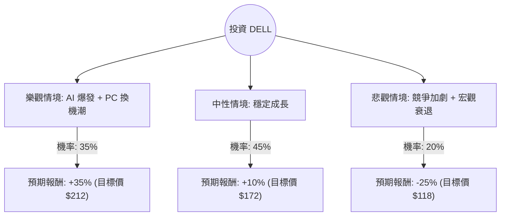

這份分析報告將結合您提供的數據與最新的市場動態（特別是 Dell 在 AI 伺服器市場的表現與 PC 換機潮），利用**決策樹（Decision Tree）**與**期望值分析（Expected Value Analysis）**來評估 DELL 的投資價值。

---

### 一、 核心假設與市場背景分析

在建立決策樹之前，我們基於數據與最新趨勢設定以下核心假設：

1.  **AI 伺服器動能（利多）**：Dell 的 AI 伺服器訂單積壓（Backlog）持續增長，且與 NVIDIA 的合作緊密（Blackwell 架構伺服器）。
2.  **PC 換機潮（利多）**：Windows 10 將於 2025 年停止支援，加上 AI PC 的推動，預計 2025 年商用電腦將迎來強勁更新。
3.  **利潤率壓力（利空）**：AI 伺服器雖然營收高，但目前毛利率（Gross Margin 19.97%）低於傳統儲存設備，且競爭激烈。
4.  **估值面**：Forward P/E 僅 10.78，PEG 0.61，顯示相對於其成長性（EPS Q/Q 56.7%），股價並未過度泡沫。

---

### 二、 決策樹分析 (Decision Tree)

我們將未來一年的表現分為三種情境：**樂觀（Bull）**、**中性（Base）**、**悲觀（Bear）**。

#### 節點詳細說明：

1.  **樂觀情境 (Bull Case) - 35% 機率**：
    *   **條件**：AI 伺服器毛利改善，Blackwell 伺服器大量出貨，且 AI PC 帶動商用換機潮超乎預期。
    *   **預期報酬**：+35%。基於 Forward P/E 回升至 15x（接近行業平均）。
2.  **中性情境 (Base Case) - 45% 機率**：
    *   **條件**：AI 伺服器營收持續增長但利潤率持平，PC 市場溫和復甦。
    *   **預期報酬**：+10%。接近分析師平均目標價 $167.89（約 7-10% 漲幅）。
3.  **悲觀情境 (Bear Case) - 20% 機率**：
    *   **條件**：AI 伺服器競爭導致價格戰，企業 IT 支出因高利率環境縮減，毛利率進一步下滑。
    *   **預期報酬**：-25%。股價回測 SMA200 或更低支撐位。

---

### 三、 期望值計算過程 (Expected Value Calculation)

我們以目前股價 **$156.76** 為基準，計算一年後的預期報酬率期望值：

| 情境 | 機率 (P) | 預期報酬率 (R) | 加權期望值 (P * R) |
| :--- | :--- | :--- | :--- |
| **樂觀 (Bull)** | 0.35 | +35% | 12.25% |
| **中性 (Base)** | 0.45 | +10% | 4.50% |
| **悲觀 (Bear)** | 0.20 | -25% | -5.00% |
| **總計期望值** | **1.00** | | **11.75%** |

**計算公式：**
$EV = (0.35 \times 35\%) + (0.45 \times 10\%) + (0.20 \times -25\%) = 11.75\%$

**預期股價估算：**
$156.76 \times (1 + 11.75\%) \approx \$175.18$

---

### 四、 綜合數據分析與最新動態補充

1.  **成長性指標**：
    *   **Sales Q/Q (40.13%)** 與 **EPS Q/Q (56.74%)** 極為強勁，顯示公司正處於高速成長期。
    *   **PEG 0.61**：在美股科技股中，PEG 低於 1 通常被視為嚴重低估。
2.  **財務結構風險**：
    *   **Quick Ratio (0.71)** 與 **Current Ratio (0.87)** 偏低，顯示短期流動性稍緊，這是硬體組裝業常見的特徵，但需留意債務壓力。
    *   **Insider Trans (-4.88%)**：內部人近期有小幅減持，可能暗示短期股價已反映部分利多。
3.  **技術面**：
    *   股價高於 SMA20, 50, 200（分別高出 10%~22%），顯示短期處於強勢多頭，但也存在乖離過大回檔的風險。

---

### 五、 最終結論

**判斷：適合投資 (Moderate Buy)**

#### 理由：
1.  **正向期望值**：經過風險加權後的期望報酬率為 **11.75%**，優於多數傳統產業，且在 AI 伺服器龍頭中估值相對便宜。
2.  **AI 轉型實質獲利**：Dell 不僅是概念股，其 Sales Q/Q 的大幅增長證明了 AI 需求已轉化為營收。
3.  **安全邊際**：Forward P/E 僅 10.78 倍，即便 AI 浪潮稍退，其傳統 PC 與儲存業務的現金流也能提供底部支撐。
4.  **投資建議**：
    *   **進場策略**：由於目前股價距離 52 週高點僅約 6.7%，且 SMA 乖離率較高，建議採取**分批進場**或等待回測 **$145 - $150** 區間再行佈局。
    *   **風險監控**：需密切關注下一季財報的「毛利率（Gross Margin）」是否改善，若營收增加但利潤持續萎縮，則需下修樂觀情境的機率。

***

**免責聲明：** 本分析僅供參考，不構成任何投資建議。投資者應自行承擔市場風險。