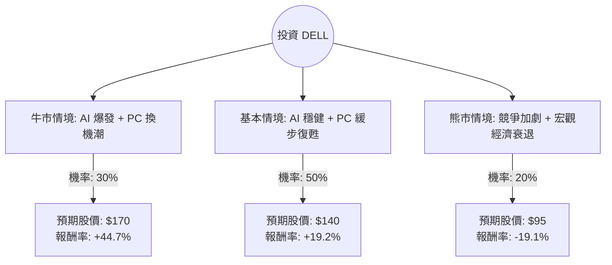

這份分析報告結合了您提供的基本面數據與最新的市場動態（包含 2024 年第二季財報表現、AI 伺服器市場趨勢及 S&P 500 指數納入等資訊），利用**決策樹（Decision Tree）**與**期望值分析（Expected Value Analysis）**評估 Dell Technologies (DELL) 的投資價值。

---

### 一、 核心假設與市場背景分析

在建立決策樹之前，我們基於以下關鍵因素設定情境：

1.  **AI 伺服器動能（利多）**：Dell 的 ISG（基礎設施解決方案）部門表現強勁，AI 伺服器訂單積壓（Backlog）達 38 億美元，且需求持續擴大。
2.  **PC 市場復甦（中性/利多）**：CSG（客戶解決方案）部門目前持平，但隨著 Windows 10 終止支援引發的換機潮及 AI PC 的推出，預計 2025 年將有顯著增長。
3.  **估值優勢（利多）**：目前 **PEG 僅 0.61**，Forward P/E 約 10.24，相較於其他 AI 概念股（如 NVIDIA, SMCI），Dell 的估值極具吸引力。
4.  **利潤率壓力（利空）**：AI 伺服器雖然營收高，但初期毛利率較低，可能稀釋整體利潤率。
5.  **指數效應**：Dell 於 2024 年 9 月重新納入 S&P 500 指數，將吸引更多被動資金流入。

---

### 二、 決策樹分析 (Decision Tree)

我們以 **12 個月** 為投資期限，設定三種主要情境：

#### 節點詳細說明：

1.  **牛市情境 (Bull Case) - 30% 機率**：
    *   **條件**：AI 伺服器毛利改善，AI PC 滲透率超預期，且聯準會降息刺激企業 IT 支出。
    *   **預期股價**：$170 (接近分析師目標價 $162.17 並考慮溢價)。
    *   **預期報酬**：(170 - 117.49) / 117.49 = **+44.7%**。

2.  **基本情境 (Base Case) - 50% 機率**：
    *   **條件**：AI 需求持續但競爭激烈導致利潤率持平，PC 市場如預期緩慢回升。
    *   **預期股價**：$140 (基於 Forward P/E 回升至歷史均值 13-14 倍)。
    *   **預期報酬**：(140 - 117.49) / 117.49 = **+19.2%**。

3.  **熊市情境 (Bear Case) - 20% 機率**：
    *   **條件**：全球經濟衰退，企業縮減 AI 資本支出，PC 市場持續萎縮。
    *   **預期股價**：$95 (回測 200 日均線下方支撐位)。
    *   **預期報酬**：(95 - 117.49) / 117.49 = **-19.1%**。

---

### 三、 期望值計算過程

**期望報酬率 (Expected Return, E(R)) 計算公式：**
$E(R) = \sum (P_i \times R_i)$
其中 $P_i$ 為機率，$R_i$ 為該情境報酬率。

*   **牛市貢獻**：$0.30 \times 44.7\% = 13.41\%$
*   **基本貢獻**：$0.50 \times 19.2\% = 9.60\%$
*   **熊市貢獻**：$0.20 \times (-19.1\%) = -3.82\%$

**總期望報酬率** = $13.41\% + 9.60\% - 3.82\% = \mathbf{19.19\%}$

**期望股價估計**：
$117.49 \times (1 + 19.19\%) = \mathbf{\$140.04}$

---

### 四、 綜合評估與最終結論

#### 1. 數據亮點分析：
*   **PEG 0.61**：這是一個非常強大的買入訊號，顯示股價相對於其盈餘成長性被嚴重低估（通常 PEG < 1 被視為便宜）。
*   **Forward P/E 10.24**：遠低於標普 500 平均水平，具備防禦性。
*   **Target Price $162.17**：目前的市價 ($117.49) 距離分析師平均目標價有約 **38% 的上漲空間**。
*   **短期技術面**：SMA20, 50, 200 均呈現負值，顯示近期股價處於修正階段，這反而提供了較佳的長期分批進場點。

#### 2. 投資判斷：
**結論：適合投資 (Suitable for Investment)**

#### 3. 理由總結：
1.  **正向期望值**：計算出的年化期望報酬率約 **19.2%**，遠高於市場平均預期。
2.  **AI 轉型實質獲利**：Dell 不僅是概念股，其 AI 伺服器營收已實質反映在財報中，且積壓訂單充足。
3.  **安全邊際高**：低 P/E 與低 PEG 提供了良好的下行保護，即便 PC 市場復甦緩慢，AI 業務的成長也能支撐估值。
4.  **資金面利多**：納入 S&P 500 將帶來長期的機構買盤支撐。

**建議策略**：
鑑於近期技術指標 (SMA) 偏弱，建議採取**分批買進 (Dollar-cost Averaging)** 策略，首批資金可在當前價位進場，若股價回測 $110 附近可加大配置，長期持有至 AI PC 換機潮爆發（預計 2025 年上半年）。