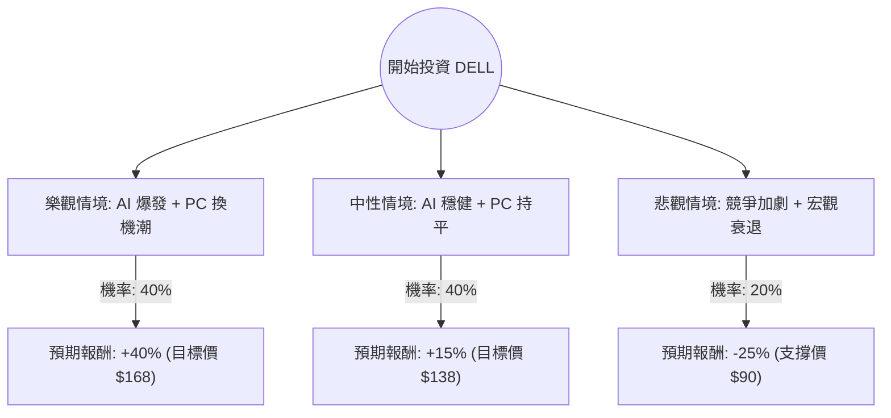

這份分析報告將結合您提供的基本面數據與最新的市場動態（包含 2024 年第二季財報表現、AI 伺服器趨勢及 PC 換機潮），利用**決策樹（Decision Tree）**與**期望值分析（Expected Value Analysis）**評估 Dell Technologies (DELL) 的投資價值。

---

### 一、 核心假設與市場背景分析

在構建決策樹之前，我們基於最新資訊設定以下核心假設：

1.  **AI 伺服器動能（利多）**：Dell 的 ISG（基礎設施解決方案）部門因 AI 伺服器（如 PowerEdge XE9680）需求強勁，積壓訂單（Backlog）高達 38 億美元。
2.  **PC 市場復甦（中性偏利多）**：CSG（客戶解決方案）部門目前表現平平，但隨著 Windows 10 終止支援及 AI PC 推出，預計 2025 年將迎來換機潮。
3.  **利潤率壓力（利空）**：AI 伺服器雖然營收高，但目前毛利率較低，且面臨同業（如 Supermicro, HPE）的激烈價格競爭。
4.  **估值水平**：目前 Forward P/E 僅約 10.48 倍，PEG 為 0.63，顯示相對於其預期成長率，股價處於低估區間。

---

### 二、 決策樹分析 (Decision Tree)

我們將未來一年的情境分為三種：**樂觀（Bull）**、**中性（Base）**、**悲觀（Bear）**。

#### 節點詳細說明：

1.  **樂觀情境 (40%)**：
    *   **條件**：AI 伺服器毛利改善，AI PC 帶動企業大規模換機。
    *   **預期報酬**：參考分析師平均目標價 $163.56（約 +35%），加上股息與超額成長，設定為 **+40%**。
2.  **中性情境 (40%)**：
    *   **條件**：AI 業務持續成長但利潤率受限，PC 市場緩步回升。
    *   **預期報酬**：股價回歸歷史平均估值，設定為 **+15%**。
3.  **悲觀情境 (20%)**：
    *   **條件**：AI 需求不如預期，或競爭對手發動價格戰導致利潤萎縮，宏觀經濟導致企業 IT 支出縮減。
    *   **預期報酬**：股價回測 200 日均線或更低支撐，設定為 **-25%**。

---

### 三、 期望值計算過程 (Expected Value Calculation)

期望值 (EV) 是將各情境的「機率」乘以「預期報酬」後的總和。

**計算公式：**
$$EV = (P_{Bull} \times R_{Bull}) + (P_{Base} \times R_{Base}) + (P_{Bear} \times R_{Bear})$$

**代入數值：**
1.  **樂觀貢獻**：$0.40 \times 40\% = 16\%$
2.  **中性貢獻**：$0.40 \times 15\% = 6\%$
3.  **悲觀貢獻**：$0.20 \times (-25\%) = -5\%$

**總期望報酬率：**
$$16\% + 6\% - 5\% = 17\%$$

**換算為預期股價（一年期）：**
$$120.53 \times (1 + 17\%) \approx \$141.02$$

---

### 四、 綜合評估與數據解讀

1.  **估值優勢**：
    *   **PEG 0.63**：通常 PEG < 1 被視為嚴重低估。Dell 的成長潛力（EPS next Y 15.61%）並未完全反映在股價中。
    *   **Forward P/E 10.48**：遠低於標普 500 平均水平及其他 AI 概念股。
2.  **財務健康度**：
    *   **ROI 23.96%**：顯示公司資本運用效率極高。
    *   **P/FCF 17.91**：現金流穩健，足以支撐其 1.68% 的股息發放。
3.  **技術面**：
    *   目前股價在 SMA20, SMA50, SMA200 之下（-2% ~ -7%），顯示短期處於超跌或整理區間，這通常是價值投資者的分批進場點。

---

### 五、 最終結論

**判斷：適合投資 (Suitable for Investment)**

#### 理由：
1.  **正向期望值**：經計算後的預期報酬率為 **17%**，遠高於無風險利率及市場平均預期。
2.  **安全邊際高**：Forward P/E 僅 10 倍出頭，即便 AI 成長放緩，下行空間受限於其強大的自由現金流與 PC 基本盤。
3.  **AI 轉型實質獲利**：不同於純題材股，Dell 已有實質的 AI 伺服器訂單與營收貢獻，且 ISG 部門的成長動能（Sales Q/Q 10.7%）正在加速。
4.  **分析師共識**：Recom 為 1.77（強烈買進），目標價 $163.56 提供約 35% 的潛在漲幅空間。

**建議策略：**
由於短期技術面（SMA 指標）偏弱，建議採取**分批買進（Dollar-cost Averaging）**策略，以應對短期市場波動，並長期持有至 2025 年 AI PC 換機潮爆發。