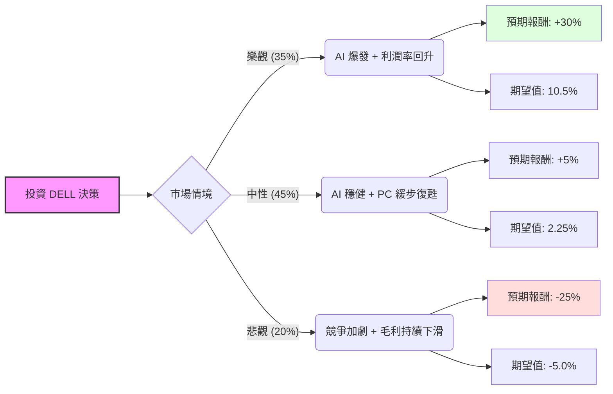

這份分析將結合您提供的基本面數據與最新的市場動態（特別是 Dell 在 AI 伺服器領域的表現與近期財報後的市場反應），利用**決策樹（Decision Tree）**與**期望值分析（Expected Value Analysis）**來評估 DELL 的投資價值。

---

### 一、 市場現況與核心假設

在進入計算前，我們先整合最新的外部資訊：
1.  **AI 伺服器動能**：DELL 的 AI 伺服器積壓訂單（Backlog）大幅增長，與 NVIDIA 的緊密合作使其成為 AI 基礎設施的主要受益者。
2.  **利潤率壓力**：最新財報顯示，儘管營收增長，但由於 AI 伺服器競爭激烈且組件成本上升，**毛利率（Gross Margin）**受到擠壓（數據顯示為 19.97%），這是市場目前最擔心的點。
3.  **PC 市場復甦**：AI PC 的推出預計在 2024 下半年至 2025 年帶動換機潮。
4.  **估值水平**：Forward P/E 僅 13.88，PEG 0.76，顯示相對於其增長潛力，股價並不算貴。

---

### 二、 決策樹分析 (Decision Tree)

我們以未來一年的投資報酬為目標，設定三種情境：

#### 1. 樂觀情境 (Bull Case) - 35% 機率
*   **假設**：AI 伺服器出貨量超預期，且 Dell 成功透過規模經濟提升毛利率；AI PC 帶動高單價筆電銷售。
*   **目標價預估**：$265 (約 +30%)。
*   **理由**：市場重新給予 AI 龍頭等級的估值（P/E 回升至 25x 以上）。

#### 2. 中性情境 (Base Case) - 45% 機率
*   **假設**：AI 業務持續增長，但毛利率維持在目前水平（約 20%）；PC 市場復甦符合預期。
*   **目標價預估**：$215 (約 +5%)。
*   **理由**：股價隨盈利增長，但估值倍數因利潤率擔憂而受限。

#### 3. 悲觀情境 (Bear Case) - 20% 機率
*   **假設**：與 Supermicro (SMCI) 的價格戰導致利潤進一步萎縮；宏觀經濟走弱導致企業推遲 AI 支出。
*   **目標價預估**：$153 (約 -25%)。
*   **理由**：股價回測 200 日均線（SMA200），市場對其 AI 轉型失去信心。

---

### 三、 期望值計算 (Expected Value Calculation)

我們根據上述情境的機率與報酬率進行加權計算：

| 情境 | 機率 (P) | 預期報酬率 (R) | 期望值 (P * R) |
| :--- | :--- | :--- | :--- |
| **樂觀** | 0.35 | +30% | +10.5% |
| **中性** | 0.45 | +5% | +2.25% |
| **悲觀** | 0.20 | -25% | -5.0% |
| **總計** | **1.00** | | **+7.75%** |

**核心計算公式：**
$EV = (0.35 \times 30\%) + (0.45 \times 5\%) + (0.20 \times -25\%) = 7.75\%$

---

### 四、 綜合評估與數據解讀

1.  **估值優勢**：
    *   **PEG 0.76**：這是一個非常強大的買入訊號，顯示其增長速度高於其本益比。
    *   **Forward P/E 13.88**：相較於 NVIDIA 或其他 AI 概念股，DELL 的價格相對「便宜」。
2.  **動能分析**：
    *   **Perf Year 140.8%**：過去一年漲幅巨大，短期內有過熱風險（SMA20, 50, 200 均呈現正乖離）。
    *   **Target Price 179.32**：目前的股價 (204.24) 已高於分析師平均目標價，這暗示短期內可能存在回調壓力。
3.  **財務風險**：
    *   **Gross Margin (19.97%)**：這是 Dell 目前最大的弱點。AI 伺服器雖然營收高，但硬體組裝的利潤極薄。

---

### 五、 最終結論

**投資建議：適合投資 (但建議採「分批買入」或「逢低布局」策略)**

#### 理由：
1.  **正向期望值**：計算出的整體期望值為 **+7.75%**，顯示在考慮風險後，該投資仍具備正向收益潛力。
2.  **AI 長期趨勢未變**：DELL 擁有強大的企業客戶基礎與端到端（End-to-End）的解決方案能力，這是純伺服器組裝廠（如 SMCI）較難競爭的護城河。
3.  **估值合理**：儘管股價已大幅上漲，但 Forward P/E 仍處於合理區間，並未出現泡沫化的極端估值。

**風險提示：**
由於目前股價高於分析師平均目標價（179.32），且近期財報後市場對毛利率極為敏感，短期內股價波動可能加劇。建議投資者關注 **$180 - $190** 區間的支撐位，若股價回落至此區間，投資吸引力將大幅提升。