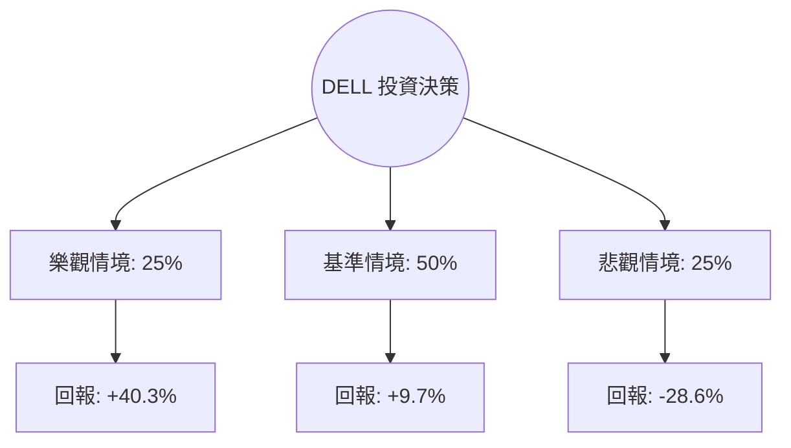

### 1. 核心驅動因素與風險 (Drivers & Risks)

#### **關鍵催化劑 (Catalysts)**
*   **AI 伺服器訂單與積壓訂單 (Backlog) 爆發**：Dell 的 PowerEdge XE9680 等 AI 伺服器需求極其強勁，主要來自二線雲端服務供應商 (CSPs) 與企業端。若積壓訂單轉化為營收的速度加快，且毛利率因規模效應改善，將是股價最強驅動力。
*   **AI PC 換機潮與 Windows 10 退役**：隨著 Windows 10 將於 2025 年停止支援，加上搭載高通、Intel 最新 AI 晶片的 PC 推出，預計 2024 下半年至 2025 年將迎來商用 PC 的強勁更新週期。
*   **納入標普 500 指數 (S&P 500 Inclusion) 預期**：Dell 目前市值已達 2,500 億美元規模，市場高度預期其將被納入 S&P 500 指數，這將引發被動基金的大規模買入。

#### **主要風險點 (Risks)**
*   **AI 伺服器毛利率稀釋**：AI 伺服器雖然營收成長快，但目前組件成本高昂且競爭激烈，若其營收佔比提升但無法有效轉嫁成本，將導致整體毛利率下滑（如 Q1 財報所示）。
*   **供應鏈瓶頸 (GPU 供應)**：儘管需求旺盛，但 NVIDIA GPU 的供應短缺仍可能限制 Dell 的出貨能力，導致營收認列延遲。
*   **宏觀經濟壓抑企業支出**：若高利率環境持續更久，企業可能縮減非 AI 相關的 IT 基礎設施支出，抵銷 AI 帶來的增長。

---

### 2. 情境設定與機率賦予 (Scenario Modeling)

基於目前 $392.10 的價格（參考提供數據）與 17.53 倍的遠期市盈率 (Forward P/E)，我們設定未來 12 個月的情境：

#### **樂觀情境 (Bull Case)**
*   **發生條件**：AI 伺服器毛利率顯著回升；AI PC 換機潮超預期；成功納入 S&P 500。
*   **預估機率**：25%
*   **目標價格與預期回報**：**$550 (+40.3%)**。基於 Forward P/E 擴張至 22x，反映其從硬體商轉型為 AI 基礎設施龍頭的估值重估。

#### **基準情境 (Base Case)**
*   **發生條件**：AI 業務穩健增長，抵銷傳統 PC 的緩慢復甦；利潤率維持穩定；符合分析師平均預期。
*   **預估機率**：50%
*   **目標價格與預期回報**：**$430 (+9.7%)**。基於 Forward P/E 維持在 18x 左右，與目標價 $507.9 的保守折現值相符。

#### **悲觀情境 (Bear Case)**
*   **發生條件**：AI 伺服器競爭加劇導致價格戰；GPU 供應嚴重中斷；全球經濟衰退導致企業 IT 預算凍結。
*   **預估機率**：25%
*   **目標價格與預期回報**：**$280 (-28.6%)**。股價回測 SMA200 支撐位，估值修正至歷史均值 12x P/E。

---

### 3. 期望值計算與決策樹 (EV Calculation & Decision Tree)

#### **決策樹結構**

```mermaid
graph TD
    Start((DELL 投資決策)) --> Bull[樂觀情境: 25%]
    Start --> Base[基準情境: 50%]
    Start --> Bear[悲觀情境: 25%]
    Bull --> BullRet[回報: +40.3%]
    Base --> BaseRet[回報: +9.7%]
    Bear --> BearRet[回報: -28.6%]
```

#### **總期望值計算**
*   `EV = (0.25 * 0.403) + (0.50 * 0.097) + (0.25 * -0.286)`
*   `EV = 0.10075 + 0.0485 - 0.0715`
*   `EV = 0.07775` → **7.78%**

#### **風險回報比分析**
*   **上行潛力**：$550 - $392.1 = $157.9
*   **下行空間**：$392.1 - $280 = $112.1
*   **風險回報比 (Risk/Reward Ratio)**：1 : 1.41。這顯示目前價位的贏面雖為正值，但由於近期股價漲幅已大（Perf Half Y: 238%），不對稱性並非極度誘人。

---

### 4. 決策總結 (Decision Summary)

| 情境 | 發生機率 (%) | 預期報酬率 (%) | 關鍵驅動/觸發因素 |
| :--- | :--- | :--- | :--- |
| **樂觀 (Bull)** | 25% | +40.3% | AI 伺服器利潤率改善、入選 S&P 500、AI PC 爆發 |
| **基準 (Base)** | 50% | +9.7% | 業務符合預期，AI 訂單持續轉化為營收 |
| **悲觀 (Bear)** | 25% | -28.6% | 競爭加劇導致毛利崩潰、宏觀經濟衰退 |
| **整體期望值** | **100%** | **+7.78%** | **加權平均預期回報** |

**最終結論：**
1. **投資建議**：**持有 (Hold) / 逢低買入 (Buy on Dips)**
2. **核心邏輯**：DELL 的期望值為正 (7.78%)，顯示長期具備投資價值。然而，短期內股價已反映大量 AI 預期（半年漲幅逾 200%），且 PEG 僅 0.49 顯示增長潛力雖大，但市場對毛利率的容錯率極低。目前的風險回報比 (1:1.41) 屬於合理但不驚艷，建議等待回調至 SMA50 附近再行加碼。
3. **風控建議**：若股價跌破 **$340**（近期支撐位與趨勢線交匯處），顯示悲觀情境機率上升，應考慮減碼；若毛利率連續兩個季度低於 18%，則視為核心投資邏輯破壞，應執行停損。

【結束指令】