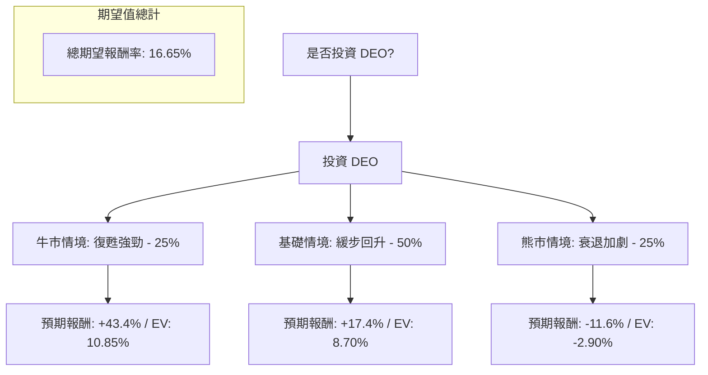

這份分析報告將結合您提供的數據與最新的市場動態（如拉丁美洲庫存問題、全球消費疲軟等），利用**決策樹（Decision Tree）**與**期望值分析（Expected Value Analysis）**評估 Diageo (DEO) 的投資價值。

---

### 一、 核心假設與市場背景分析

在建立模型前，我們先釐清影響 DEO 股價的三大核心變數：

1.  **消費趨勢與庫存（關鍵風險）：** DEO 近期股價重挫主因是拉丁美洲及加勒比海地區（LAC）庫存積壓，以及美國市場對高端烈酒（Premiumization）需求放緩。
2.  **估值水平（安全邊際）：** 目前 P/E 約 17.26，Forward P/E 僅 11.49，遠低於歷史均值（約 20-22）。股息率 3.38% 具備吸引力。
3.  **財務健康度：** 負債權益比（Debt/Eq）高達 2.03，在當前高利率環境下，利息支出壓力較大，限制了回購股票的空間。

---

### 二、 決策樹分析 (Decision Tree)

我們預測未來 12 個月內的三種可能情境：

---

### 三、 期望值計算過程

#### 1. 情境參數設定

| 情境 | 發生機率 | 預期目標價 (12M) | 預期報酬率 (含 3.38% 股息) | 計算理由 |
| :--- | :--- | :--- | :--- | :--- |
| **牛市 (Bull)** | 25% | $104.47 (分析師目標價) | **+43.4%** | LAC 庫存問題完全解決，美國消費力反彈，估值回歸歷史均值。 |
| **基礎 (Base)** | 50% | $85.00 | **+17.4%** | 庫存緩慢消化，營收持平或微增，P/E 修復至 14-15 倍。 |
| **熊市 (Bear)** | 25% | $63.50 | **-11.6%** | 全球經濟衰退，高端化趨勢逆轉，負債壓力導致信用評等下調。 |

*註：目前股價以 $74.60 計算。*

#### 2. 期望值 (Expected Value, EV) 計算

$$EV = (P_{Bull} \times R_{Bull}) + (P_{Base} \times R_{Base}) + (P_{Bear} \times R_{Bear})$$

*   **牛市貢獻：** $0.25 \times 43.4\% = 10.85\%$
*   **基礎貢獻：** $0.50 \times 17.4\% = 8.70\%$
*   **熊市貢獻：** $0.25 \times (-11.6\%) = -2.90\%$

**總期望報酬率 = 10.85% + 8.70% - 2.90% = 16.65%**

---

### 四、 綜合數據評估 (補充基本面)

*   **技術面極度超賣：** SMA20 (-11.26%)、SMA50 (-16.48%)、SMA200 (-22.76%) 顯示股價處於極度低迷狀態，通常預示短期內有技術性反彈機會。
*   **獲利能力仍強：** 儘管營收受挫，但 **Gross Margin (59.68%)** 與 **Oper. Margin (28.2%)** 依然維持在產業高標，顯示其品牌護城河（Johnnie Walker, Guinness, Tanqueray）並未消失。
*   **PEG 警訊：** PEG 高達 6.14，反映出市場對其短期增長動能的極度懷疑。

---

### 五、 最終結論

#### **判斷：適合投資 (建議分批買入 / Long-term Buy)**

**理由：**
1.  **期望值為正 (16.65%)：** 即使在考慮了 25% 的衰退風險後，整體的數學期望值依然優於標普 500 的長期平均回報。
2.  **估值具備安全邊際：** Forward P/E 11.49 倍對於一家擁有全球頂級品牌的必需消費品公司來說，已進入「價值區」。
3.  **股息支撐：** 3.38% 的股息率提供了下行保護，適合追求現金流的投資者。
4.  **逆向投資機會：** 目前市場情緒極度悲觀（Perf Year -29.9%），且股價接近 52 週低點，符合「在恐懼時貪婪」的原則。

**風險提示：**
*   **債務風險：** Debt/Eq 2.03 偏高，若利率長期維持高位，將侵蝕利潤。
*   **庫存去化速度：** 若下一季財報顯示 LAC 地區庫存未見改善，股價可能下探至 $65 以下。

**建議策略：**
不要一次性投入，建議採用**定期定額**或**分批佈局**（例如：現在買入 50%，若跌破 $70 再補 50%），以應對短期內可能持續的震盪。