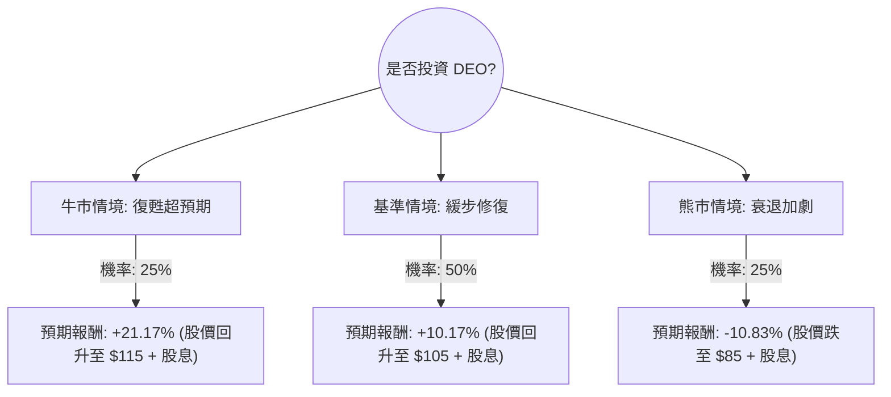

這份分析報告將結合您提供的數據與最新的市場動態（如 2024 財年財報表現、拉丁美洲庫存問題、全球烈酒市場趨勢），利用**決策樹（Decision Tree）**與**期望值分析（Expected Value Analysis）**評估 Diageo (DEO) 的投資價值。

---

### 一、 核心假設與市場現況分析

在建立模型前，我們先整合基本面與最新外部資訊：

1.  **負面因素（Bearish Factors）**：
    *   **拉美市場危機**：DEO 近期股價受挫主因是拉丁美洲與加勒比海地區（LAC）銷售大幅下滑（-21%），導致庫存積壓。
    *   **高槓桿壓力**：Debt/Eq 高達 2.2，在當前高利率環境下，利息支出對利潤構成壓力。
    *   **消費降級**：全球通膨導致「高端化（Premiumization）」趨勢放緩，消費者轉向更便宜的酒類。
2.  **正面因素（Bullish Factors）**：
    *   **估值吸引力**：Forward P/E 僅 14.83，遠低於歷史均值（約 20-22 倍）。
    *   **護城河與品牌**：擁有 Johnnie Walker, Guinness 等頂級品牌，ROE 達 22.33%，獲利能力依然強勁。
    *   **股息誘人**：4.17% 的殖利率提供了一定的下行保護。
3.  **中性因素（Base Case）**：
    *   管理層預計 2025 財年上半年環境依然艱難，但下半年將隨庫存去化而改善。

---

### 二、 決策樹分析 (Decision Tree)

我們以 **1 年為投資期限**，設定三種可能的情境：

#### 節點詳細說明：

1.  **牛市情境 (Bull Case) - 25% 機率**：
    *   **假設**：拉美庫存問題在兩季內解決，美國市場消費力強韌，中國刺激政策帶動高端酒類需求。
    *   **目標價**：回升至分析師平均目標價 $111.86 以上，約 $115。
    *   **計算**：[(115 - 99.17) / 99.17] + 4.17% (股息) = **+20.13%**。

2.  **基準情境 (Base Case) - 50% 機率**：
    *   **假設**：業績符合管理層預期，上半年持平，下半年微幅增長。估值修復至 Forward P/E 16-17 倍。
    *   **目標價**：約 $105。
    *   **計算**：[(105 - 99.17) / 99.17] + 4.17% (股息) = **+10.05%**。

3.  **熊市情境 (Bear Case) - 25% 機率**：
    *   **假設**：全球經濟陷入衰退，高債務導致利息覆蓋率下降，股價回測 52 週低點。
    *   **目標價**：約 $85。
    *   **計算**：[(85 - 99.17) / 99.17] + 4.17% (股息) = **-10.12%**。

---

### 三、 期望值計算 (Expected Value Analysis)

根據上述決策樹節點，計算總體期望報酬率：

| 情境 | 預期報酬 (R) | 機率 (P) | P × R |
| :--- | :--- | :--- | :--- |
| **牛市** | +20.13% | 0.25 | +5.03% |
| **基準** | +10.05% | 0.50 | +5.03% |
| **熊市** | -10.12% | 0.25 | -2.53% |
| **總計期望值** | | **1.00** | **+7.53%** |

**計算過程：**
$EV = (0.25 \times 20.13\%) + (0.50 \times 10.05\%) + (0.25 \times -10.12\%)$
$EV = 5.0325\% + 5.025\% - 2.53\% = 7.5275\%$

---

### 四、 核心假設與風險評估

1.  **估值修復假設**：目前 DEO 的 Forward P/E (14.83) 處於十年低位。假設市場情緒回歸正常，即便盈餘不增長，僅靠估值回升（Mean Reversion）就有 10% 以上空間。
2.  **財務風險**：Debt/Eq 2.2 是主要隱憂。若利率維持高位更久，DEO 的淨利潤會被利息侵蝕，這也是為何熊市情境設定了 25% 的權重。
3.  **股息安全性**：DEO 擁有強大的自由現金流（P/FCF 20.36），且作為「股息貴族」類型的公司，縮減股息機率極低，這為投資者提供了 4% 的安全墊。

---

### 五、 最終結論

**判斷：適合投資 (建議分批買入)**

#### 理由：
1.  **正向期望值**：計算出的期望報酬率為 **7.53%**，優於持有現金或低風險債券，且這是在相對保守的估計下得出。
2.  **風險回報比（Risk/Reward）**：目前股價 ($99.17) 接近 52 週區間的中下部，下行空間受 4.17% 股息支撐，而上行空間則有估值修復與業績反轉的雙重驅動。
3.  **逆向投資機會**：DEO 目前正處於「壞消息出盡」的階段。雖然 EPS Q/Q 表現糟糕 (-74.5%)，但 Forward P/E 顯示市場已預期明年會好轉 (EPS next Y +4.22%)。

**操作建議：**
由於短期內（未來 3-6 個月）拉美市場與全球消費疲軟的利空可能仍有餘震，建議不要一次性投入，而是採取**定期定額**或**分批佈局**的方式，重點關注 2025 年初的財報指引是否確認庫存問題已解決。