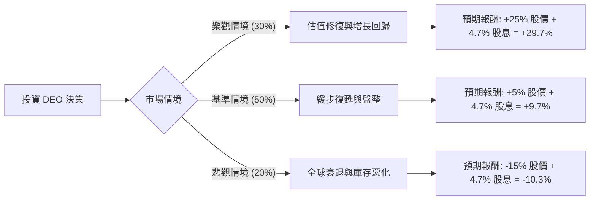

這份分析報告將結合您提供的基本面數據與最新的市場動態（包含 2024 年財報表現、拉丁美洲市場挑戰及全球消費趨勢），利用**決策樹（Decision Tree）**與**期望值分析（Expected Value Analysis）**評估 Diageo (DEO) 的投資價值。

---

### 1. 市場現況與核心假設分析

在進入決策樹之前，我們先整合基本面與最新外部資訊：

*   **利空因素（Bearish Factors）：**
    *   **拉美市場危機：** 2024 年財報顯示拉丁美洲與加勒比海地區（LAC）庫存過剩，銷售額大幅下滑，影響整體利潤。
    *   **消費降級：** 高通膨導致消費者從「高端烈酒（Premiumization）」轉向更便宜的替代品。
    *   **債務壓力：** 數據顯示 Debt/Eq 高達 2.2，在當前高利率環境下，財務成本較重。
    *   **技術面疲軟：** 股價處於 52 週低點附近，且 SMA200 (-12.4%) 顯示長期趨勢仍偏空。

*   **利多因素（Bullish Factors）：**
    *   **估值吸引力：** Forward P/E 僅 13.16，遠低於歷史平均與同業；Target Price $111.01 隱含約 25% 的上漲空間。
    *   **高股息：** 4.68% 的股息率提供了強大的下行保護與現金流。
    *   **品牌護城河：** 擁有 Johnnie Walker, Guinness, Tanqueray 等全球領導品牌，毛利率高達 60%。
    *   **內部優化：** 公司正進行 20 億美元的成本節約計畫。

---

### 2. 決策樹分析 (Decision Tree)

我們預測未來 12 個月的投資回報，分為三種情境：

#### 節點詳細說明：

1.  **樂觀情境 (Bull Case) - 30% 機率：**
    *   **條件：** 美國市場消費力回升，拉美庫存問題在兩季內解決，公司達到 Target Price $111。
    *   **期望值貢獻：** $0.30 \times 29.7\% = 8.91\%$

2.  **基準情境 (Base Case) - 50% 機率：**
    *   **條件：** 營收增長緩慢（如數據中 Sales Q/Q 1.23% 所示），高端化趨勢停滯但未崩潰，股價隨大盤小幅回升至 $93 左右。
    *   **期望值貢獻：** $0.50 \times 9.7\% = 4.85\%$

3.  **悲觀情境 (Bear Case) - 20% 機率：**
    *   **條件：** 全球經濟硬著陸，債務利息支出侵蝕利潤，EPS 持續負成長（目前 EPS Q/Q 為 -74.5%），股價跌破 52W Low 至 $75 左右。
    *   **期望值貢獻：** $0.20 \times (-10.3\%) = -2.06\%$

---

### 3. 期望值計算過程 (Expected Value Calculation)

根據上述決策樹，我們計算總體期望報酬率（Expected Return, E(R)）：

$$E(R) = (P_{Bull} \times R_{Bull}) + (P_{Base} \times R_{Base}) + (P_{Bear} \times R_{Bear})$$

*   **計算：**
    *   $0.30 \times 29.7\% = 0.0891$
    *   $0.50 \times 9.7\% = 0.0485$
    *   $0.20 \times (-10.3\%) = -0.0206$
*   **總計：**
    *   $0.0891 + 0.0485 - 0.0206 = 0.117$
    *   **總期望報酬率 = 11.7%**

#### 核心假設：
*   **股息安全性：** 假設公司維持現有股息政策（ROE 22.3% 支撐了派息能力）。
*   **估值修復：** 假設 Forward P/E 13.16 已反映大部分利空，下行空間受限於 4.6% 的殖利率支撐。
*   **時間維度：** 以 12 個月為持有週期。

---

### 4. 最終結論

**評估結果：適合投資 (適合價值投資者 / 長期收息投資者)**

#### 判斷理由：
1.  **正向期望值：** 11.7% 的預期報酬率優於許多防禦性板塊，且在悲觀情境下，高股息抵銷了部分股價跌幅。
2.  **風險溢價合理：** 目前股價 ($88.56) 接近 52 週低點，且 Forward P/E 遠低於歷史均值，顯示市場情緒過度悲觀，提供了良好的安全邊際（Margin of Safety）。
3.  **財務韌性：** 儘管短期 EPS 承壓，但 60% 的毛利率與 28% 的營業利益率顯示其核心業務極具競爭力，一旦拉美庫存去化完成，獲利彈性大。
4.  **技術面築底：** SMA20 已轉正 (+0.78%)，顯示短期拋售壓力減輕，可能正在築底。

**建議操作：**
*   **分批買入：** 鑑於目前仍處於 SMA200 之下，建議採取分批建倉策略，以降低短期波動風險。
*   **監控指標：** 需密切關注下一季財報中「拉丁美洲地區」的銷售恢復狀況以及「淨負債/EBITDA」比率是否下降。

---
*免責聲明：本分析僅供參考，不構成具體投資建議。投資股票具有風險，入市前請審慎評估自身風險承受能力。*