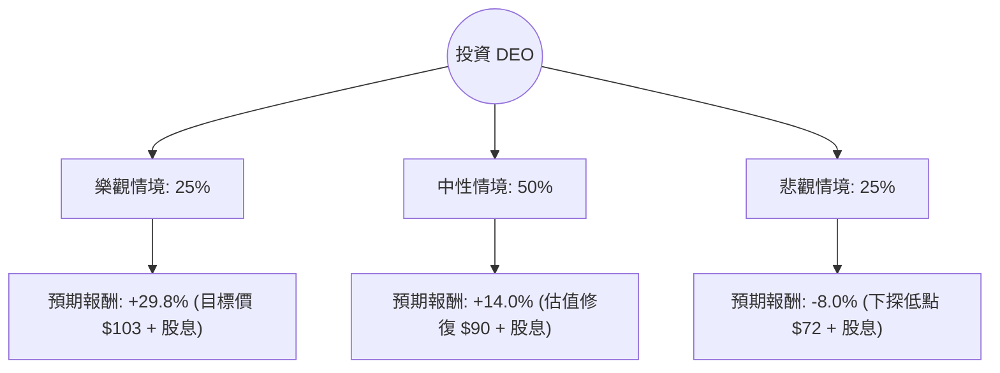

這份分析報告將結合您提供的數據與最新的市場動態（截至 2024 年中下旬），利用**決策樹（Decision Tree）**與**期望值分析（Expected Value Analysis）**來評估 Diageo (DEO) 的投資價值。

---

### 1. 最新市場動態與背景分析 (Market Context)

在進入計算前，我們先整合最新的外部資訊：
*   **業績挑戰**：Diageo 近期面臨拉丁美洲及加勒比海地區（LAC）庫存積壓與需求疲軟的嚴重打擊，導致 2024 財年利潤出現下滑。
*   **消費趨勢**：全球「高端化（Premiumization）」趨勢在通膨壓力下有所放緩，消費者開始轉向更便宜的替代品。
*   **財務狀況**：DEO 的債務股本比（Debt/Eq）高達 2.03，在當前高利率環境下，利息支出壓力較大。
*   **估值吸引力**：目前股價接近 52 週低點，Forward P/E 僅 12.73，遠低於其歷史平均水平（約 20-22 倍），且股息率（4.05%）具備吸引力。

---

### 2. 決策樹分析 (Decision Tree)

我們將未來一年的投資回報分為三種情境：**樂觀（復甦）**、**中性（震盪）**、**悲觀（衰退）**。

#### 決策樹節點詳細說明：

| 節點 (情境) | 機率 (P) | 預期股價目標 | 資本利得 | 股息收益 | 總報酬 (R) | 期望值 (P * R) |
| :--- | :--- | :--- | :--- | :--- | :--- | :--- |
| **樂觀 (Bull)** | 25% | $103.00 | +25.8% | 4.0% | **+29.8%** | **7.45%** |
| **中性 (Base)** | 50% | $90.00 | +9.9% | 4.1% | **+14.0%** | **7.00%** |
| **悲觀 (Bear)** | 25% | $72.00 | -12.1% | 4.1% | **-8.0%** | **-2.00%** |
| **合計** | **100%** | - | - | - | - | **12.45%** |

---

### 3. 核心假設與計算過程

#### A. 核心假設：
1.  **樂觀情境 (25%)**：拉丁美洲庫存問題在兩季內完全解決，美國市場消費力因降息預期回升，公司恢復 5-7% 的有機增長。股價回歸分析師目標價 $103。
2.  **中性情境 (50%)**：全球經濟軟著陸，高端烈酒需求緩步回升，公司進行成本削減（目前正在實施）。股價回歸至 SMA200 附近或歷史平均 P/E 的中值（約 $90）。
3.  **悲觀情境 (25%)**：全球經濟衰退，消費者大幅轉向低價酒類，且高債務（Debt/Eq 2.03）導致利息負擔侵蝕利潤。股價回測 52 週低點 $72。

#### B. 期望值 (Expected Value, EV) 計算：
$$EV = (P_{Bull} \times R_{Bull}) + (P_{Base} \times R_{Base}) + (P_{Bear} \times R_{Bear})$$
$$EV = (0.25 \times 29.8\%) + (0.50 \times 14.0\%) + (0.25 \times -8.0\%)$$
$$EV = 7.45\% + 7.00\% - 2.00\% = \mathbf{12.45\%}$$

---

### 4. 綜合基本面評估

*   **優勢 (Pros)**：
    *   **股息優渥**：4.05% 的股息率處於歷史高位，且 DEO 具有強大的自由現金流（P/FCF 18.02）。
    *   **估值低廉**：Forward P/E 12.73 顯示市場已過度反應負面消息。
    *   **盈利能力**：ROE 22.03% 顯示其品牌護城河依然穩固。
*   **劣勢 (Cons)**：
    *   **增長停滯**：PEG 8.78 極高，顯示短期內盈餘增長速度遠低於其本益比。
    *   **債務風險**：Debt/Eq 2.03 較高，需關注現金流對債務的覆蓋能力。
    *   **技術面弱勢**：SMA50 (-2.09%) 與 SMA200 (-12.71%) 顯示長期趨勢仍處於空頭，雖短期有反彈（Perf Week +5.72%）。

---

### 5. 最終結論

**投資建議：適合投資 (建議分批買入)**

#### 理由：
1.  **正向期望值**：經過決策樹計算，未來一年的預期總報酬率約為 **12.45%**，優於多數固定收益產品。
2.  **安全邊際已現**：股價已從高點大幅修正（52W High -29.8%），目前的 Forward P/E 提供了較好的安全邊際。
3.  **防禦性特質**：Diageo 擁有強大的品牌組合（Johnnie Walker, Guinness 等），在通膨環境下具有定價權。雖然短期受庫存影響，但長期消費趨勢並未崩潰。
4.  **適合對象**：適合**價值型投資者**或**存股族**。由於技術面尚未完全轉強，建議採取「分批佈局」策略，以應對可能出現的悲觀情境（回測 $72）。

**風險提示**：需密切關注下一季財報中關於拉丁美洲庫存去化進度及北美市場的有機增長數據。若 EPS 持續負增長，則需重新評估悲觀情境的權重。