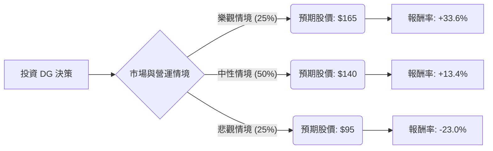

這份分析報告結合了您提供的基本面數據，以及針對 **Dollar General (DG)** 2024 年最新財報（Q1 2024）與市場動態的即時搜尋資訊。

---

### 一、 市場現況與最新動態補充

根據 2024 年 5 月 30 日發布的最新財報及市場趨勢：
1.  **財報表現優於預期**：DG 第一季營收 99.1 億美元（年增 6.1%），EPS 為 1.65 美元，均高於市場預期。
2.  **核心策略「Back to Basics」**：執行長 Todd Vasos 推動回歸基本面，專注於門市營運、減少庫存損耗（Shrink）以及提升勞動力效率。
3.  **消費者行為轉變**：高通膨環境下，中高收入族群出現「降級消費（Trade-down）」趨勢，對 DG 有利；但其核心低收入客群受通膨打擊最重，購買力受限。
4.  **競爭壓力**：面臨 Walmart 的價格競爭以及 PDD (Temu) 等電商的低價衝擊。
5.  **財務壓力**：債務股本比（Debt/Eq）高達 1.85，利息支出是潛在風險。

---

### 二、 決策樹分析 (Decision Tree)

我們將未來一年的投資預期分為三種情境：**樂觀（牛市）、中性（基準）、悲觀（熊市）**。

#### 節點詳細說明：

1.  **樂觀情境 (Bull Case) - 25% 機率**
    *   **條件**：「Back to Basics」策略極其成功，庫存損耗大幅下降，且中產階級降級消費帶來的流量抵銷了低收入戶的疲軟。
    *   **預期報酬**：股價回升至 52 週高點附近，約 **$165**。
    *   **期望值貢獻**：$165 \times 0.25 = \$41.25$

2.  **中性情境 (Base Case) - 50% 機率**
    *   **條件**：公司達成 2024 全年指引（營收增長 2.1%-2.7%），同店銷售額微幅增長，利潤率維持穩定。
    *   **預期報酬**：接近分析師平均目標價，約 **$140**。
    *   **期望值貢獻**：$140 \times 0.50 = \$70.00$

3.  **悲觀情境 (Bear Case) - 25% 機率**
    *   **條件**：美國經濟陷入衰退，核心客戶失業率上升，且 Walmart 價格戰導致 DG 毛利進一步萎縮，高債務壓力顯現。
    *   **預期報酬**：股價回測近期低點，約 **$95**。
    *   **期望值貢獻**：$95 \times 0.25 = \$23.75$

---

### 三、 期望值分析 (Expected Value Analysis)

#### 1. 核心假設
*   **當前股價 (Current Price)**：$123.45
*   **估值基礎**：參考 Forward P/E (15.39) 與歷史平均值。
*   **風險因子**：債務比率高 (1.85)、營業利益率低 (5.16%)、庫存損耗問題。

#### 2. 計算過程
*   **總期望股價 (Expected Price)** = (樂觀 $165 \times 0.25$) + (中性 $140 \times 0.50$) + (悲觀 $95 \times 0.25$)
*   **總期望股價** = $41.25 + 70.00 + 23.75 = \mathbf{\$135.00}$

#### 3. 預期報酬率計算
*   **預期報酬率** = $(\$135.00 - \$123.45) / \$123.45 \approx \mathbf{9.36\%}$
*   **加上股息收益 (Dividend Yield)**：$1.91\%$
*   **總預期年化報酬率**：$9.36\% + 1.91\% = \mathbf{11.27\%}$

---

### 四、 最終結論

**判斷：適合投資 (建議：分批買入 / 價值投資導向)**

#### 理由：
1.  **期望值為正且具吸引力**：計算出的期望股價 $135 高於當前股價 $123.45，且總預期報酬率（含息）約 11.27%，優於一般市場平均預期。
2.  **估值處於合理區間**：Forward P/E 為 15.39，相較於其歷史高點與同業，目前的價格並未過度膨脹，具備一定的安全邊際。
3.  **轉型契機**：最新財報顯示營運已出現止跌回升跡象（EPS Beat），且執行長的回歸有助於修復過去兩年的營運失誤。
4.  **防禦屬性**：作為折扣零售商，在經濟放緩時期具有較強的抗跌性（降級消費受益者）。

#### 風險提示：
*   **高槓桿風險**：Debt/Eq 1.85 偏高，若利率長期維持高位，利息支出將侵蝕利潤。
*   **短期波動**：近期股價表現（SMA20, SMA50 均為負值）顯示技術面仍偏弱，建議採取**分批進場**策略，以應對可能的短期下探。

**結論：DG 目前屬於「價值顯現」階段，適合尋求中長期反轉機會的投資者。**