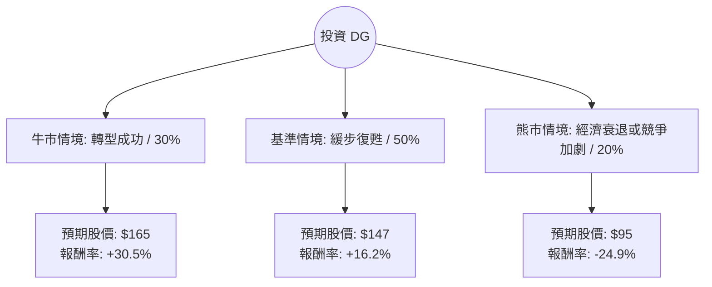

這份分析報告將結合您提供的基本面數據與最新的市場動態（包含 2024 年財報表現、CEO 策略轉向及宏觀經濟環境），利用**決策樹（Decision Tree）**與**期望值分析（Expected Value Analysis）**評估 Dollar General (DG) 的投資價值。

---

### 1. 市場背景與最新動態分析

在進入計算前，我們先整合最新的外部資訊：
*   **營運策略：** DG 目前正處於「Back to Basics（回歸基礎）」轉型期，由回鍋 CEO Todd Vasos 領導，重點在於增加店內人手、優化供應鏈及減少損耗（Shrink）。
*   **財務壓力：** 雖然 Q1 財報顯示營收微增，但毛利率受損耗和促銷活動影響。債務股本比（Debt/Eq）高達 1.85，在當前高利率環境下財務壓力較大。
*   **消費者行為：** 通膨使中低收入核心客戶預算吃緊，雖然有「向下消費（Trade-down）」效應帶來的客流，但客戶購買高毛利非必需品的意願降低。
*   **競爭環境：** 競爭對手 Family Dollar 大規模關店，對 DG 而言是市佔率擴張的機會。

---

### 2. 決策樹分析 (Decision Tree)

我們以未來一年的投資報酬為目標，設定三種主要情境：

#### 決策樹節點詳細說明：

| 節點 (情境) | 機率 (P) | 預期股價 (Target) | 預期報酬率 (R) | 說明 |
| :--- | :--- | :--- | :--- | :--- |
| **牛市情境 (Bull)** | 30% | $165 | +30.5% | 轉型策略見效，損耗大幅降低，市佔率因對手關店而提升。 |
| **基準情境 (Base)** | 50% | $147 | +16.2% | 符合分析師平均目標價，營收穩定增長，利潤率維持現狀。 |
| **熊市情境 (Bear)** | 20% | $95 | -24.9% | 美國陷入深度衰退，債務壓力爆發，低收入客戶購買力崩潰。 |

---

### 3. 核心假設與計算過程

#### A. 核心假設
1.  **折現率/基準價：** 以目前市價 **$126.46** 為基準。
2.  **估值邏輯：** 
    *   牛市參考 52 週高點並給予溢價（Forward P/E 回升至 20x）。
    *   基準情境參考分析師平均目標價 **$147.45**。
    *   熊市情境考慮跌破 52 週低點（$86.25）附近的支撐位。
3.  **股息收益：** 考慮 Dividend Yield 1.87%，加入總報酬計算。

#### B. 期望值 (Expected Value) 計算
期望值公式：$EV = \sum (P_i \times R_i)$

1.  **牛市貢獻：** $0.30 \times (30.5\% + 1.87\%) = 0.30 \times 32.37\% = 9.71\%$
2.  **基準貢獻：** $0.50 \times (16.2\% + 1.87\%) = 0.50 \times 18.07\% = 9.04\%$
3.  **熊市貢獻：** $0.20 \times (-24.9\% + 1.87\%) = 0.20 \times -23.03\% = -4.61\%$

**總期望報酬率 (Total Expected Return) = 9.71% + 9.04% - 4.61% = 14.14%**

---

### 4. 綜合評估與最終結論

#### 基本面數據亮點與隱憂：
*   **優勢：** ROE (18.99%) 依然強勁；P/S (0.65) 處於歷史低位，顯示股價相對營收被低估；Forward P/E (15.86) 低於過去五年平均。
*   **劣勢：** 流動比率 (Current Ratio 1.13) 與速動比率 (0.22) 偏低，短期償債能力有壓力；債務負擔重。

#### 最終判斷：適合投資 (建議：分批買入)

**判定理由：**
1.  **期望值為正且具吸引力：** 14.14% 的預期總報酬率優於標普 500 的長期平均回報。
2.  **估值安全邊際：** 目前股價 $126.46 距離分析師目標價 $147.45 仍有約 16% 的上漲空間，且 P/E 處於相對合理區間。
3.  **防禦性特質：** 在經濟放緩預期下，DG 作為折扣零售商具有抗週期性。雖然短期受通膨壓抑，但「回歸基礎」策略若能有效控制損耗，利潤回升彈性大。
4.  **技術面支撐：** 股價已從 52 週低點反彈約 46%，且 SMA20 與 SMA200 呈現正向走勢，顯示短期動能轉強。

**風險提示：**
需密切關注下一季財報中的 **「毛利率 (Gross Margin)」** 與 **「損耗 (Shrink)」** 數據。若毛利率持續下滑或債務利息支出過高，需重新評估熊市機率。