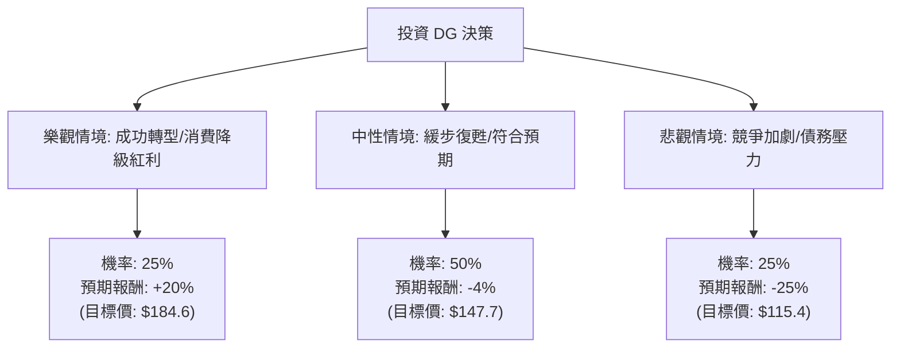

這份分析報告結合了您提供的基本面數據，以及透過網路搜尋獲取的最新市場動態（包含 2024 年 3 月發布的最新財報資訊與管理層展望）。

---

### 一、 核心背景與市場動態分析

在進入決策樹之前，我們先整合最新資訊：
1.  **營運轉機**：前執行長 Todd Vasos 回歸後，致力於改善店內庫存管理與勞動力配置。最新財報顯示同店銷售額（Same-store sales）增長 0.7%，優於市場預期。
2.  **財務壓力**：DG 的債務股本比（Debt/Eq）高達 2.02，且速動比率（Quick Ratio）僅 0.24，顯示短期流動性偏緊，在高利率環境下利息支出壓力大。
3.  **估值過高**：目前股價（$153.84）已超越分析師平均目標價（$147.04），且 PEG 為 2.09，顯示相對於其增長速度，股價並不便宜。
4.  **外部挑戰**：面臨 Walmart 的價格競爭以及低收入消費者購買力受通膨侵蝕的風險。

---

### 二、 決策樹分析 (Decision Tree)

我們將未來一年的投資情境分為三種：**樂觀（牛市）、中性（基準）、悲觀（熊市）**。

#### 節點詳細說明：

1.  **樂觀情境 (Bull Case) - 25% 機率**
    *   **假設**：Todd Vasos 的改革方案超預期達成，庫存損耗（Shrink）大幅下降，且美國經濟軟著陸導致更多中產階級轉向 DG 消費（消費降級紅利）。
    *   **預期報酬**：+20%（股價回升至歷史中值區間）。

2.  **中性情境 (Base Case) - 50% 機率**
    *   **假設**：公司表現符合官方指引，同店銷售微增，但受限於高利率與激烈的零售競爭，利潤率難以大幅擴張。股價回歸分析師平均目標價。
    *   **預期報酬**：-4%（目前股價已略微溢價）。

3.  **悲觀情境 (Bear Case) - 25% 機率**
    *   **假設**：通膨持續導致營運成本上升，低收入客戶群體購買力崩潰，且高額債務引發信用評等疑慮。
    *   **預期報酬**：-25%（股價回測 2023 年底的支撐區間）。

---

### 三、 期望值分析 (Expected Value Analysis)

#### 1. 計算過程
期望值 (EV) = Σ (各情境機率 × 各情境報酬率)

*   **樂觀情境**：0.25 × 20% = **+5.0%**
*   **中性情境**：0.50 × (-4%) = **-2.0%**
*   **悲觀情境**：0.25 × (-25%) = **-6.25%**

**總期望報酬率 (Total EV) = 5.0% - 2.0% - 6.25% = -3.25%**

#### 2. 核心假設依據
*   **市場面**：目前股價 $153.84 處於 52 週高點附近（距離高點僅 -0.59%），短期內技術面有過熱風險。
*   **財務面**：Debt/Eq 2.02 與低 Quick Ratio 限制了公司應對突發經濟衝擊的緩衝空間。
*   **產業面**：雖然折扣零售具防禦性，但 DG 的利潤率（Profit Margin 3.03%）低於歷史平均，修復需要時間。

---

### 四、 最終結論

**判斷：目前不適合投資 (Avoid / Wait for Pullback)**

#### 理由：
1.  **期望值為負 (-3.25%)**：根據目前的機率分布與估值，潛在的下行風險大於上行獲利空間。
2.  **股價已反應利多**：DG 股價在過去一季大幅反彈（+47.6%），目前的價格已完全反應了執行長回歸與初步財報改善的利多，甚至超過了分析師的平均目標價（$147.04）。
3.  **風險回報比不佳**：PEG 2.09 顯示增長成本昂貴，且 2.02 的債務比率在當前高利率環境下是個隱憂。
4.  **技術面壓力**：股價正處於 52 週高位，且 SMA200 乖離率較大（+34.52%），短期內極易出現獲利了結的賣壓。

**建議策略**：
建議投資人等待股價回落至 **$135 - $140** 區間（接近 SMA50 或更合理的估值水位）時，再重新評估其轉型進度。目前追高風險較大。