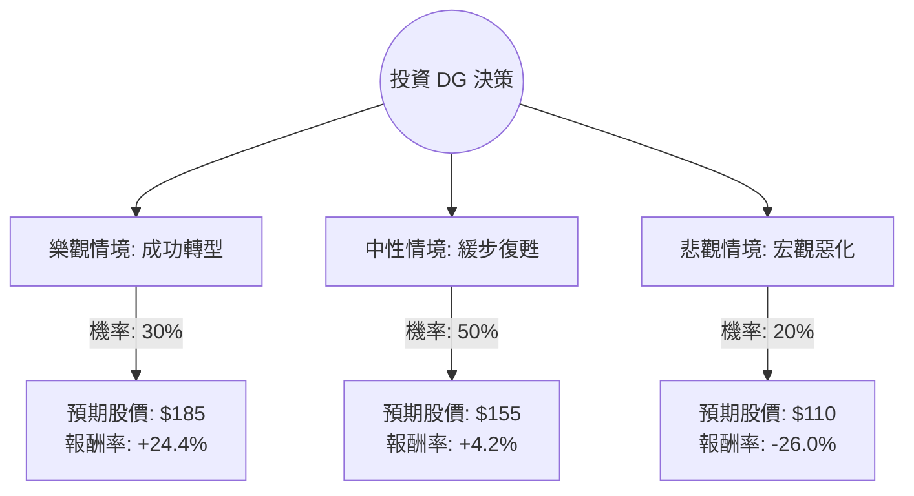

這份分析報告將結合您提供的基本面數據，以及透過網路搜尋獲取的最新市場動態（包含 2024 年 3 月發布的最新財報資訊），利用**決策樹（Decision Tree）**與**期望值分析（Expected Value Analysis）**評估 Dollar General (DG) 的投資價值。

---

### 一、 最新市場動態與背景分析（網路搜尋摘要）

根據最新財報（2023 Q4）與市場趨勢，DG 的現況如下：
1.  **業績回溫但毛利承壓**：DG 最近一季的同店銷售額增長優於預期，顯示低收入消費者在通膨壓力下轉向折扣零售店（Trade-down effect）。然而，由於「損耗（Shrink，指偷竊或損壞）」以及促銷活動增加，毛利率受到擠壓。
2.  **「回歸基礎」計畫（Back to Basics）**：執行長 Todd Vasos 回歸後，致力於增加店內人手、優化供應鏈並減少庫存，這增加了短期成本，但有利於長期競爭力。
3.  **財務壓力**：債務股本比（Debt/Eq）高達 2.02，在當前高利率環境下，利息支出是一大負擔。
4.  **競爭環境**：面臨 Walmart 的價格競爭以及 Dollar Tree (DLTR) 關閉部分表現不佳門市後的市場重整。

---

### 二、 決策樹分析 (Decision Tree)

我們將未來一年的投資情境分為三種：**樂觀（成功轉型）**、**中性（緩步復甦）**、**悲觀（宏觀惡化與競爭加劇）**。

#### 節點詳細說明：

1.  **樂觀情境 (Bull Case) - 30%**：
    *   **描述**：「回歸基礎」計畫成效顯著，損耗問題得到控制，利潤率回升至歷史平均。
    *   **預期報酬**：股價回升至歷史估值中位數（P/E 約 18-20x），目標價約 $185。
2.  **中性情境 (Base Case) - 50%**：
    *   **描述**：營收維持增長，但高利率與競爭使得利潤率改善緩慢。股價隨大盤波動。
    *   **預期報酬**：參考分析師平均目標價 $143.04（目前股價已略微溢價），給予小幅上修至 $155。
3.  **悲觀情境 (Bear Case) - 20%**：
    *   **描述**：美國經濟陷入衰退導致消費者購買力進一步萎縮，且高債務成本侵蝕淨利。
    *   **預期報酬**：股價回測 52 週低點區域，目標價約 $110。

---

### 三、 期望值計算過程 (Expected Value Calculation)

#### 1. 核心假設
*   **當前股價 (P0)**：$148.74
*   **持有期限**：12 個月
*   **股息收益**：1.58% (加回總報酬計算)
*   **機率分配**：基於目前 DG 轉型初期且基本面數據（ROE 16.45%, Debt/Eq 2.02）顯示仍有風險，故給予中性情境最高權重。

#### 2. 各情境報酬率計算 (含股息)
*   **樂觀報酬 (R1)**：[(185 - 148.74) / 148.74] + 0.0158 = **25.98%**
*   **中性報酬 (R2)**：[(155 - 148.74) / 148.74] + 0.0158 = **5.78%**
*   **悲觀報酬 (R3)**：[(110 - 148.74) / 148.74] + 0.0158 = **-24.42%**

#### 3. 總期望報酬率 (Expected Return)
$$EV = (P_{Bull} \times R1) + (P_{Base} \times R2) + (P_{Bear} \times R3)$$
$$EV = (0.3 \times 25.98\%) + (0.5 \times 5.78\%) + (0.2 \times -24.42\%)$$
$$EV = 7.794\% + 2.89\% - 4.884\%$$
$$EV = 5.8\%$$

---

### 四、 最終結論

**判斷：目前「不適合」激進投資，建議「觀望」或「逢低分批佈局」。**

#### 理由如下：

1.  **期望值吸引力不足**：計算出的總期望報酬率僅為 **5.8%**。考慮到目前美國無風險利率（國債收益率）約在 4.5% - 5% 之間，DG 承擔的個股風險（高債務、損耗問題）與預期回報不成正比。
2.  **估值已部分反映復甦**：DG 股價在過去一季已大幅反彈 43.78%，目前股價 ($148.74) 已高於分析師平均目標價 ($143.04)。這意味著市場已經消化了大部分的利多消息。
3.  **財務結構風險**：Debt/Eq 2.02 顯示財務槓桿較高，在利率維持高位的情況下，淨利潤（Profit Margin 3.03%）的容錯率極低。
4.  **技術面壓力**：股價目前接近 52 週高點（-3.49% 差距），且 SMA200 乖離率較大，短期內可能面臨回檔修正。

**建議操作：**
若您仍看好 DG 的長期轉型，建議等待股價回落至 **$130 - $135** 區間（中性情境下方），屆時期望值將顯著提升，投資勝率較高。