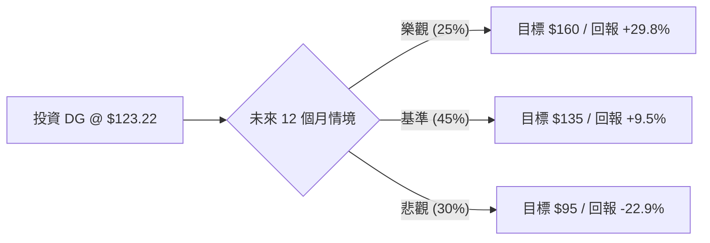

# Dollar General (DG) 投資價值量化分析報告

作為量化投資分析師，針對 Dollar General (DG) 目前的市場處境，我將透過機率模型與期望值框架進行深度拆解。DG 目前正處於「營運轉型期」與「宏觀壓力期」的交匯點，其股價表現高度取決於核心低收入客群的購買力恢復以及公司內部「Back to Basics」策略的執行成效。

---

### 1. 核心驅動因素與風險 (Drivers & Risks)

#### **關鍵催化劑 (Catalysts)**
1.  **營運效率提升與庫存優化**：CEO Todd Vasos 回歸後推動的「回歸基礎」計劃，若能有效解決店內庫存堆積、改善缺貨率並透過自動化減少損耗（Shrink），將直接提振利潤率。
2.  **競爭格局改善**：主要競爭對手 Family Dollar 宣佈關閉近千家門店，這為 DG 在農村與低收入社區提供了獲取市場份額的真空期。
3.  **宏觀環境轉向**：若聯準會啟動降息循環，將減輕 DG 高額債務（Debt/Eq 1.79）的利息壓力，同時通膨放緩有助於其核心客群（年收 3.5 萬美元以下）恢復非必需品的消費能力。

#### **主要風險點 (Risks)**
1.  **損耗（Shrink）與盜竊問題持續**：零售盜竊與庫存管理不善導致的損耗是侵蝕毛利（目前 28.36%）的主因，若改善進度慢於預期，估值將進一步下修。
2.  **消費降級中的競爭加劇**：Walmart 與 PDD (Temu) 在價格戰上的激進投入，可能迫使 DG 必須犧牲利潤率來維持營收增長。
3.  **勞動力成本壓力**：最低工資上漲與勞動力短缺對這類高店數（19,000+ 間）的零售商構成長期結構性成本挑戰。

---

### 2. 情境設定與機率賦予 (Scenario Modeling)

基於當前 $123.22 的股價與 15.38 倍的遠期本益比，設定未來 12 個月的三種情境：

#### **樂觀情境 (Bull Case)**
*   **發生條件**：轉型計劃超預期，損耗率顯著下降，同店銷售增長 (SSSG) 回升至 3% 以上，且宏觀經濟實現軟著陸。
*   **預估機率**：25%
*   **目標價格與預期回報**：**$160 (+29.8%)**。基於恢復至歷史平均本益比 19x，EPS 預期回升至 $8.42。

#### **基準情境 (Base Case)**
*   **發生條件**：營運狀況穩定，損耗問題緩慢改善，市場份額保持穩定，符合分析師平均預期。
*   **預估機率**：45%
*   **目標價格與預期回報**：**$135 (+9.5%)**。接近分析師平均目標價 $131.46，給予 16x Forward P/E。

#### **悲觀情境 (Bear Case)**
*   **發生條件**：核心客戶受經濟衰退打擊嚴重，盜竊問題失控，利潤率持續萎縮，債務壓力迫使削減資本支出。
*   **預估機率**：30%
*   **目標價格與預期回報**：**$95 (-22.9%)**。回測 52 週低點，估值下修至 12x P/E 的安全邊際位置。

---

### 3. 期望值計算與決策樹 (EV Calculation & Decision Tree)

#### **決策樹結構**

```mermaid
graph LR
    A[投資 DG @ $123.22] --> B{未來 12 個月情境}
    B -- 樂觀 (25%) --> C[目標 $160 / 回報 +29.8%]
    B -- 基準 (45%) --> D[目標 $135 / 回報 +9.5%]
    B -- 悲觀 (30%) --> E[目標 $95 / 回報 -22.9%]
```

#### **總期望值計算**
*   `EV = (0.25 * 0.298) + (0.45 * 0.095) + (0.30 * -0.229)`
*   `EV = 0.0745 + 0.04275 - 0.0687`
*   **`EV = 0.04855 (約 4.86%)`**

#### **風險回報比分析**
*   **上行潛力**：$160 - $123.22 = $36.78
*   **下行空間**：$123.22 - $95 = $28.22
*   **風險回報比 (RR Ratio)**：1.30 : 1。這顯示目前的投資具備正向不對稱性，但優勢並不明顯。

---

### 4. 決策總結 (Decision Summary)

| 情境 | 發生機率 (%) | 預期報酬率 (%) | 關鍵驅動/觸發因素 |
| :--- | :--- | :--- | :--- |
| **樂觀 (Bull)** | 25% | +29.8% | 損耗率大幅下降，同店銷售強勁增長 |
| **基準 (Base)** | 45% | +9.5% | 營運回歸常態，符合市場共識預期 |
| **悲觀 (Bear)** | 30% | -22.9% | 消費者購買力崩潰，競爭導致利潤萎縮 |
| **整體期望值** | **100%** | **+4.86%** | **加權平均預期回報** |

**最終結論：**
1.  **投資建議**：**持有 (Hold) / 區間操作**
2.  **核心邏輯**：DG 的期望值為正（4.86%），顯示目前股價已部分反映利空，具備一定的安全邊際。然而，4.86% 的預期回報相對於當前無風險利率（約 4-5%）並無顯著超額收益（Alpha）。這是一個典型的「價值修復」案例，而非「高成長」案例。
3.  **風控建議**：
    *   **出場訊號**：若財報顯示毛利率 (Gross Margin) 跌破 27% 或同店銷售連續兩季負增長，應果斷止損。
    *   **保護措施**：考慮在 $115 附近設置硬止損，或利用賣出價外買權 (Covered Call) 獲取權利金以對沖下行風險。【結束指令】