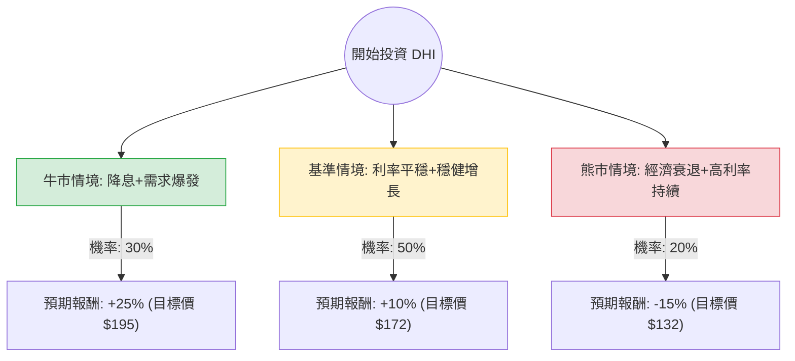

這份分析報告將針對美國最大的房屋建造商 **D.R. Horton (DHI)** 進行評估。我們將結合您提供的財務數據與當前市場動態（如聯準會利率政策、美國房市供需）進行「決策樹」與「期望值」分析。

---

### 一、 核心假設與市場背景分析

在建立決策樹之前，我們基於最新資訊設定以下核心假設：

1.  **利率環境（關鍵變數）：** 市場普遍預期聯準會（Fed）將在 2024 年下半年啟動降息。降息將降低抵押貸款利率，刺激購屋需求。
2.  **住房供應短缺：** 美國成屋供應量持續低迷（屋主因低利率鎖定效應不願賣房），這使得買方轉向新成屋，對 DHI 等大型建商有利。
3.  **DHI 競爭優勢：** DHI 專注於「入門級」住房，並透過提供「抵押貸款利率補貼（Rate Buy-downs）」來吸引買家，這使其在利率高企時仍能維持銷量。
4.  **財務穩健度：** 債務股本比（Debt/Eq）僅 0.25，流動比率（Current Ratio）高達 8.62，顯示其抗風險能力極強。

---

### 二、 決策樹分析 (Decision Tree)

以下為 DHI 未來一年的投資決策樹模型：

#### 節點詳細說明：

1.  **牛市情境 (Optimistic Case) - 30% 機率**
    *   **條件：** 聯準會降息幅度超預期，房貸利率降至 6% 以下，成屋庫存持續短缺。
    *   **預期報酬：** +25%。DHI 的 EPS 增長預期（15.97%）完全兌現，且本益比（P/E）從 13.5 倍修復至歷史高位 16 倍。
2.  **基準情境 (Base Case) - 50% 機率**
    *   **條件：** 利率緩步下降或維持現狀，美國經濟實現軟著陸，DHI 透過補貼維持市佔率。
    *   **預期報酬：** +10%。接近分析師平均目標價 $162.71，加上約 1% 的股息收益。
3.  **熊市情境 (Pessimistic Case) - 20% 機率**
    *   **條件：** 通膨反彈導致利率再度上升，或失業率飆升導致購屋能力崩潰。
    *   **預期報酬：** -15%。股價回測 52 週低點區域，估值受壓。

---

### 三、 期望值分析 (Expected Value Analysis)

我們根據上述情境計算投資 DHI 一年的預期總報酬率：

#### 1. 計算過程：
$$EV = (P_{Bull} \times R_{Bull}) + (P_{Base} \times R_{Base}) + (P_{Bear} \times R_{Bear})$$

*   $P$ = 發生機率 (Probability)
*   $R$ = 預期報酬率 (Return)

**計算：**
*   牛市：$0.30 \times 25\% = 7.5\%$
*   基準：$0.50 \times 10\% = 5.0\%$
*   熊市：$0.20 \times (-15\%) = -3.0\%$

**總期望報酬率 (Total EV)：**
$$7.5\% + 5.0\% - 3.0\% = 9.5\%$$

#### 2. 財務數據支持點：
*   **Forward P/E (12.13)：** 低於當前 P/E (13.53)，顯示市場預期未來獲利將增長。
*   **PEG (1.36)：** 考慮到增長率，估值尚屬合理（通常 < 1 為極便宜，1-1.5 為合理）。
*   **ROE (14.48%)：** 獲利能力穩健，優於許多同業。
*   **技術面：** 股價位於 SMA20, 50, 200 之上，呈現多頭排列。

---

### 四、 最終結論

#### **判斷：適合投資 (Buy / Overweight)**

#### **理由總結：**
1.  **正向期望值：** 經過風險加權後的預期報酬率為 **9.5%**，優於無風險利率（美債約 4.5%）及多數保守型投資工具。
2.  **極佳的防禦性：** DHI 擁有極高的流動比率 (8.62) 與極低的負債比 (0.25)，即使面臨短期經濟波動，破產或財務危機的風險極低。
3.  **產業結構性利多：** 美國住房供應短缺是長期問題，DHI 作為產業龍頭，擁有規模經濟優勢，能比小建商提供更好的融資補貼方案來鎖定客戶。
4.  **估值合理：** 目前 P/E 僅 13.5 倍，相對於其在產業中的壟斷地位與未來 EPS 15.97% 的增長預期，股價並未過熱。

**建議操作策略：**
*   **進場點：** 目前股價 $155.96 接近 SMA20，可考慮分批進場。
*   **止損點：** 若跌破 52 週低點支撐（約 $110-$120 區間）或美國失業率大幅攀升至 5% 以上，需重新評估。
*   **持有期限：** 建議持有 6-12 個月，以等待降息循環對房市的實質推動。

***

**風險提示：** 房地產板塊對利率極度敏感。若聯準會因通膨反彈而意外升息，或房貸利率長期維持在 7% 以上，DHI 的利潤空間（Gross Margin 23.7%）可能會因過度補貼而受壓。