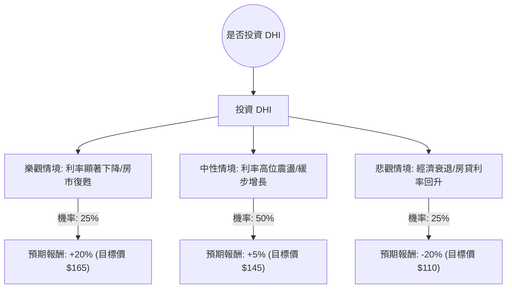

這份分析報告將結合您提供的財務數據與最新的市場動態（包含 2024 年第四季財報表現與 2025 年展望），利用**決策樹（Decision Tree）**與**期望值分析（Expected Value Analysis）**評估 D.R. Horton (DHI) 的投資價值。

---

### 1. 市場現況與核心假設

在進行計算前，我們先整合最新的外部資訊：
*   **最新財報表現**：DHI 近期公布的 2024 財年第四季財報顯示，營收與獲利均低於市場預期。主要原因是高房貸利率導致買方觀望，公司必須增加「利率買斷（Rate Buy-downs）」等促銷激勵措施，這直接壓縮了毛利率。
*   **2025 展望**：公司給出的 2025 年交屋指引（90,000 - 92,000 戶）低於分析師預期，顯示短期內增長放緩。
*   **總體經濟**：聯準會雖啟動降息，但長端利率（如 10 年期美債）近期回升，導致房貸利率維持在 6.5% - 7% 高位，壓抑房市復甦。
*   **估值面**：目前 P/E 約 12.5 倍，處於歷史合理區間；債務股本比（Debt/Eq）僅 0.23，財務結構極其穩健。

---

### 2. 決策樹分析 (Decision Tree)

我們將未來一年的表現分為三種情境：**樂觀（牛市）**、**中性（基準）**、**悲觀（熊市）**。

#### 決策樹節點詳細說明：

| 情境 | 機率 (P) | 預期報酬 (R) | 說明 |
| :--- | :--- | :--- | :--- |
| **樂觀 (Bull)** | 25% | +20% | 聯準會降息路徑明確，房貸利率降至 6% 以下，剛需釋放，毛利率回升。 |
| **中性 (Base)** | 50% | +5% | 利率維持在 6.5% 左右，DHI 繼續靠促銷維持市佔，獲利持平，股價隨大盤波動。 |
| **悲觀 (Bear)** | 25% | -20% | 通膨反彈導致利率再升，或失業率上升導致房市崩潰，股價回測 52 週低點。 |

---

### 3. 期望值計算 (Expected Value Analysis)

**計算公式：**
$EV = (P_{Bull} \times R_{Bull}) + (P_{Base} \times R_{Base}) + (P_{Bear} \times R_{Bear})$

**計算過程：**
1.  **樂觀貢獻**：$0.25 \times 20\% = 5.0\%$
2.  **中性貢獻**：$0.50 \times 5\% = 2.5\%$
3.  **悲觀貢獻**：$0.25 \times (-20\%) = -5.0\%$

**總期望報酬率：**
$EV = 5.0\% + 2.5\% - 5.0\% = \mathbf{2.5\%}$

---

### 4. 核心假設與風險評估

1.  **利率敏感度**：DHI 的股價與 10 年期美債殖利率呈高度負相關。目前的計算假設利率不會在短期內大幅下降。
2.  **毛利率壓力**：數據顯示 Gross Margin 為 23.27%，但最新財報顯示該數值正在下滑。若 2025 年促銷成本持續上升，期望值將進一步下修。
3.  **技術面弱勢**：SMA20 (-8.03%)、SMA50 (-10.3%)、SMA200 (-8.94%) 全數呈現負值，顯示目前處於空頭排列，短期內有進一步下探風險。
4.  **財務韌性**：Current Ratio 高達 11.92，Debt/Eq 僅 0.23。這意味著 DHI 沒有破產風險，適合長期持有者，但對追求短期爆發力的投資者不利。

---

### 5. 最終結論

#### **判斷：暫不適合投資 (觀望 / Neutral)**

**理由：**
1.  **期望值過低**：計算出的預期報酬率僅為 **2.5%**，遠低於標普 500 指數的歷史平均報酬率，且考慮到目前美債殖利率約 4.3%-4.5%，投資 DHI 的風險溢酬（Risk Premium）不足。
2.  **基本面轉弱**：最新財報顯示營收與指引雙雙失守，市場正在消化「高利率環境將持續更久」的預期，DHI 的促銷成本將持續拖累獲利。
3.  **技術面探底**：股價目前低於所有主要均線，且過去一個月跌幅達 17.5%，顯示市場信心潰散，尚未出現止跌訊號。
4.  **資金效率**：雖然 P/E 12.5 倍看似便宜，但在房市下行週期，低估值往往是「價值陷阱」。

**建議：**
待股價站穩 **SMA200 ($151 附近)** 或 **房貸利率出現明確下行趨勢** 後再行介入。目前 DHI 雖然是一家財務極其穩健的好公司，但當前並非最佳的進場時機。