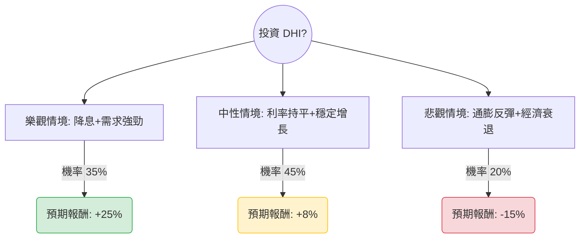

這份分析報告將結合您提供的 **D.R. Horton (DHI)** 基本面數據，以及當前美股市場的最新動態（如聯準會利率政策、房地產市場趨勢）進行綜合評估。

---

### 一、 市場最新動態與產業趨勢分析

在進入決策樹之前，我們先整合最新的市場資訊：
1.  **利率環境**：聯準會（Fed）目前維持利率不變，但市場預期 2024 年下半年可能降息。房貸利率的波動直接影響 DHI 的銷量。
2.  **成屋庫存短缺**：全美成屋供應量依然偏低，這迫使買家轉向新成屋市場，對身為全美最大建商的 DHI 極為有利。
3.  **公司策略**：DHI 專注於「入門級」住房，並透過「買低房貸利率（Rate Buy-downs）」補貼政策吸引買家，這使其在競爭中保持高市佔率。
4.  **財務體質**：數據顯示其 **Debt/Eq 僅 0.23**，財務極為穩健；**Forward P/E 12.57** 低於歷史平均，顯示估值尚屬合理。

---

### 二、 決策樹分析（Decision Tree）

我們將未來一年的投資情境分為三種主要路徑：**樂觀（牛市）**、**中性（基準）**、**悲觀（熊市）**。

#### 節點詳細說明：

1.  **樂觀情境 (Bull Case) - 35% 機率**：
    *   **條件**：聯準會於下半年明確降息 2-3 碼，房貸利率回落至 6% 以下。
    *   **預期報酬**：股價挑戰 52 週高點甚至突破，預估回升至 $185 左右（約 +23.5%），加上股息約 **+25%**。
2.  **中性情境 (Base Case) - 45% 機率**：
    *   **條件**：利率維持高檔震盪，但 DHI 憑藉規模優勢與補貼政策維持銷量，EPS 達成預期的 15.46% 增長。
    *   **預期報酬**：股價向分析師目標價 $154.93 靠攏，考慮到當前 SMA20 的上升趨勢，預估總報酬約 **+8%**。
3.  **悲觀情境 (Bear Case) - 20% 機率**：
    *   **條件**：通膨意外反彈導致 Fed 再次升息，或美國陷入深度衰退導致失業率飆升。
    *   **預期報酬**：股價回測 52 週低點支撐位（約 $120-$125），預估總報酬約 **-15%**。

---

### 三、 期望值分析（Expected Value Analysis）

#### 1. 核心假設
*   **當前股價**：$149.81
*   **持有期限**：12 個月
*   **EPS 增長預期**：參考數據 `EPS next Y_%: 0.1546`，顯示市場對其明年獲利仍有雙位數增長期待。
*   **估值倍數**：假設 P/E 維持在 12-14 倍之間。

#### 2. 計算過程
期望值 (EV) = Σ (各情境機率 × 各情境報酬)

*   **EV = (0.35 × 0.25) + (0.45 × 0.08) + (0.20 × -0.15)**
*   **EV = 0.0875 + 0.036 - 0.03**
*   **EV = 0.0935**

**最終期望報酬率：9.35%**

---

### 四、 綜合評估與最終結論

#### 1. 數據亮點總結
*   **安全性**：`Debt/Eq 0.23` 與 `Current Ratio 11.92` 顯示該公司擁有極強的抗風險能力，即便市場轉差，倒閉風險極低。
*   **成長性**：`Forward P/E 12.57` 低於當前 P/E，且 `EPS next Y` 預期增長 15.46%，顯示目前股價並未過度泡沫化。
*   **技術面**：`SMA20 (+6.98%)` 與 `SMA50 (+0.88%)` 均呈現黃金交叉後的向上趨勢，短期動能強勁。

#### 2. 投資建議：**適合投資 (Buy / Overweight)**

**理由：**
1.  **期望值為正**：9.35% 的預期報酬率在當前高利率環境下具有吸引力，且風險回報比（Risk-Reward Ratio）合理。
2.  **產業護城河**：DHI 作為產業龍頭，在成屋供應短缺的結構性問題下，擁有定價權與補貼能力，能有效抵禦高利率衝擊。
3.  **估值合理**：PEG 為 1.8，雖非極度便宜，但考量到其 ROE (13.63%) 與穩健的資產負債表，目前的 P/E 13.6 倍屬於合理區間。

**操作建議：**
*   **進場點**：目前股價 $149.81 接近 SMA50，可考慮分批進場。
*   **停損點**：若股價跌破 $135（跌破 SMA200 且基本面惡化），應重新評估。
*   **獲利了結**：首波目標價設在 $165 - $170 區間。

---
*免責聲明：本分析僅供參考，不構成具體投資建議。投資股票具有風險，入市前請務必自行審慎評估。*