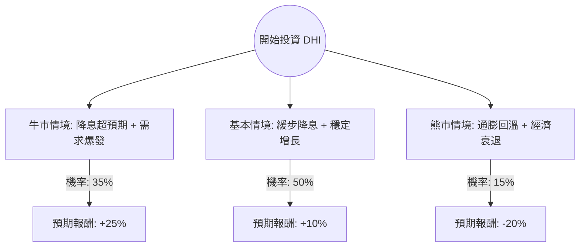

這份分析報告將結合您提供的財務數據與最新的市場動態（聯準會降息預期、美國房市供需、D.R. Horton 最新財報），利用**決策樹（Decision Tree）**與**期望值分析（Expected Value Analysis）**評估 DHI 的投資價值。

---

### 1. 市場現況與核心假設

在建立決策樹之前，我們先整合最新資訊：
*   **宏觀環境：** 聯準會（Fed）已進入降息週期。房貸利率下降將直接刺激購屋需求，對 DHI 這種專注於首購族的建商極為有利。
*   **產業趨勢：** 美國成屋庫存依然短缺，買方轉向新成屋。DHI 作為全美最大建商，擁有規模經濟優勢。
*   **財務表現：** DHI 的 P/E (15.23) 與 Forward P/E (13.75) 處於歷史合理區間。ROE (13.63%) 與極低的負債比 (Debt/Eq 0.23) 顯示財務結構極其穩健。
*   **風險點：** 為了維持銷量，DHI 頻繁使用「買低利率（Rate Buydowns）」促銷，這會壓縮毛利率（Gross Margin 23.27% 已較高峰下滑）。

---

### 2. 決策樹分析 (Decision Tree)

我們以未來 12 個月的投資回報為目標，設定三種主要情境：

#### 節點詳細說明：

| 情境節點 | 發生機率 (P) | 預期報酬 (R) | 說明 |
| :--- | :--- | :--- | :--- |
| **牛市情境 (Bull)** | 35% | +25% | Fed 降息節奏快，房貸利率降至 6% 以下，帶動 EPS 增長超預期（預估 EPS Next Y 16.22% 達標並超越）。 |
| **基本情境 (Base)** | 50% | +10% | 利率緩降，成屋庫存維持低位。DHI 透過促銷維持市佔，股價隨盈利穩定增長，接近歷史高點。 |
| **熊市情境 (Bear)** | 15% | -20% | 通膨反彈導致 Fed 停止降息，或失業率飆升導致房市崩盤。DHI 必須進一步犧牲毛利清庫存。 |

---

### 3. 期望值計算過程 (Expected Value Calculation)

期望值 (EV) 的計算公式為：
$$EV = \sum (Probability_i \times Return_i)$$

**計算步驟：**
1.  **牛市貢獻：** $0.35 \times 25\% = 8.75\%$
2.  **基本情境貢獻：** $0.50 \times 10\% = 5.0\%$
3.  **熊市貢獻：** $0.15 \times (-20\%) = -3.0\%$

**總期望報酬率：**
$$8.75\% + 5.0\% - 3.0\% = 10.75\%$$

---

### 4. 核心假設與數據支持

1.  **估值合理性：** 目前 P/E 15.23 倍，對比標普 500 指數（約 20-22 倍）具有明顯折價。考慮到 DHI 的龍頭地位與 13.6% 的 ROE，下行空間受限。
2.  **增長動能：** 數據顯示 EPS Next Y 預期增長 16.22%，這與降息循環帶來的房市復甦邏輯一致。
3.  **技術面：** 股價目前在 SMA20, 50, 200 之上（分別高出 7.9%~13.2%），顯示短期與長期趨勢皆為多頭，但需注意目前股價 ($167.78) 已高於分析師平均目標價 ($160.86)，這暗示短期可能會有震盪回檔。
4.  **財務韌性：** Current Ratio 高達 11.92，Debt/Eq 僅 0.23，這意味著即便進入熊市情境，DHI 也有極強的抗風險能力，不會出現流動性危機。

---

### 5. 最終結論

**評估結果：適合投資 (Buy / Overweight)**

#### 理由：
1.  **正向期望值：** 經過決策樹分析，DHI 的年度預期報酬率約為 **10.75%**，優於多數保守型投資工具，且風險回報比合理。
2.  **宏觀紅利：** DHI 是降息循環的核心受益股。在美國住房結構性短缺的背景下，新屋開工的需求具有剛性。
3.  **財務防禦力：** 極低的負債率與強大的現金流（P/FCF 13.98）為投資者提供了良好的安全邊際。
4.  **操作建議：** 由於目前股價略高於分析師目標價且近期漲幅較大（Perf Year 29.72%），建議採取**分批進場**策略，或等待股價回測 SMA50（約 153-155 美元區間）時加碼，以優化成本。

**風險提示：** 需密切關注美國非農就業數據。若失業率大幅上升，將抵消降息對房市的利多。