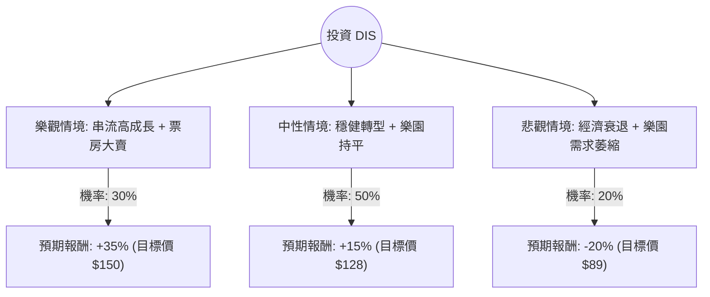

這份分析報告結合了您提供的基本面數據與最新的市場動態（包含 2024 年第二季財報表現、串流媒體獲利轉正、以及樂園業務的展望），利用**決策樹（Decision Tree）**與**期望值分析（Expected Value Analysis）**評估華特迪士尼公司（DIS）的投資價值。

---

### 一、 核心假設與市場動態分析

在建立決策樹前，我們先設定核心假設：
1.  **串流媒體（DTC）轉折點**：迪士尼串流業務（Disney+ & Hulu）已首次實現季度盈利，未來獲利能力的持續性是關鍵。
2.  **樂園與體驗業務**：雖然是現金牛，但近期財報顯示美國本土樂園需求有放緩跡象，受通膨與消費者支出減弱影響。
3.  **內容產出**：近期《腦筋急轉彎 2》與《死侍與鋼鐵人》票房大賣，顯示內容實力回升。
4.  **估值基準**：目前股價約 $111，分析師平均目標價約 $133.67（約 20% 漲幅空間）。

---

### 二、 決策樹分析圖 (Decision Tree)

我們將未來一年的情境分為：**樂觀（Bull）**、**中性（Base）**、**悲觀（Bear）**。

#### 決策樹節點詳細說明：

| 節點名稱 | 發生機率 (P) | 預期報酬 (R) | 說明 |
| :--- | :--- | :--- | :--- |
| **樂觀情境 (Bull)** | 30% | +35% | 串流利潤大幅擴張，電影票房連連破紀錄，宏觀經濟軟著陸帶動樂園消費。 |
| **中性情境 (Base)** | 50% | +15% | 串流維持小幅獲利，傳統電視衰退速度符合預期，股價回歸平均目標價。 |
| **悲觀情境 (Bear)** | 20% | -20% | 美國消費支出嚴重下滑衝擊樂園，串流訂閱戶因漲價流失，內容表現不穩定。 |

---

### 三、 期望值計算過程 (Expected Value Calculation)

期望值（EV）的計算公式為：
$$EV = \sum (機率 \times 預期報酬)$$

**計算步驟：**
1.  **樂觀貢獻**：$0.30 \times 35\% = 10.5\%$
2.  **中性貢獻**：$0.50 \times 15\% = 7.5\%$
3.  **悲觀貢獻**：$0.20 \times (-20\%) = -4.0\%$

**總期望報酬率：**
$$10.5\% + 7.5\% - 4.0\% = 14.0\%$$

**換算為預期股價：**
目前股價 $111.20 \times (1 + 14.0\%) \approx \mathbf{\$126.77}$

---

### 四、 綜合基本面與即時資訊評估

1.  **財務健康度**：
    *   **P/E (16.33)** 與 **Forward P/E (15.19)**：相較於歷史平均與標普 500 指數，目前估值處於合理偏低區間。
    *   **PEG (1.28)**：顯示其增長速度與估值匹配，並未過度泡沫。
    *   **ROE (11.78%)**：正在回升中，顯示管理層資本運用效率改善。
2.  **技術面與籌碼**：
    *   股價目前在 SMA200 ($110 附近) 震盪，具備支撐。
    *   空單比率 (Short Float 1.23%) 極低，市場並無強烈看空情緒。
3.  **最新動態補充**：
    *   迪士尼已恢復派息（殖利率 1.12%），並啟動庫藏股買回計畫，這對股價有下行保護作用。
    *   串流媒體整合（Disney+, Hulu, ESPN+）的綜效開始顯現，有助於降低獲客成本。

---

### 五、 最終結論

#### **判斷：適合投資 (Buy / Overweight)**

**理由如下：**
1.  **正向期望值**：經決策樹分析，預期報酬率為 **14.0%**，明顯高於無風險利率及市場平均預期。
2.  **獲利轉折點已現**：串流業務轉盈是迪士尼近年最大的利空出盡，這將改變市場對其估值邏輯（從燒錢轉向獲利）。
3.  **安全邊際**：目前 P/E 僅 16 倍，且股價距離 52 週高點仍有約 10% 空間，距離分析師目標價有 20% 空間，具備一定的安全邊際。
4.  **內容週期回升**：2024 下半年至 2025 年的電影排片強勁，有助於帶動周邊與樂園熱度。

**風險提示：**
*   需密切觀察**美國消費數據**，若樂園業務（Experiences）利潤下滑超過串流業務的增長，股價可能回測 $90-$100 區間。
*   **傳統電視（Linear TV）**的衰退速度若加快，將持續拖累整體營收增速。

**建議操作策略：**
可在 $110 附近分批布局，首個目標價設為 $128 (中性情境)，若串流利潤持續擴大則可持有至 $140 以上。