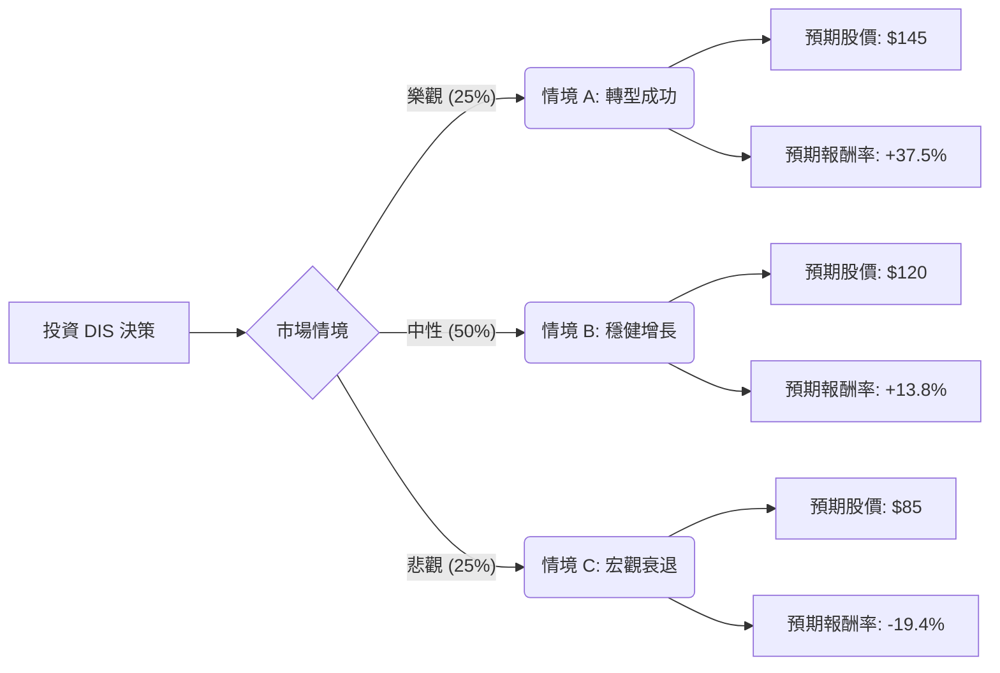

這份分析報告結合了您提供的基本面數據，以及最新的市場動態（包含 2024 年第二季財報表現、串流媒體轉虧為盈、樂園業務展望及宏觀經濟影響），利用**決策樹（Decision Tree）**與**期望值（Expected Value）**進行評估。

---

### 一、 核心假設與市場現況分析

在構建決策樹之前，我們基於最新資訊設定以下核心假設：

1.  **串流媒體轉折點**：Disney+ 娛樂部門已首次實現盈利。假設未來一年內，串流業務的利潤貢獻將決定估值修復的速度。
2.  **樂園業務（Experiences）**：目前是 DIS 的現金牛，但管理層警告需求正在「正常化」（即增長放緩）。
3.  **線性電視（Linear TV）**：傳統電視廣告與訂閱收入持續萎縮，這是一個結構性衰退，需靠 ESPN 轉型來抵銷。
4.  **估值修復**：目前 P/E 約 15.5 倍，處於歷史低位。分析師平均目標價為 $134.85，隱含約 28% 的上漲空間。

---

### 二、 決策樹分析圖 (Decision Tree)

我們將未來一年的情境分為三種：**樂觀（Bull）**、**中性（Base）**、**悲觀（Bear）**。

#### 節點詳細說明：

| 節點 (情境) | 機率 (P) | 預期股價 (Target) | 預期報酬率 (R) | 說明 |
| :--- | :--- | :--- | :--- | :--- |
| **樂觀 (Bull)** | 25% | $145 | +37.5% | 串流利潤大幅增長，電影票房（如《腦筋急轉彎2》）大賣，樂園維持高利潤。 |
| **中性 (Base)** | 50% | $120 | +13.8% | 串流維持微利，樂園增長放緩但穩定，EPS 符合預期（$4.7+）。 |
| **悲觀 (Bear)** | 25% | $85 | -19.4% | 美國消費支出疲軟衝擊樂園，線性電視衰退加速，宏觀經濟進入衰退。 |

---

### 三、 期望值 (Expected Value) 計算過程

我們以目前股價 **$105.45** 為基準進行計算。

#### 1. 預期股價期望值計算：
$$EV_{Price} = (P_{Bull} \times Price_{Bull}) + (P_{Base} \times Price_{Base}) + (P_{Bear} \times Price_{Bear})$$
$$EV_{Price} = (0.25 \times 145) + (0.50 \times 120) + (0.25 \times 85)$$
$$EV_{Price} = 36.25 + 60 + 21.25 = \mathbf{\$117.5}$$

#### 2. 預期報酬率期望值計算：
$$EV_{Return} = (0.25 \times 37.5\%) + (0.50 \times 13.8\%) + (0.25 \times -19.4\%)$$
$$EV_{Return} = 9.375\% + 6.9\% - 4.85\% = \mathbf{11.425\%}$$

#### 3. 核心財務指標支持：
*   **Forward P/E (14.38)**：低於標普 500 平均水平，顯示下行風險受限。
*   **PEG (1.28)**：顯示相對於其盈利增長，股價並未過度高估。
*   **技術面**：目前股價低於 SMA20, 50, 200，顯示短期趨勢偏弱，但處於超賣區間，適合價值投資者分批佈局。

---

### 四、 最終結論

#### **評估結果：適合投資 (分批買入)**

**判斷理由：**

1.  **正向期望值**：計算出的期望報酬率為 **11.4%**，且預期股價期望值 **$117.5** 高於當前市價。這顯示在考慮風險後，該投資仍具備正向收益潛力。
2.  **估值安全邊際**：DIS 目前的 P/E 處於歷史低位區間，且 Forward P/E 僅 14 倍。對於一家擁有全球最強 IP 護城河的公司來說，目前的價格具有吸引力。
3.  **基本面轉折**：串流媒體業務轉虧為盈是重大利多，這解決了過去幾年市場對其「燒錢」的擔憂。雖然樂園業務增速放緩，但其高利潤率仍能提供穩定的現金流。
4.  **風險提示**：短期內技術面呈現空頭排列（SMA 指標皆為負），且宏觀經濟對消費者支出的影響仍有不確定性。

**建議策略：**
由於目前股價處於 52 週區間的中低位（$105.45 接近 $80-$124 的中軸偏下），建議採取**分批進場（Dollar Cost Averaging）**策略，以應對短期內可能因宏觀數據波動導致的股價回落，長期目標看好其回歸 $120-$130 的價值區間。