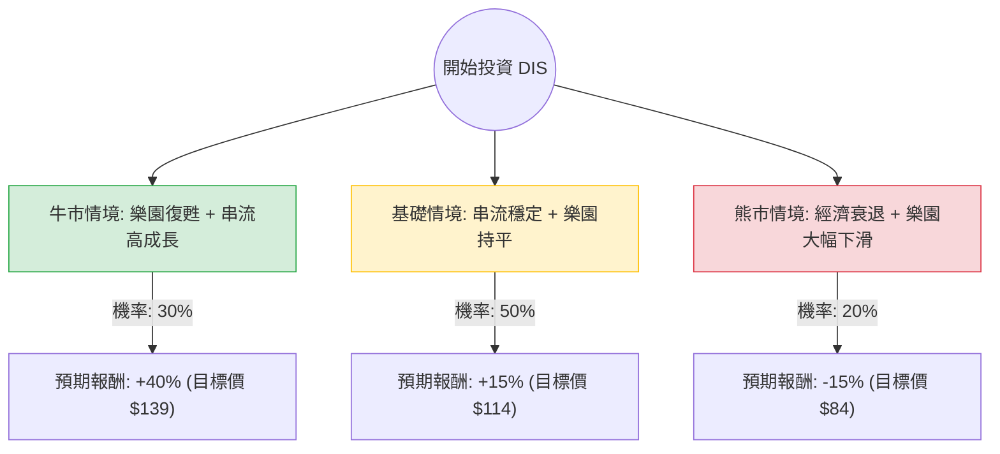

這份分析報告結合了您提供的基本面數據，以及最新的市場動態（包含 2024 年第三季財報表現、串流媒體獲利轉正、以及主題樂園需求放緩等資訊），透過**決策樹（Decision Tree）**與**期望值（Expected Value）**進行評估。

---

### 一、 核心假設與市場背景分析

在建立決策樹之前，我們基於最新資訊設定以下核心假設：

1.  **串流媒體轉捩點**：Disney+ 與整體串流部門已首次實現營業利潤轉正。假設未來一年此趨勢持續，將成為利潤增長引擎。
2.  **樂園業務放緩**：最新財報顯示美國本土樂園需求因通膨與消費者支出疲軟而放緩，這是一個主要的下行風險。
3.  **內容產出回溫**：隨著《腦筋急轉彎 2》與《死侍與鋼鐵人》票房大賣，電影部門（Studio）進入強勢週期。
4.  **估值水平**：目前 Forward P/E 約 13.55 倍，低於歷史平均，顯示股價處於相對低位。

---

### 二、 決策樹分析 (Decision Tree)

以下為 DIS 未來一年的投資情境決策樹：

#### 節點詳細說明：

1.  **牛市情境 (Optimistic Case) - 30% 機率**
    *   **條件**：美國經濟軟著陸，消費者支出回升；串流媒體利潤率快速擴張；電影票房持續爆發。
    *   **預期報酬**：+40%（接近分析師目標價 $133.84 並考慮超額表現）。
    *   **期望值貢獻**：$0.30 \times 40\% = 12\%$

2.  **基礎情境 (Base Case) - 50% 機率**
    *   **條件**：串流媒體維持小幅獲利；樂園業務受通膨影響維持平淡但未衰退；公司執行成本削減計畫。
    *   **預期報酬**：+15%（股價回歸至 SMA200 以上並修復估值）。
    *   **期望值貢獻**：$0.50 \times 15\% = 7.5\%$

3.  **熊市情境 (Pessimistic Case) - 20% 機率**
    *   **條件**：美國進入經濟衰退，高利潤的樂園業務大幅下滑；串流媒體訂閱數因競爭加劇而流失。
    *   **預期報酬**：-15%（回測 52 週低點 $80 附近）。
    *   **期望值貢獻**：$0.20 \times (-15\%) = -3\%$

---

### 三、 期望值分析 (Expected Value Calculation)

根據上述決策樹，我們計算 DIS 的**總體預期報酬率 (Expected Return)**：

$$E(R) = (P_{Bull} \times R_{Bull}) + (P_{Base} \times R_{Base}) + (P_{Bear} \times R_{Bear})$$

**計算過程：**
1.  牛市：$0.30 \times 0.40 = 0.12$ (12%)
2.  基礎：$0.50 \times 0.15 = 0.075$ (7.5%)
3.  熊市：$0.20 \times (-0.15) = -0.03$ (-3%)

**總期望報酬率：**
$$12\% + 7.5\% - 3\% = \mathbf{16.5\%}$$

---

### 四、 綜合評估與最終結論

#### 1. 基本面數據支持點：
*   **估值吸引力**：Forward P/E 13.55 與 PEG 1.23 顯示目前股價並未過熱，相較於標普 500 平均水平具有防禦性。
*   **財務結構**：Debt/Eq 0.43 顯示債務壓力尚在可控範圍，且 P/FCF (24.91) 顯示現金流產生能力正在改善。
*   **技術面背離**：雖然目前股價低於 SMA20/50/200，呈現空頭排列，但這也意味著負面消息（樂園放緩）已大部分反映在股價中。

#### 2. 潛在風險：
*   **短期動能不足**：Perf Half Y (-15.19%) 顯示市場信心尚未恢復。
*   **宏觀環境**：若聯準會降息節奏不如預期，消費者對非必要支出（樂園旅遊）的壓抑將持續更久。

#### 3. 最終結論：**適合投資 (Buy/Accumulate)**

**理由：**
1.  **期望值為正 (16.5%)**：即便考慮了 20% 的衰退風險，整體的數學期望值仍顯著優於現金利率。
2.  **結構性轉變**：串流媒體轉虧為盈是 Disney 近年來最大的利多，這改變了公司的長期獲利結構。
3.  **安全邊際**：目前股價 ($99.2) 距離分析師平均目標價 ($133.84) 有約 35% 的上行空間，且 P/B 僅 1.63，下行風險相對有限。

**建議策略：**
由於技術面（SMA 指標）仍偏弱，建議採取**分批買入（Dollar Cost Averaging）**策略，以應對短期內可能因樂園業務數據波動帶來的股價震盪。