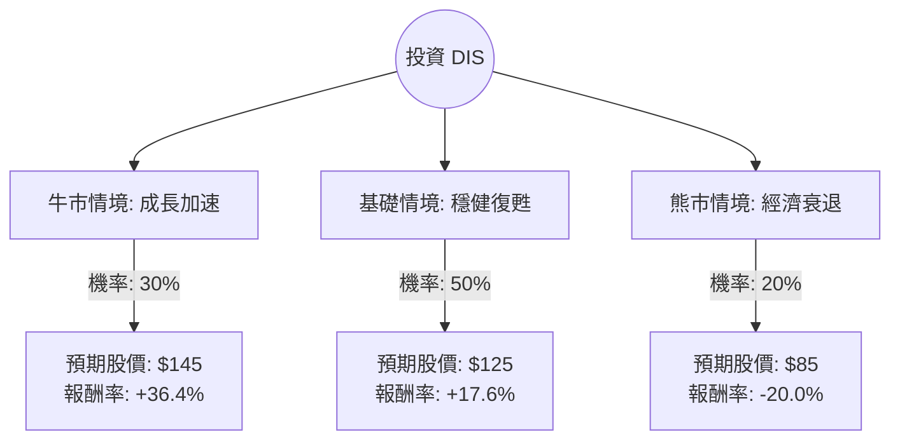

這份分析報告結合了您提供的基本面數據，以及最新的市場動態（包含 2024 年第三季財報表現、串流媒體獲利轉折、以及主題樂園的展望），利用**決策樹（Decision Tree）**與**期望值（Expected Value）**進行綜合評估。

---

### 一、 核心假設與市場動態分析

在建立決策樹之前，我們基於最新資訊設定以下核心假設：

1.  **串流媒體（DTC）轉虧為盈**：Disney+ 與 Hulu 首次實現季度盈利，這是 DIS 估值修復的關鍵。
2.  **主題樂園（Experiences）放緩**：管理層警告美國本土樂園需求因通膨與消費者支出疲軟而放緩，這將是短期最大的下行風險。
3.  **電影事業回溫**：隨著《腦筋急轉彎 2》與《死侍與鋼鐵人》票房大賣，內容事業部進入強勢週期。
4.  **宏觀環境**：聯準會（Fed）降息預期將有利於高負債比的資本密集產業（如樂園建設），並刺激消費。

---

### 二、 決策樹分析 (Decision Tree)

我們以未來 **12 個月** 的投資回報為目標，設定三種情境：

#### 節點詳細說明：

1.  **牛市情境 (Bull Case) - 30% 機率**：
    *   **條件**：串流媒體利潤率大幅提升；電影票房持續爆發；降息帶動樂園消費反彈。
    *   **預期股價**：$145（接近歷史高點區域與分析師樂觀目標）。
    *   **報酬率**：$(145 - 106.3) / 106.3 = 36.4\%$。

2.  **基礎情境 (Base Case) - 50% 機率**：
    *   **條件**：串流媒體維持小幅獲利；樂園業務持平；EPS 達到管理層預期的 30% 增長。
    *   **預期股價**：$125（接近分析師平均目標價 $131.62）。
    *   **報酬率**：$(125 - 106.3) / 106.3 = 17.6\%$。

3.  **熊市情境 (Bear Case) - 20% 機率**：
    *   **條件**：美國經濟陷入衰退，樂園收入大幅下滑；串流媒體訂閱數因漲價而流失。
    *   **預期股價**：$85（回測 52 週低點支撐區）。
    *   **報酬率**：$(85 - 106.3) / 106.3 = -20.0\%$。

---

### 三、 期望值分析 (Expected Value Analysis)

#### 1. 計算過程：
期望值 (EV) = (牛市報酬率 × 牛市機率) + (基礎報酬率 × 基礎機率) + (熊市報酬率 × 熊市機率)

*   **EV** = $(36.4\% \times 0.30) + (17.6\% \times 0.50) + (-20.0\% \times 0.20)$
*   **EV** = $10.92\% + 8.8\% - 4.0\%$
*   **EV** = **15.72%**

#### 2. 財務指標輔助驗證：
*   **Forward P/E (14.53)**：低於歷史平均與標普 500 平均，顯示估值具有吸引力。
*   **PEG (1.33)**：考慮到 EPS 預期增長，股價並未過度泡沫。
*   **Target Price ($131.62)**：目前的 $106.3 距離目標價仍有約 23% 的上漲空間。

---

### 四、 最終結論

**判斷：適合投資 (Buy / Overweight)**

#### 理由：
1.  **正向期望值**：計算出的預期報酬率為 **15.72%**，顯著高於無風險利率（美債殖利率約 4%）及市場平均預期回報。
2.  **結構性轉變**：迪士尼最燒錢的串流媒體業務已跨過損益兩平點，這將釋放大量自由現金流（P/FCF 目前為 26.67，未來有望下降）。
3.  **安全邊際**：目前股價雖較 52 週低點回升，但仍遠低於目標價，且 Forward P/E 僅 14.5 倍，對於一家擁有強大 IP 護城河的公司而言，下行風險相對可控。
4.  **技術面支撐**：SMA20 與 SMA50 均呈現正向走勢（+7.65%, +4.58%），顯示短期動能轉強，正在擺脫過去半年的低迷。

**風險提示**：
投資者應密切關注**主題樂園（Experiences）**的營收數據。若美國消費疲軟超乎預期，導致該高利潤部門大幅萎縮，則可能觸發「熊市情境」。建議分批進場，並以 $90 附近作為長期止損參考點。