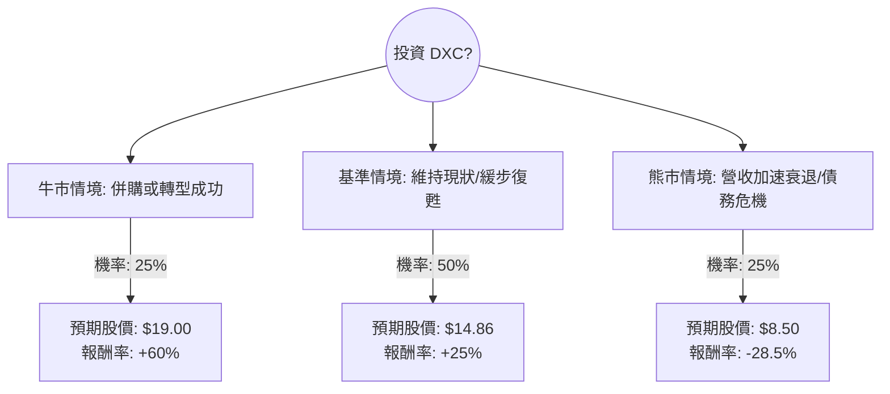

針對美股公司 **DXC Technology (DXC)** 的投資評估，我結合了您提供的基本面數據，並檢索了最新的市場動態（包括 2024 年 5 月發布的最新財報與管理層指引）。

以下是基於**決策樹分析**與**期望值分析**的詳細報告。

---

### 一、 核心背景與市場動態分析

在進入模型前，需掌握 DXC 的現狀：
1.  **估值極低**：P/S 僅 0.16，P/FCF 1.82，顯示市場對其成長性極度悲觀，但也意味著具備「深層價值（Deep Value）」。
2.  **轉型陣痛**：DXC 正處於從傳統 IT 外包轉向雲端與數據服務的長期轉型中。最新財報顯示營收持續萎縮（Sales Q/Q -0.96%），但 EPS 表現優於預期。
3.  **併購傳聞**：市場多次傳出私募股權基金（如 Apollo）或同業（如 Kyndryl）有意收購 DXC，這是一個潛在的暴漲催化劑。
4.  **財務壓力**：債務股本比（Debt/Eq）達 1.37，在高利率環境下具有一定風險。

---

### 二、 決策樹分析 (Decision Tree)

以下決策樹模擬未來 12 個月的投資情境：

#### 決策樹節點詳細說明：

1.  **牛市情境 (Bull Case) - 25% 機率**：
    *   **觸發條件**：公司被私募股權以溢價收購，或新任 CEO 成功縮減開支並恢復營收增長。
    *   **預期報酬**：參考歷史高點與併購溢價，目標價設定為 $19.00。
2.  **基準情境 (Base Case) - 50% 機率**：
    *   **觸發條件**：公司維持目前的獲利能力，營收微幅下滑但自由現金流穩定，市場給予估值修復（Mean Reversion）。
    *   **預期報酬**：參考分析師平均目標價 $14.86。
3.  **熊市情境 (Bear Case) - 25% 機率**：
    *   **觸發條件**：傳統業務流失速度超過新業務增長，債務利息負擔加重，股價跌破 52 週低點。
    *   **預期報酬**：預期股價下探至 $8.50。

---

### 三、 期望值分析 (Expected Value Analysis)

#### 1. 核心假設
*   **當前股價 ($P_0$)**：$11.88
*   **持有期限**：12 個月
*   **折現率**：不計入（純以資本利得計算）

#### 2. 計算過程
期望報酬率 ($E[R]$) 計算公式：
$$E[R] = \sum (P_i \times R_i)$$
其中 $P_i$ 為機率，$R_i$ 為該情境報酬率。

*   **牛市報酬 ($R_1$)**：$(19.00 - 11.88) / 11.88 = +59.93\% \approx 60\%$
*   **基準報酬 ($R_2$)**：$(14.86 - 11.88) / 11.88 = +25.08\% \approx 25\%$
*   **熊市報酬 ($R_3$)**：$(8.50 - 11.88) / 11.88 = -28.45\% \approx -28.5\%$

**期望值計算：**
$$E[R] = (0.25 \times 0.60) + (0.50 \times 0.25) + (0.25 \times -0.285)$$
$$E[R] = 0.15 + 0.125 - 0.07125$$
$$E[R] = 0.20375 = 20.38\%$$

---

### 四、 最終結論

#### **判斷：適合投資 (建議分批買進)**

#### **理由：**
1.  **正向期望值**：計算出的預期報酬率為 **20.38%**，遠高於市場平均預期，顯示目前的股價已過度反應負面消息，具備安全邊際。
2.  **極低估值提供保護**：P/B 0.64 且 P/S 0.16 意味著投資者是以低於清算價值的價格買入這家年營收百億美元的公司。即使轉型緩慢，只要不破產，估值回歸的機率極高。
3.  **現金流強勁**：P/FCF 僅 1.82，這在科技服務業中極其罕見，強大的現金流能支撐其償還債務或進行股票回購。
4.  **潛在催化劑**：高達 12.98% 的空單餘額（Short Float），一旦有任何併購消息或財報利多，極易引發「軋空（Short Squeeze）」行情。

#### **風險提示：**
*   **價值陷阱 (Value Trap)**：若營收持續以 5% 以上的速度萎縮，低估值可能會持續更久。
*   **技術面弱勢**：目前股價低於 SMA20, 50, 200，屬於空頭排列，建議採用**分批佈局**策略，而非一次性全倉投入。

**總結：DXC 是一檔典型的「高風險、高潛在回報」的價值股，適合追求超額報酬且能忍受波動的投資者。**