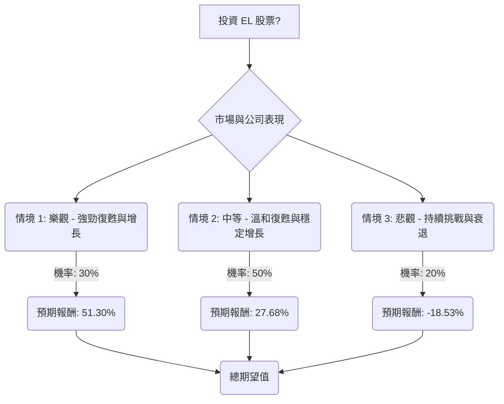

根據對美股公司 Estée Lauder (EL) 的基本面數據、「決策樹分析」與「期望值分析」，並參考最新的市場資訊，以下是評估其目前是否適合投資的分析。

**公司概況與近期表現：**
Estée Lauder (EL) 是一家全球領先的聲望美妝公司，產品涵蓋護膚、彩妝、香水和護髮。 儘管其擁有強大的品牌組合和高毛利率，但公司在近期面臨挑戰。

在 2024 財年第二季度（截至 2023 年 12 月 31 日），EL 的淨銷售額同比下降 7% 至 42.8 億美元，有機淨銷售額下降 8%。淨收益為 3.13 億美元，低於去年同期的 3.94 億美元。稀釋後每股收益為 0.87 美元，而去年同期為 1.09 美元。 這些下降主要歸因於亞洲旅遊零售的挑戰以及中國大陸聲望美妝市場的持續疲軟，以色列和中東地區的業務中斷也產生了不利影響。

然而，公司在某些領域也表現出亮點，例如 Clinique、The Ordinary 和 M·A·C 的淨銷售額實現了兩位數增長，香水業務中的 Le Labo 和 Jo Malone London 也表現強勁。

**未來展望與策略：**
Estée Lauder 正在實施一項名為「Beauty Reimagined」的策略和「利潤復甦計劃」，旨在改善銷售、擴大營運利潤率並提升每股收益。 管理層已上調 2026 財年的展望，預計有機淨銷售額增長 1% 至 3%，營運利潤率將提升至 9.8%-10.2%。 預計 2026 財年稀釋後每股收益為 2.05 至 2.25 美元，同比增長 36% 至 49%。

公司正積極拓展全通路銷售（包括 Amazon 和 TikTok Shop），並專注於創新（特別是護膚和高端香水，如 Tom Ford 和 The Ordinary），以吸引年輕消費者（Z 世代和千禧一代）。 此外，公司也在進行地域市場的重新平衡，減少對海南/韓國旅遊零售的依賴，轉而加強中國大陸、東南亞、印度、中東和美洲市場。

**分析師評級與目標價：**
分析師對 EL 的共識評級介於「持有」至「溫和買入」之間。 12 個月平均目標價約在 100.20 美元至 112.81 美元之間，最高目標價為 130-140 美元，最低目標價為 60-73 美元。目前股價約為 85.92 美元。

---

### 1. 決策樹分析 (Decision Tree Analysis)

**核心假設：**
*   **市場趨勢**：全球聲望美妝市場將持續增長，由個性化、數位化參與和新興市場推動。
*   **公司財務**：Estée Lauder 的「Beauty Reimagined」策略和利潤復甦計劃對於改善銷售、利潤率和每股收益至關重要。 公司的高毛利率和良好的流動性提供了緩衝。
*   **產業動態**：向線上通路（Amazon、TikTok Shop）的轉變以及對年輕消費群體（Z 世代、千禧一代）的關注是增長的關鍵。 護膚和奢侈香水（Tom Ford、The Ordinary）的創新是核心。 中國市場和旅遊零售的挑戰預計將穩定或改善。

**決策點：投資 EL 股票**

**情境說明與預期報酬計算：**

*   **當前股價 (Close)**: 85.92 美元

1.  **情境 1: 樂觀 - 強勁復甦與增長**
    *   **預測情境名稱**：Estée Lauder 成功執行其「Beauty Reimagined」策略和利潤復甦計劃。中國市場強勁反彈，旅遊零售改善，新產品創新（如 Tom Ford、The Ordinary、Clinique）受到消費者青睞，特別是 Z 世代和千禧一代。數位通路擴張帶來顯著銷售增長。營運利潤率按預期擴大。
    *   **機率 (Probability)**：30%
    *   **預期報酬 (Expected Return)**：假設股價達到分析師目標價的高端，例如 130 美元。
        *   報酬率 = (130 美元 - 85.92 美元) / 85.92 美元 = 51.30%
    *   **期望值 (Expected Value)**：30% * 51.30% = 15.39%

2.  **情境 2: 中等 - 溫和復甦與穩定增長**
    *   **預測情境名稱**：Estée Lauder 的轉型進展穩定但非驚人。中國市場和旅遊零售逐步改善。創新帶來溫和的提升。成本削減措施產生效果，每股收益實現緩慢但持續的增長。
    *   **機率 (Probability)**：50%
    *   **預期報酬 (Expected Return)**：假設股價達到分析師平均目標價，例如 109.7 美元（來自提供數據的目標價）。
        *   報酬率 = (109.7 美元 - 85.92 美元) / 85.92 美元 = 27.68%
    *   **期望值 (Expected Value)**：50% * 27.68% = 13.84%

3.  **情境 3: 悲觀 - 持續挑戰與衰退**
    *   **預測情境名稱**：Estée Lauder 的轉型努力受挫。中國市場因經濟放緩或競爭加劇而持續疲軟或惡化。旅遊零售持續拖累業績。新產品推出未能獲得顯著關注。激烈競爭和宏觀經濟逆風侵蝕市場份額。利潤復甦計劃面臨重大阻力。
    *   **機率 (Probability)**：20%
    *   **預期報酬 (Expected Return)**：假設股價跌至分析師目標價的低端，例如 70 美元（介於 60 美元和 73 美元之間）。
        *   報酬率 = (70 美元 - 85.92 美元) / 85.92 美元 = -18.53%
    *   **期望值 (Expected Value)**：20% * -18.53% = -3.71%

---

### 2. 期望值分析 (Expected Value Analysis)

**總期望值計算：**

將所有情境的期望值加總：
總期望值 = (情境 1 期望值) + (情境 2 期望值) + (情境 3 期望值)
總期望值 = 15.39% + 13.84% + (-3.71%)
總期望值 = 25.52%

---

### 3. 最終結論

根據決策樹分析和期望值分析，投資 Estée Lauder (EL) 股票的**整體期望值為 25.52%**。

**判斷：適合投資**

**簡短理由：**
儘管 Estée Lauder 在近期面臨中國市場疲軟和旅遊零售挑戰等逆風，導致其過去 12 個月未能實現盈利，但公司正在積極實施全面的「Beauty Reimagined」策略和「利潤復甦計劃」。這些計劃包括拓展數位通路、加強產品創新（特別是高端護膚和香水）以及重新平衡全球市場佈局。分析師的共識目標價也顯示出顯著的潛在上漲空間。 考慮到全球美妝市場的整體韌性和增長潛力，以及公司預計在 2026 財年實現強勁的每股收益增長，目前的股價（約 85.92 美元）相對於其平均目標價（約 100-112 美元）具有吸引力。因此，儘管存在風險，但其預期的正向報酬率表明 EL 目前適合投資。