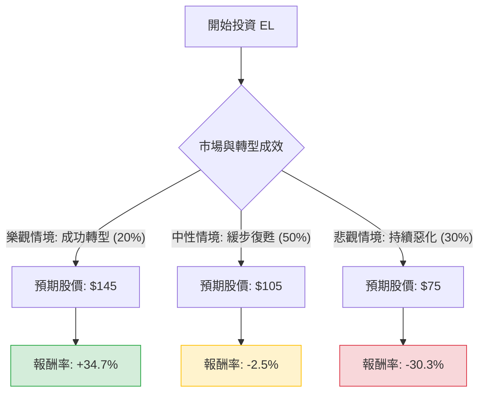

針對美股雅詩蘭黛（Estée Lauder Companies Inc., 代碼：**EL**）的投資評估，我結合了您提供的基本面數據以及最新的市場動態（包含 2024 年底的最新財報指引、執行長更迭及中國市場趨勢）進行深度分析。

---

### 一、 核心背景與市場動態分析（最新資訊補充）

在進行決策樹分析前，必須納入以下關鍵即時資訊：
1.  **管理層大換血**：長期執行長 Fabrizio Freda 將於 2025 年退休，由內部資深主管 Stéphane de La Faverie 接任。這象徵公司進入轉型陣痛期。
2.  **中國市場逆風**：EL 高度依賴中國市場及旅遊零售（Travel Retail）。然而，中國本土品牌（C-Beauty）崛起及消費降級，導致 EL 在亞洲區銷售持續疲軟。
3.  **財務警訊**：公司近期**大幅削減股息（約 47%）**並撤回了 2025 財年的全年業績指引，顯示短期內現金流壓力巨大。
4.  **估值壓力**：目前 Forward P/E 約 36.91 倍，相對於其負值的 ROE (-20.73%) 與萎縮的利潤率，估值顯得昂貴。

---

### 二、 決策樹分析（Decision Tree）

以下使用 Markdown 繪製決策樹，評估未來一年的投資情境：

#### 決策樹節點詳細說明：

1.  **樂觀情境 (Bull Case) - 20% 機率**：
    *   **條件**：新任 CEO 上任後迅速優化成本結構；中國經濟刺激政策超預期，帶動高端美容消費回升。
    *   **預期報酬**：股價回升至 2024 年初高點約 $145。
    *   **期望值貢獻**：$0.20 \times 34.7\% = +6.94\%$

2.  **中性情境 (Base Case) - 50% 機率**：
    *   **條件**：中國市場止跌但未大幅增長；公司維持現狀，利潤率緩慢修復。股價受限於目前的 Target Price ($105.45)。
    *   **預期報酬**：股價微跌至 $105 附近。
    *   **期望值貢獻**：$0.50 \times (-2.5\%) = -1.25\%$

3.  **悲觀情境 (Bear Case) - 30% 機率**：
    *   **條件**：中國市場份額持續被歐萊雅（L'Oreal）或本土品牌侵蝕；高負債（Debt/Eq 2.42）導致財務成本激增；再次下修財測。
    *   **預期報酬**：股價下探 52 週低點甚至更低，約 $75。
    *   **期望值貢獻**：$0.30 \times (-30.3\%) = -9.09\%$

---

### 三、 期望值分析（Expected Value Analysis）

#### 1. 計算過程
我們以當前股價 **$107.65** 為基準，計算未來一年的預期總報酬期望值（EV）：

$$EV = (P_{Bull} \times R_{Bull}) + (P_{Base} \times R_{Base}) + (P_{Bear} \times R_{Bear})$$

*   $0.20 \times 34.7\% = 6.94\%$
*   $0.50 \times (-2.5\%) = -1.25\%$
*   $0.30 \times (-30.3\%) = -9.09\%$

**總期望報酬率 (Total EV) = 6.94% - 1.25% - 9.09% = -3.4%**

#### 2. 核心假設
*   **市場假設**：中國市場的結構性放緩並非短期波動，而是長期趨勢。
*   **財務假設**：負的 ROE (-20.73%) 與高債務比（Debt/Eq 2.42）限制了公司進行大規模併購或研發投入的能力。
*   **產業趨勢**：高端美容市場競爭加劇，EL 的品牌溢價能力正在減弱。

---

### 四、 最終結論

**評估結果：不適合投資（Not Recommended）**

#### 理由如下：
1.  **期望值為負**：經過加權計算，預期報酬率為 **-3.4%**，這意味著從機率角度看，目前買入 EL 虧損的風險高於獲利的潛力。
2.  **基本面惡化**：ROE 為負值，且 Debt/Eq 高達 2.42，財務槓桿過高。在降息循環中，雖然債務壓力可能減輕，但其營運獲利能力的衰退速度超過了成本節省的速度。
3.  **缺乏短期催化劑**：新 CEO 需時間證明其策略有效，且中國市場的復甦具有高度不確定性。
4.  **技術面與估值背離**：儘管股價已從高點大幅回落，但 Forward P/E 仍高達 36.9 倍，對於一個成長停滯甚至衰退的公司來說，此估值並不具備安全邊際（Margin of Safety）。

**建議**：投資者應等待公司連續兩個季度展現利潤率改善，或中國市場銷售數據出現明確拐點後，再行考慮分批布局。目前資金留在標普 500 指數或其他成長性更明確的消費股（如 LVMH 或 L'Oreal）可能更具效益。