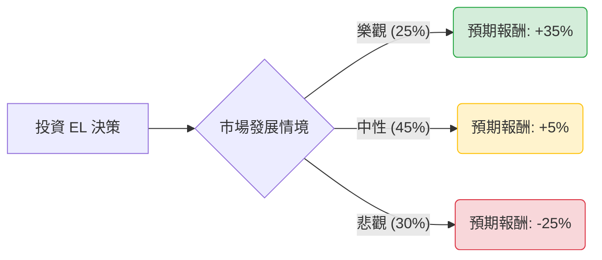

針對美股公司 **Estée Lauder Companies Inc. (雅詩蘭黛，代碼：EL)**，目前的投資環境處於高度不確定性的轉折點。以下運用**決策樹分析**與**期望值分析**，評估其未來 12 個月的投資潛力。

---

### 一、 核心假設與數據來源

在進行計算前，我們設定以下基於市場現狀、財務報告及產業趨勢的假設：

1.  **核心問題**：中國市場（尤其是旅遊零售）的復甦速度，以及公司「利潤恢復計畫（Profit Recovery Plan）」的執行成效。
2.  **目前股價環境**：EL 股價處於近年低檔，本益比雖有所修正，但成長動能疲軟。
3.  **情境設定**：
    *   **樂觀（Bull Case）**：中國消費信心大振，旅遊零售超預期復甦，裁員與轉型計畫成功提升毛利。
    *   **中性（Base Case）**：中國市場緩慢穩定，北美與歐洲市場維持微幅增長，獲利能力緩步回升。
    *   **悲觀（Bear Case）**：中國本土品牌（C-Beauty）強勢崛起導致市佔永久流失，全球經濟衰退壓抑高端消費。

---

### 二、 決策樹分析圖 (Decision Tree)

使用 Markdown 結構展示決策路徑：

**節點詳細說明：**

| 節點名稱 | 機率 (P) | 預期報酬 (R) | 說明 |
| :--- | :--- | :--- | :--- |
| **樂觀情境** | 25% | +35% | 獲利重回增長軌道，本益比估值修復。 |
| **中性情境** | 45% | +5% | 業績止跌回穩，股價隨大盤震盪。 |
| **悲觀情境** | 30% | -25% | 下調財測、庫存積壓、市佔流失加劇。 |

---

### 三、 期望值 (Expected Value) 計算過程

#### 1. 計算公式
期望值 $E(R) = \sum (P_i \times R_i)$
其中 $P$ 為機率，$R$ 為該情境下的預期報酬率。

#### 2. 計算步驟
*   **樂觀貢獻**：$0.25 \times 35\% = 8.75\%$
*   **中性貢獻**：$0.45 \times 5\% = 2.25\%$
*   **悲觀貢獻**：$0.30 \times (-25\%) = -7.50\%$

#### 3. 總計期望值
$E(R) = 8.75\% + 2.25\% - 7.50\% = \mathbf{3.5\%}$

---

### 四、 核心假設分析

1.  **市場趨勢（中國因素）**：EL 高度依賴亞洲旅遊零售（海南島等地）。目前中國消費者趨於理性，且本土品牌如「珀萊雅」等崛起，對 EL 構成結構性威脅。因此悲觀機率設定較高（30%）。
2.  **財務狀況**：EL 近期營收多次不如預期，並下調指引。雖然公司推動利潤恢復計畫預計可省下數億美元成本，但這通常需要 1-2 年才能反映在財報上。
3.  **估值水平**：相較於同業（如 L'Oréal），EL 的溢價空間已大幅收斂，但在缺乏增長動能的情況下，目前的股價尚稱不上「極度便宜」。

---

### 五、 最終結論

#### **判斷：不適合投資 (Not Recommended / Underweight)**

#### **理由：**
1.  **期望值過低**：經過計算，EL 的年度預期報酬僅為 **3.5%**。這不僅低於標普 500 指數的歷史平均回報（約 8-10%），甚至低於目前美債無風險利率（約 4-5%）。
2.  **風險收益比不匹配**：為了追求潛在的 3.5% 報酬，投資人必須承擔 30% 機率可能面臨的 25% 重大虧損（悲觀情境）。在統計學上，這不是一個具備「正向偏態」的交易。
3.  **基本面缺乏催化劑**：儘管公司正在轉型，但面臨的競爭壓力是結構性的。在看到中國區銷售數據出現連續兩季的強勁反彈前，介入的左側交易風險過高。

**總結建議：** 目前應將資金分配至成長動能更明確的標的，或等待 EL 成功證明其「利潤恢復計畫」能抵銷市佔率流失後，再行評估。