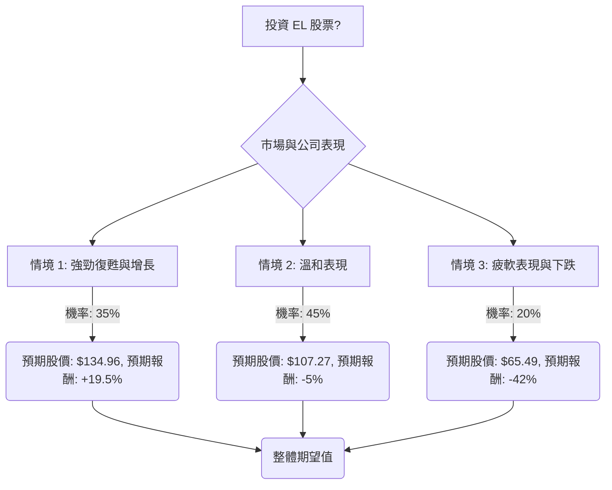

根據「決策樹分析（Decision Tree）」與「期望值分析（Expected Value Analysis）」，並參考美股公司 **EL (The Estée Lauder Companies Inc.)** 的基本面數據及最新市場資訊，以下是評估其目前是否適合投資的分析。

### **核心假設 (Core Assumptions)**

1.  **市場趨勢 (Market Trends):**
    *   **全球經濟:** 預計全球經濟將保持溫和增長，但部分地區（如歐洲）可能面臨經濟放緩，通膨壓力仍可能影響消費者可支配支出。
    *   **奢侈品市場:** 奢侈品市場預計將保持韌性，但在某些地區（如中國）可能面臨日益增長的價格敏感性。
2.  **公司財務與營運 (Company Financials & Operations):**
    *   **轉型計畫:** 公司正在執行的「利潤復甦與增長計畫」及重組措施預計將持續改善營運利潤率和成本效率。
    *   **中國與旅遊零售:** 亞洲旅遊零售和中國大陸市場將逐步復甦，但仍面臨來自本土品牌的激烈競爭以及消費者對頻繁漲價的潛在抵制。
    *   **產品創新:** 關鍵品牌（如La Mer、The Ordinary、Jo Malone London）的成功以及對新興領域（如XINÚ、清真美容）的戰略投資將持續。
    *   **行銷策略:** 公司將加強在亞洲主要市場的數位行銷和消費者互動。
3.  **產業趨勢 (Industry Trends):**
    *   **高端化與醫美級護膚品:** 對高品質、科學驗證的護膚品和高端美容產品的需求將持續強勁。
    *   **永續性與包容性:** 消費者對具有強大ESG（環境、社會、治理）表現的品牌偏好日益增長。
    *   **電子商務:** 電子商務銷售管道將持續增長。

### **基本面數據摘要 (Fundamental Data Summary)**

*   **股價 (Close):** $112.92
*   **市值 (Market Cap):** $40.85 Billion
*   **本益比 (P/E):** - (過去一年為負值，因虧損)
*   **預期本益比 (Forward P/E):** 37.49 (較高，顯示市場對未來盈利有較高預期)
*   **股價淨值比 (P/B):** 10.13 (較高)
*   **股息率 (Dividend %):** 1.24%
*   **52週高點 (52W High):** $121.64
*   **52週低點 (52W Low):** $48.37
*   **年度表現 (Perf Year):** +51% (過去一年股價已大幅上漲)
*   **股東權益報酬率 (ROE):** -4.34% (負值，顯示過去盈利能力不佳)
*   **資產報酬率 (ROA):** -0.90% (負值)
*   **投資報酬率 (ROI):** -1.37% (負值)
*   **負債權益比 (Debt/Eq):** 2.33 (較高，顯示公司槓桿較高)
*   **分析師目標價 (Target Price):** $110.57 (略低於當前股價)

### **最新資訊補充 (Latest Information Supplement)**

*   **近期財報 (Q2 FY2026, 截至2025年12月31日，於2026年2月5日發布):** 淨銷售額42.29億美元（同比增長6%），有機淨銷售額增長4%。毛利率76.5%，調整後營運利潤率14.4%。稀釋後每股收益0.44美元（調整後為0.89美元）。公司上調了2026財年展望。
*   **2025財年表現 (FY2025, 截至2025年6月30日):** 淨銷售額143億美元（同比下降8.21%），調整後稀釋每股收益1.51美元（同比下降42%）。主要受亞洲旅遊零售和中國大陸市場疲軟影響。
*   **中國市場:** 儘管過去面臨挑戰，但近期報告顯示中國大陸市場銷售額有所回升（Q1 FY2026增長8.5%）。 然而，頻繁的漲價（10-20%）可能與中國消費者日益增長的價格意識和本土品牌的競爭相衝突。
*   **分析師評級:** 分析師對EL的共識評級介於「買入」和「持有」之間。 平均12個月目標價約為100.20美元至110.86美元，低於當前股價。 最高目標價為130-140美元，最低為60-70美元。
*   **重組計畫:** 公司正在實施一項重組計畫，預計到2026年底將產生12億至16億美元的稅前成本，並裁員5,800至7,000人，以提高效率。

---

### **決策樹分析 (Decision Tree Analysis)**

**決策點：投資 EL 股票？**

我們將評估未來12-18個月內投資 EL 股票的三種主要情境。

**節點說明與計算過程：**

*   **當前股價 (P0):** $112.92

**1. 情境 1: 強勁復甦與增長 (Optimistic Scenario)**
    *   **預測情境名稱:** 強勁復甦與增長
    *   **核心假設:** 全球經濟穩定，中國和亞洲旅遊零售強勁反彈，重組計畫成功執行，新產品推出成功，市場份額增加，價格調整被市場接受。
    *   **機率 (Probability, P1):** 35% (基於部分分析師的「買入/強買」評級和高目標價)
    *   **預期報酬 (Estimated Return, R1):** +19.5% (基於分析師最高目標價約130-140美元，取中位數135美元計算：($135 - $112.92) / $112.92 ≈ 19.5%)
    *   **預期股價 (Expected Stock Price, S1):** $112.92 * (1 + 0.195) = $134.96
    *   **期望值 (Expected Value, EV1):** P1 * S1 = 0.35 * $134.96 = $47.24

**2. 情境 2: 溫和表現 (Moderate Scenario)**
    *   **預測情境名稱:** 溫和表現
    *   **核心假設:** 全球經濟信號複雜，中國/旅遊零售市場復甦緩慢但穩定，重組效益部分被高銷售、一般及行政費用 (SG&A) 和競爭抵消，產品表現平穩。股價維持在分析師平均目標價附近。
    *   **機率 (Probability, P2):** 45% (基於分析師的「持有」評級)
    *   **預期報酬 (Estimated Return, R2):** -5% (基於分析師平均目標價約107美元計算：($107 - $112.92) / $112.92 ≈ -5.24%)
    *   **預期股價 (Expected Stock Price, S2):** $112.92 * (1 - 0.05) = $107.27
    *   **期望值 (Expected Value, EV2):** P2 * S2 = 0.45 * $107.27 = $48.27

**3. 情境 3: 疲軟表現與下跌 (Pessimistic Scenario)**
    *   **預測情境名稱:** 疲軟表現與下跌
    *   **核心假設:** 全球經濟下行，中國/旅遊零售市場持續疲軟或惡化，競爭加劇和消費者對漲價的抵制產生重大影響，重組成本超過效益，新計畫失敗。
    *   **機率 (Probability, P3):** 20% (基於分析師的「賣出/強賣」評級)
    *   **預期報酬 (Estimated Return, R3):** -42% (基於分析師最低目標價約60-70美元，取中位數65美元計算：($65 - $112.92) / $112.92 ≈ -42.35%)
    *   **預期股價 (Expected Stock Price, S3):** $112.92 * (1 - 0.42) = $65.49
    *   **期望值 (Expected Value, EV3):** P3 * S3 = 0.20 * $65.49 = $13.10

### **整體期望值計算 (Overall Expected Value Calculation)**

**整體期望值 (EV_total) = EV1 + EV2 + EV3**
EV_total = $47.24 + $48.27 + $13.10 = $108.61

### **最終結論 (Final Conclusion)**

根據上述決策樹分析和期望值計算，EL 股票的整體期望值為 **$108.61**。

**判斷:** **不適合投資**

**理由:**
儘管 Estée Lauder 正在積極實施轉型計畫並在某些市場（如中國）顯示出復甦跡象，但其整體期望值 ($108.61) 略低於當前股價 ($112.92)。這表明從當前價格買入，預期報酬為負值。

此外，公司面臨多重挑戰，包括：
*   **高估值:** 儘管過去一年股價大幅上漲51%，但其P/B和Forward P/E等估值指標仍然較高，且過去的ROE、ROA、ROI均為負值，顯示基本面仍需時間改善。
*   **市場競爭與風險:** 在中國市場，本土品牌的競爭日益激烈，且頻繁的漲價可能導致消費者抵制。 亞洲旅遊零售市場的復甦也存在不確定性。
*   **高負債:** 較高的負債權益比 (2.33) 增加了財務風險。
*   **分析師共識:** 大多數分析師的平均目標價也低於當前股價，暗示潛在的下行空間或有限的上漲空間。

綜合來看，儘管公司有潛在的復甦機會，但當前股價可能已經充分反映了這些預期，且潛在風險較高，導致其期望值低於當前價格，因此目前不適合投資。