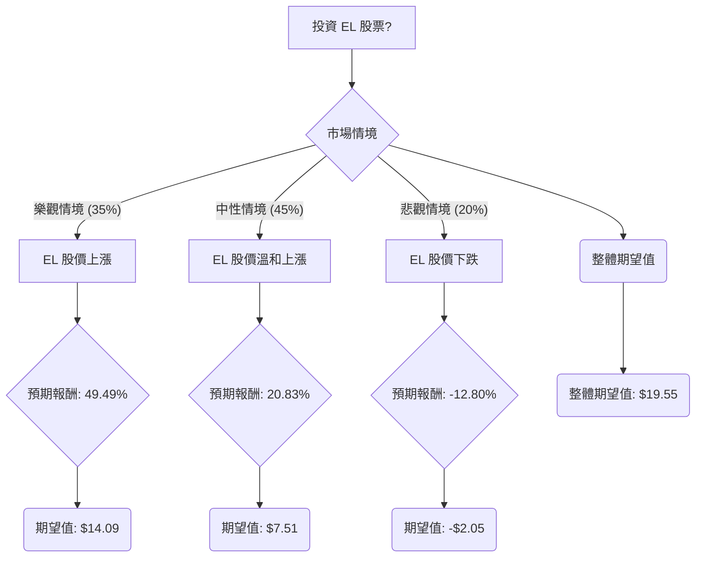

根據對美股公司 Estée Lauder (EL) 的基本面數據和最新市場資訊的綜合分析，以下是基於決策樹分析和期望值分析的投資評估。

**最新資訊摘要：**

*   **近期業績 (2026 財年第三季度)**：淨銷售額增長 5% 至 37.1 億美元，有機淨銷售額增長 2%。毛利率提高至 76.4%。儘管淨銷售額增長，但淨利潤為 8900 萬美元，較 2025 財年第三季度下降 44%，每股收益 (EPS) 較分析師預期低 59%。
*   **重組與成本削減**：公司正在執行「利潤復甦與增長計劃」，預計到 2026 財年末將裁員 9,000 至 10,000 個職位（約佔全球員工的 17.5%）。預計重組費用為 15 億至 17 億美元，每年可帶來 10 億至 12 億美元的總收益。該計劃旨在簡化業務、外包服務並降低成本，以提高運營利潤。
*   **戰略舉措**：與 Shopify、Accenture 和 WPP 建立合作夥伴關係，並計劃收購 Forest Essentials 的剩餘股權和對 111Skin 進行少數股權投資。Clinique 在 Amazon Premium Beauty 商店的首次亮相超出了預期。
*   **產業趨勢**：美容和個人護理市場持續增長，消費者對科學支持、可持續、多功能產品的需求增加。然而，經濟不確定性和通脹可能導致消費者尋求性價比更高的產品。
*   **分析師預期**：當前股價約為 80.28 美元。分析師的平均 12 個月目標價介於 94.04 美元至 101.07 美元之間，最高目標價為 130.00 美元，最低目標價為 70.00 美元。共識評級普遍為「適度買入」或「持有」。預計未來幾年 EPS 將增長 47.6%，營收將增長 3.8%。然而，有分析師指出，營運利潤率的擴張主要來自成本削減而非營收增長，這引發了對可持續性的擔憂。StockInvest.us 預測該股在未來 3 個月內可能下跌 26.69%。

---

### 1. 決策樹分析 (Decision Tree Analysis)

**決策點：投資 EL 股票**

*   **當前股價 (Close)**: $80.28

---

### 2. 計算過程與核心假設

**核心假設：**

*   **市場假設**：
    *   全球美容和個人護理市場將持續增長，尤其是在亞洲旅遊零售和新興市場。
    *   消費者對「潔淨美容」、成分透明和科學支持產品的需求將繼續推動行業創新。
    *   經濟不確定性可能導致部分消費者轉向性價比更高的產品，但高端美容市場仍有韌性。
*   **財務假設 (EL 特定)**：
    *   EL 的「利潤復甦與增長計劃」將有效執行，並在未來 1-2 年內顯著改善營運利潤率和整體盈利能力。
    *   公司在數位化轉型和新興渠道（如 Amazon）的投資將帶來新的增長點。
    *   儘管目前 P/E 為負且 ROE 為負，但預計未來幾年 EPS 和 ROE 將實現顯著轉正和增長，符合分析師預期。
    *   高負債權益比 (Debt/Eq: 2.33) 是一個風險因素，但假設公司能有效管理債務並通過盈利增長來改善財務結構。
*   **產業趨勢假設**：
    *   EL 能夠成功應對不斷變化的消費者偏好和市場競爭，特別是在香水和護膚品等高增長領域保持領先地位。
    *   公司對新興品牌的投資（如 111Skin）將有助於其產品組合的多元化和市場滲透。

**情境定義與期望值計算：**

1.  **樂觀情境 (Optimistic Scenario)**
    *   **情境名稱**：強勁增長與成功轉型
    *   **情境描述**：EL 的重組計劃超預期成功，宏觀經濟環境改善，消費者對高端美容產品的需求強勁。公司在亞洲旅遊零售、香水和護膚品領域實現顯著增長，數位化戰略成效顯著。EPS 和營收增長達到或超過分析師預期。
    *   **機率 (Probability)**：35%
    *   **預期股價**：$120 (接近分析師目標價區間的高端，考慮到成功轉型和市場利好)
    *   **預期報酬 (Return)**：(($120 - $80.28) / $80.28) = 49.49%
    *   **期望值 (Expected Value)**：0.35 * 49.49% = 17.32% (基於初始投資的百分比回報)
        *   若以金額計算：0.35 * ($120 - $80.28) = 0.35 * $39.72 = $13.90

2.  **中性情境 (Neutral Scenario)**
    *   **情境名稱**：溫和增長與部分轉型
    *   **情境描述**：EL 的重組計劃取得一定進展，但宏觀經濟逆風（如通脹、消費者謹慎支出）持續存在。主要業務板塊實現溫和增長，競爭壓力仍在。公司股價達到分析師平均目標價。
    *   **機率 (Probability)**：45%
    *   **預期股價**：$97 (分析師平均目標價的中點，介於 $94.04 和 $101.07 之間)
    *   **預期報酬 (Return)**：(($97 - $80.28) / $80.28) = 20.83%
    *   **期望值 (Expected Value)**：0.45 * 20.83% = 9.37% (基於初始投資的百分比回報)
        *   若以金額計算：0.45 * ($97 - $80.28) = 0.45 * $16.72 = $7.52

3.  **悲觀情境 (Pessimistic Scenario)**
    *   **情境名稱**：停滯與執行挑戰
    *   **情境描述**：EL 的重組計劃遇到重大阻礙，未能實現預期的成本節約或市場份額增長。全球經濟惡化，消費者對奢侈品支出大幅減少。來自「平替」產品和新興品牌的競爭加劇，侵蝕市場份額和定價權。公司盈利能力持續低迷。
    *   **機率 (Probability)**：20%
    *   **預期股價**：$70 (分析師最低目標價)
    *   **預期報酬 (Return)**：(($70 - $80.28) / $80.28) = -12.80%
    *   **期望值 (Expected Value)**：0.20 * -12.80% = -2.56% (基於初始投資的百分比回報)
        *   若以金額計算：0.20 * ($70 - $80.28) = 0.20 * -$10.28 = -$2.06

**整體期望值 (Overall Expected Value)：**

整體期望值 = (樂觀情境期望值) + (中性情境期望值) + (悲觀情境期望值)
整體期望值 (百分比回報) = 17.32% + 9.37% - 2.56% = **24.13%**

整體期望值 (金額回報) = $13.90 + $7.52 - $2.06 = **$19.36**

這意味著，基於當前股價 $80.28，預期每股投資可獲得 $19.36 的收益。

---

### 3. 最終結論

根據決策樹分析和期望值分析，EL 股票的整體期望值為 **24.13% 的預期報酬** (或每股 $19.36 的預期收益)。

**判斷：適合投資**

**理由：**
儘管 EL 目前面臨盈利能力挑戰（負 P/E 和 ROE），且正在進行大規模重組，但其最新的財報顯示出積極的轉變跡象，尤其是在亞洲旅遊零售、香水和護膚品領域的增長。公司正在積極執行「利潤復甦與增長計劃」，旨在提高效率和盈利能力，並預計在未來幾年帶來顯著的營運利潤增長。分析師普遍對 EL 的未來增長持樂觀態度，平均目標價顯示出可觀的潛在漲幅。儘管存在宏觀經濟逆風和競爭加劇的風險，但綜合考慮其品牌實力、戰略舉措和預期的財務改善，EL 在當前價格下具有吸引力的投資潛力。