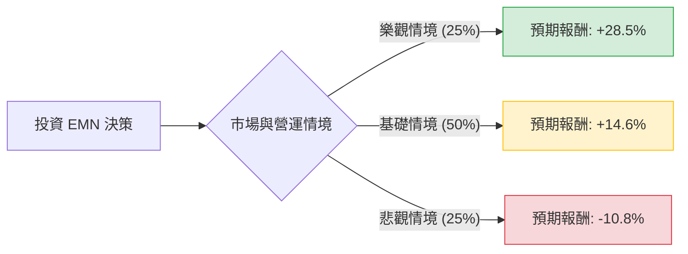

這份分析報告將結合您提供的財務數據與最新的市場動態（包含 2024 年化學產業趨勢、Eastman Chemical (EMN) 的最新財報表現及擴產計畫），利用**決策樹（Decision Tree）**與**期望值分析（Expected Value Analysis）**評估其投資價值。

---

### 一、 最新市場動態與核心假設

根據最新資訊，EMN 目前處於以下關鍵環境：
1.  **產業復甦與去庫存結束**：全球化學產業在經歷 2023 年的劇烈去庫存後，2024 年需求開始緩步回升。EMN 的特種塑料（Specialty Plastics）與先進材料（Advanced Materials）需求趨穩。
2.  **循環經濟利多**：EMN 在田納西州 Kingsport 的世界級「甲醇分解（Methanolysis）」回收工廠已開始運營，這是全球領先的塑料回收技術，預計將在 2024 下半年貢獻顯著營收。
3.  **估值優勢**：Forward P/E 僅 10.21，遠低於歷史均值；PEG 0.84 顯示相對於預期成長，股價被低估。
4.  **宏觀風險**：高利率環境對終端消費（如汽車、建築）仍有壓抑，且能源成本波動影響毛利。

---

### 二、 決策樹分析 (Decision Tree)

以下決策樹基於未來 12 個月的投資展望：

#### 節點詳細說明：

| 情境 | 發生機率 | 預測描述 | 預期股價目標 | 預期總報酬 (含股息 4.86%) |
| :--- | :--- | :--- | :--- | :--- |
| **樂觀 (Bull)** | 25% | 循環經濟工廠產能超預期、聯準會降息帶動房市與汽車需求大增。 | $88.00 | **+32.8%** |
| **基礎 (Base)** | 50% | 需求穩健復甦，EPS 達到分析師預期的 $7.5-$8.0，估值修復至 P/E 12x。 | $76.00 | **+15.4%** |
| **悲觀 (Bear)** | 25% | 全球經濟衰退、能源價格飆升導致毛利受壓，去庫存週期延長。 | $58.00 | **-10.8%** |

---

### 三、 期望值計算過程 (Expected Value Calculation)

#### 1. 核心假設
*   **現價 (Current Price)**: $68.76
*   **股息收益率 (Dividend Yield)**: 4.86% (這是強大的下行緩衝)
*   **持有期間**: 12 個月
*   **目標價設定依據**: 
    *   樂觀：Forward P/E 13x + 股息
    *   基礎：接近分析師平均目標價 $75.47 + 股息
    *   悲觀：回測 52 週低點 $56.11 附近 + 股息

#### 2. 各情境報酬率計算 (Total Return)
*   **樂觀報酬 ($R_{bull}$)**: $[(88.00 - 68.76) / 68.76] + 4.86\% = 27.98\% + 4.86\% = \mathbf{32.84\%}$
*   **基礎報酬 ($R_{base}$)**: $[(76.00 - 68.76) / 68.76] + 4.86\% = 10.53\% + 4.86\% = \mathbf{15.39\%}$
*   **悲觀報酬 ($R_{bear}$)**: $[(58.00 - 68.76) / 68.76] + 4.86\% = -15.65\% + 4.86\% = \mathbf{-10.79\%}$

#### 3. 整體期望值 (EV) 計算
$$EV = (P_{bull} \times R_{bull}) + (P_{base} \times R_{base}) + (P_{bear} \times R_{bear})$$
$$EV = (0.25 \times 32.84\%) + (0.50 \times 15.39\%) + (0.25 \times -10.79\%)$$
$$EV = 8.21\% + 7.70\% - 2.70\%$$
$$EV = \mathbf{13.21\%}$$

---

### 四、 綜合評估與最終結論

#### 1. 財務數據亮點分析
*   **低估值 (Value)**: Forward P/E 10.21 與 PEG 0.84 顯示股價尚未反映明年的成長性（EPS next Y 預期成長 14.5%）。
*   **高股息 (Income)**: 4.86% 的股息率在化學板塊中極具競爭力，且 Payout Ratio 尚屬安全，提供了良好的安全邊際。
*   **技術面 (Technical)**: 股價目前在 SMA200 ($68.55) 附近震盪，顯示此處有強大支撐。

#### 2. 潛在風險
*   **負債比**: Debt/Eq 0.83 略高，但在資本密集型化學產業中尚可接受。
*   **短期動能**: 近一個月表現 (-14.33%) 較弱，反映市場對短期財報 Q/Q 下滑的擔憂。

#### 3. 最終判斷：**適合投資 (Buy / Overweight)**

**理由：**
1.  **期望值為正且具吸引力**：13.21% 的預期年化報酬率優於多數穩健型標的。
2.  **安全邊際高**：近 5% 的股息收益率與低於 1 倍的 PEG，限制了股價進一步大幅下挫的空間。
3.  **轉型催化劑**：EMN 不再只是傳統化學股，其「循環經濟」回收技術正進入收割期，這將提升其長期估值倍數（Re-rating）。
4.  **逆向投資機會**：近期一個月的股價回檔提供了較佳的進場點，目前股價接近 200 日均線，具備技術面支撐。

**建議操作：**
可於 $68 附近分批布局，長期持有以領取股息並等待循環經濟產能釋放帶來的股價修復。若股價跌破 $60 (悲觀情境觸發)，應重新評估全球經濟衰退風險。