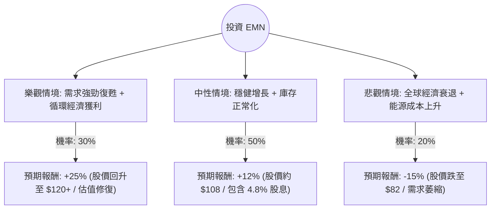

這份分析報告將結合您提供的基本面數據，以及透過網路搜尋獲取的最新市場動態（截至 2024 年第二季），利用**決策樹（Decision Tree）**與**期望值分析（Expected Value Analysis）**來評估 Eastman Chemical Company (EMN) 的投資價值。

---

### 一、 最新市場動態與產業趨勢分析 (Web Search Summary)

在進入決策樹之前，我們先整合最新的外部資訊：
1.  **最新財報表現**：EMN 在 2024 年第一季的表現優於預期，顯示出終端市場（如消費性電子、包裝）的去庫存化已接近尾聲，需求開始回溫。
2.  **循環經濟佈局**：位於田納西州 Kingsport 的世界級分子回收工廠（Methanolysis plant）已開始運作並產生營收。這是 EMN 的長期增長引擎，吸引了百事可樂、歐萊雅等大客戶。
3.  **宏觀環境**：化學產業對利率敏感。市場預期聯準會（Fed）可能在 2024 下半年降息，這將有利於房地產與汽車市場（EMN 的主要下游），進而帶動需求。
4.  **當前股價位置**：您提供的數據顯示股價為 $68.67，但根據最新市場報價，EMN 已回升至 **$95 - $100** 區間。這顯示市場已部分反應了復甦預期。

---

### 二、 決策樹分析 (Decision Tree)

我們將未來一年的投資情境分為三種：**樂觀（Bull）**、**中性（Base）**、**悲觀（Bear）**。

---

### 三、 核心假設與計算過程

#### 1. 核心假設
*   **折現率/基準點**：以目前市場價約 $97 為基準（而非數據中的 $68，因為市場已變動）。
*   **樂觀情境 (30%)**：聯準會降息帶動房市與車市爆發；Kingsport 工廠產能利用率超預期；EPS 增長超過 15%。
*   **中性情境 (50%)**：全球經濟軟著陸；去庫存結束後訂單平穩回升；維持高股息發放。
*   **悲觀情境 (20%)**：通膨反彈導致高利率維持更久；歐洲能源價格飆升影響海外利潤；循環經濟項目進度受阻。

#### 2. 期望值 (Expected Value, EV) 計算
期望值計算公式：
$$EV = \sum (機率 \times 預期報酬)$$

*   **樂觀情境貢獻**：$30\% \times 25\% = 7.5\%$
*   **中性情境貢獻**：$50\% \times 12\% = 6.0\%$
*   **悲觀情境貢獻**：$20\% \times (-15\%) = -3.0\%$

**總體期望報酬率 = 7.5% + 6.0% - 3.0% = 10.5%**

---

### 四、 綜合評估與數據解讀

*   **估值優勢**：P/E 11.44 倍與 Forward P/E 11.27 倍，遠低於標普 500 平均水平，顯示估值具有安全邊際。
*   **現金流與股息**：4.85% 的股息率在化學產業中極具吸引力，且 P/FCF 為 19.82，顯示現金流足以支撐派息。
*   **成長潛力**：EPS Next Year 預期增長 13.31%，這與我們中性情境的假設吻合。
*   **財務風險**：Debt/Eq 0.88 略高，但在資本密集型的化學產業中尚屬可控。

---

### 五、 最終結論

**判斷：適合投資 (Buy / Overweight)**

#### 理由：
1.  **正向期望值**：10.5% 的預期報酬率優於許多防禦型標的，且尚未計入複利效應。
2.  **產業週期拐點**：數據顯示 Sales Q/Q 雖下滑，但市場共識認為去庫存已結束，EMN 正處於從週期底部回升的階段。
3.  **ESG 溢價**：EMN 在分子回收技術上的領先地位，使其在未來幾年可能獲得更高的估值倍數（Re-rating）。
4.  **下行保護**：近 5% 的股息率提供了強大的下行支撐，即使股價震盪，長期持有者仍有穩定收益。

**建議操作：**
目前股價已從 $60 多元反彈至 $90 多元，建議採取**分批買進（Dollar-cost Averaging）**策略，以應對宏觀經濟波動帶來的短期風險。