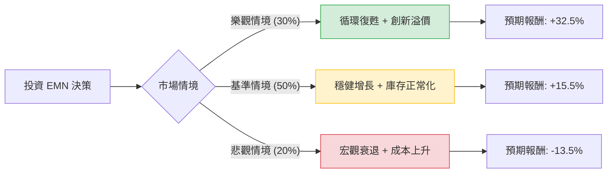

這份分析報告將結合您提供的基本面數據與最新的市場動態（截至 2024 年 5 月），利用**決策樹（Decision Tree）**與**期望值分析（Expected Value Analysis）**評估 Eastman Chemical (EMN) 的投資價值。

### 1. 市場現況與核心假設 (Core Assumptions)

在進入決策樹之前，我們先整合基本面與最新資訊：
*   **最新動態：** EMN 2024 年第一季財報顯示銷量開始回升，結束了長達一年的去庫存週期。特別是其位於 Kingsport 的**分子回收工廠（Molecular Recycling）**已正式投產，這是全球最大的塑膠回收設施，被視為長期增長引擎。
*   **估值分析：** 根據數據，Forward P/E 僅 10.85，PEG 為 0.8，顯示相對於其預期盈餘成長（EPS next Y +14.9%），股價目前處於低估區間。
*   **宏觀環境：** 化學產業對利率敏感。若聯準會維持高利率，建築與汽車需求將受壓；若降息，則有利於 EMN 的終端市場。

---

### 2. 決策樹分析 (Decision Tree)

我們以 **1 年為投資期限**，設定三種主要情境：

#### 節點詳細說明：

| 情境 | 機率 (P) | 預期報酬 (R) | 說明 |
| :--- | :--- | :--- | :--- |
| **樂觀情境** | 30% | **+32.5%** | 循環經濟工廠產能超預期，終端市場（汽車、電子）強勁復甦，估值修復至 P/E 14x。 |
| **基準情境** | 50% | **+15.5%** | 銷量溫和增長，去庫存結束，EPS 達到預期的 $7.50 左右，加上 4.5% 股息。 |
| **悲觀情境** | 20% | **-13.5%** | 全球經濟衰退，原油成本飆升擠壓毛利，股價回測 52 週低點。 |

---

### 3. 期望值計算過程 (Expected Value Calculation)

我們將各情境的「資本利得」與「股息收益」合併計算。

**計算公式：**
$EV = (P_{Bull} \times R_{Bull}) + (P_{Base} \times R_{Base}) + (P_{Bear} \times R_{Bear})$

1.  **樂觀情境 (Bull Case):** $0.30 \times 32.5\% = 9.75\%$
2.  **基準情境 (Base Case):** $0.50 \times 15.5\% = 7.75\%$
3.  **悲觀情境 (Bear Case):** $0.20 \times (-13.5\%) = -2.7\%$

**總期望報酬率 (Total Expected Return):**
$9.75\% + 7.75\% - 2.7\% = \mathbf{14.8\%}$

---

### 4. 綜合分析與核心假設依據

*   **估值安全邊際：** EMN 的 PEG 為 0.8（小於 1 通常代表低估），且 P/S 僅 0.96。這意味著即便在基準情境下，股價也有向上修正的空間。
*   **股息支撐：** 4.53% 的股息率在化學板塊中極具競爭力，且 Current Ratio 1.37 顯示短期償債能力無虞，股息發放安全。
*   **成長動能：** EPS next Y 預計增長 14.9%，這主要來自於新技術（分子回收）帶來的特種化學品高毛利貢獻，而非單純的基礎化學品量增。
*   **風險點：** 債務比 (Debt/Eq 0.83) 略高，且 Q/Q 數據顯示近期營收仍有波動，需關注 Kingsport 工廠的實際產出效率。

---

### 5. 最終結論

**判斷：適合投資 (Recommend: BUY)**

#### 理由：
1.  **期望值吸引人：** 14.8% 的預期年化報酬率優於標普 500 的歷史平均，且在考慮了 20% 的悲觀衰退機率後，結果依然為正。
2.  **估值窪地：** Forward P/E 10.85 遠低於行業平均與其歷史中位數，提供了良好的安全邊際。
3.  **轉型催化劑：** Eastman 不再只是傳統化學公司，其在「可持續塑料」領域的領先地位將吸引 ESG 資金流入，並可能導致估值倍數（Multiple Expansion）的重估。
4.  **技術面支撐：** 目前股價高於 SMA200 (8.36%)，顯示長期趨勢已轉多，且距離 52 週高點仍有空間。

**建議操作：**
考慮到目前股價約 $73.78（參考數據），低於分析師目標價 $77.2，且近期市場已消化部分利空。建議可於此價位分批進場，長期持有以領取 4.5% 股息並等待循環經濟題材發酵。