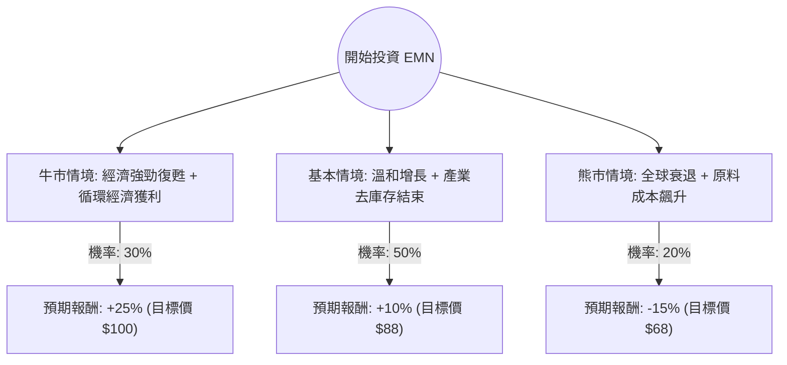

這份分析報告結合了您提供的基本面數據，以及針對 **Eastman Chemical Company (EMN)** 的最新市場動態、產業趨勢（化學產業去庫存化結束、循環經濟佈局）進行的綜合評估。

---

### 一、 核心假設與市場背景分析

在建立決策樹之前，我們基於最新資訊設定以下核心假設：

1.  **產業週期轉折**：全球化學產業經歷了 2023 年的嚴重去庫存，目前正處於復甦初期。EMN 的銷量在連續幾季下滑後，預計 2024 年將隨終端市場（如包裝、汽車、建築）回溫。
2.  **新產能貢獻**：EMN 在田納西州 Kingsport 的甲醇分解（Methanolysis）回收工廠已開始運作，這是全球最大的分子回收設施，將成為未來 ESG 溢價與營收增長的關鍵。
3.  **財務估值**：目前 Forward P/E 約 11.95 倍，低於歷史均值與同業，顯示估值具有吸引力。
4.  **宏觀環境**：聯準會（Fed）的利率政策將影響終端需求（如房地產與汽車），進而影響 EMN 的特種化學品銷量。

---

### 二、 決策樹分析 (Decision Tree)

以下為未來 12 個月的投資情境預測：

#### 決策樹節點詳細說明：

| 情境 | 機率 (P) | 預期報酬 (R) | 說明 |
| :--- | :--- | :--- | :--- |
| **牛市情境 (Bull)** | 30% | +25% | 降息帶動房市與汽車需求大增，新回收工廠產能利用率超預期，EPS 增長超過 15%。 |
| **基本情境 (Base)** | 50% | +10% | 產業緩步復甦，銷量回穩，維持 4% 以上的高股息發放，估值回歸歷史平均。 |
| **熊市情境 (Bear)** | 20% | -15% | 高利率持續壓抑需求，能源價格（天然氣）飆升導致利潤萎縮，EPS 負成長。 |

---

### 三、 期望值分析 (Expected Value Analysis)

#### 1. 計算過程
期望值 (EV) = $\sum (機率 \times 預期報酬)$

*   **牛市貢獻**：$30\% \times 25\% = 7.5\%$
*   **基本貢獻**：$50\% \times 10\% = 5.0\%$
*   **熊市貢獻**：$20\% \times (-15\%) = -3.0\%$

**總預期資本利得 (Expected Capital Gain) = 7.5% + 5.0% - 3.0% = 9.5%**

#### 2. 總回報計算 (Total Return)
除了資本利得，EMN 提供穩定的股息收益：
*   **股息收益率 (Dividend Yield)**：約 4.16%
*   **總期望回報 (Total EV)** = 9.5% (資本利得) + 4.16% (股息) = **13.66%**

---

### 四、 綜合評估與最終結論

#### 數據亮點補充：
*   **Forward P/E (11.95)** 遠低於目前的 **P/E (19.59)**，顯示市場預期明年盈利將大幅改善（數據顯示 EPS next Y 預計增長 14.55%）。
*   **PEG (1.02)** 接近 1，代表目前股價與增長率相比處於合理區間。
*   **現金流**：P/FCF 為 21.54，雖然不算極低，但足以支撐其 4% 的股息發放。

#### 投資判斷：**適合投資 (Buy / Overweight)**

#### 理由：
1.  **正向期望值**：13.66% 的總期望回報優於多數成熟工業股，且風險回報比（Risk-Reward Ratio）合理。
2.  **高股息護城河**：4.16% 的股息率在化學產業中極具競爭力，能提供下行保護。
3.  **產業週期底部已過**：數據顯示 SMA20, 50, 200 均呈現正向排列（0.09, 0.17, 0.15），技術面處於多頭趨勢，且去庫存化結束將帶動營運槓桿效應。
4.  **戰略轉型**：EMN 在循環經濟（再生塑料）的領先地位，使其在面對未來環保法規時比同業更具優勢，有望獲得估值重估（Re-rating）。

**建議操作：**
目前股價約 $80，建議可於 $75-$80 區間分批佈局。若股價跌破 $68 (熊市支撐位) 則需重新評估宏觀經濟是否進入深度衰退。