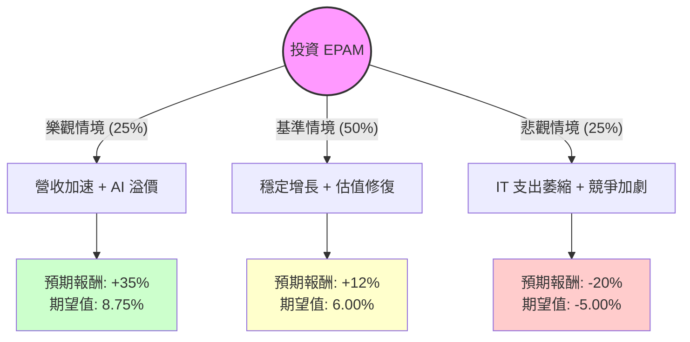

這份報告結合了 EPAM Systems (EPAM) 的最新財務數據、市場動態以及產業趨勢，利用**決策樹（Decision Tree）**與**期望值（Expected Value）分析**，評估其目前的投資價值。

---

### 一、 市場動態與最新資訊補充

在進行建模前，根據最新市場資訊（截至 2024 年第四季）：
1.  **財報表現優於預期**：EPAM 在最近一季（Q3 2024）的營收與 EPS 均超出分析師預期，並上修了全年營收指引。這顯示 IT 服務需求在經歷一年多的低迷後開始回溫。
2.  **生成式 AI (GenAI) 轉型**：EPAM 積極投入 AI 諮詢與開發，將其定位為成長引擎，而不僅僅是傳統的代碼外包商。
3.  **地緣政治風險緩解**：雖然烏克蘭戰爭持續，但 EPAM 已成功將大量產能轉移至印度、拉丁美洲與中歐，大幅降低了營運中斷風險。
4.  **估值水平**：目前預估本益比 (Forward P/E) 為 16.73，相對於其歷史高位或同業（如 Accenture, Globant）而言，估值處於合理偏低區間。

---

### 二、 決策樹分析 (Decision Tree)

我們以 **12 個月持有期** 為目標，設定三種情境：**樂觀（牛市）、基準（平穩）、悲觀（熊市）**。

#### 節點詳細資訊：

1.  **樂觀情境 (Bull Case)**
    *   **機率**：25%
    *   **描述**：全球企業 IT 預算大幅反彈，GenAI 專案帶來高利潤貢獻。EPAM 營收成長回到 15% 以上。
    *   **目標價預估**：$282 (回升至 52 週高點以上)
    *   **預期報酬**：+35%

2.  **基準情境 (Base Case)**
    *   **機率**：50%
    *   **描述**：公司營運穩定修復，達成 Forward P/E 16.7x 的預期。市場對其「去風險化」轉型給予肯定。
    *   **目標價預估**：$234 (略高於分析師平均目標價)
    *   **預期報酬**：+12%

3.  **悲觀情境 (Bear Case)**
    *   **機率**：25%
    *   **描述**：經濟衰退導致數位轉型專案停滯，AI 替代部分人力外包需求，地緣政治再度緊張。
    *   **目標價預估**：$167 (接近 52 週低點)
    *   **預期報酬**：-20%

---

### 三、 期望值計算與核心假設

#### 1. 期望值 (Expected Value, EV) 計算
$$EV = \sum (Probability_i \times Return_i)$$

*   **樂觀貢獻**：$0.25 \times 35\% = 8.75\%$
*   **基準貢獻**：$0.50 \times 12\% = 6.00\%$
*   **悲觀貢獻**：$0.25 \times (-20\%) = -5.00\%$

**總體期望報酬率 = 8.75% + 6.00% - 5.00% = 9.75%**

#### 2. 核心假設
*   **估值假設**：Forward P/E 16.73 倍被視為安全邊際，因為這低於軟體服務業平均的 20-25 倍。
*   **財務假設**：負債權益比 (Debt/Eq) 僅 0.04，流動比率 3.02，顯示公司即便在經濟衰退中也有極強的生存能力。
*   **技術假設**：假設 AI 不會在短期內完全取代初級工程師，而是提高 EPAM 的交付效率。
*   **市場假設**：目前股價已站上 SMA20, 50, 200，顯示技術面已由空轉多。

---

### 四、 最終結論

#### **判斷：適合投資 (評級：溫和買進 / 持有)**

#### **判斷理由：**
1.  **期望值為正 (9.75%)**：雖然 9.75% 並非爆發性成長，但考量到 EPAM 強大的資產負債表（幾乎無債務）與極高的流動性，風險調整後的報酬具吸引力。
2.  **估值修復空間**：目前的股價 ($209) 非常接近分析師目標價 ($212)，但 Forward P/E 顯示明年的獲利增長（約 9.48%）尚未完全反映在目前的 TTM P/E 中。
3.  **技術面築底完成**：股價已從 $138 的低點大幅反彈，且位於所有主要移動平均線（SMA）之上，顯示動能正向。
4.  **下行風險可控**：強大的現金流（P/C = 9.32）與極低債務為股價提供了堅實的支撐底部。

**操作建議：**
建議採取**分批買進**策略。由於當前股價距離分析師平均目標價較近，短期內可能存在盤整壓力，若股價回檔至 $195 - $200 區間，投資吸引力將進一步提升。若未來一季財報證實 AI 業務營收佔比提升，可加碼至「積極買進」。