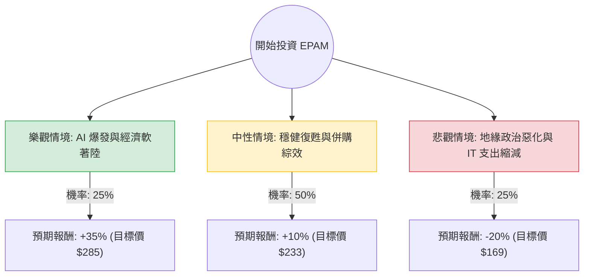

這份分析報告結合了您提供的基本面數據，以及針對 **EPAM Systems (EPAM)** 最新財報（2024 Q3）、市場動態與產業趨勢的網路搜尋資訊。

---

### 1. 市場動態與最新資訊補充

根據 2024 年 11 月初的最新資訊：
*   **財報表現亮眼**：EPAM 在 2024 年第三季度的財報中，營收與 EPS 均超出市場預期。公司上調了全年業績指引，顯示出 IT 服務需求正在回溫。
*   **併購策略**：EPAM 最近完成了對 **NEORIS** 的收購，這大幅擴張了其在拉丁美洲與歐洲（西班牙）的版圖，減少了對東歐（烏克蘭、白俄羅斯）地緣政治風險的依賴。
*   **AI 轉型**：公司積極投入生成式 AI (GenAI) 諮詢，這被視為未來 1-3 年的主要成長引擎。
*   **估值觀察**：目前 Forward P/E 約 17.02x，相較於其歷史高點與同業，估值已回落至相對合理的區間。

---

### 2. 決策樹分析 (Decision Tree Analysis)

我們將未來一年的投資情境分為三種：**樂觀（牛市）**、**中性（基準）**與**悲觀（熊市）**。

#### 節點詳細說明：

1.  **樂觀情境 (Bull Case) - 25% 機率**：
    *   **條件**：企業 AI 轉型預算大幅釋放，EPAM 成功將 GenAI 轉化為高利潤訂單；NEORIS 整合超乎預期。
    *   **預期報酬**：+35%。基於 Forward P/E 回升至 22x 以上。

2.  **中性情境 (Base Case) - 50% 機率**：
    *   **條件**：全球經濟緩步成長，IT 支出穩定。EPAM 營收維持中個位數成長，地緣政治風險維持現狀。
    *   **預期報酬**：+10%。基於目前 Target Price ($212.73) 略微上修，反映財報利多。

3.  **悲觀情境 (Bear Case) - 25% 機率**：
    *   **條件**：東歐戰事擴大影響交付能力；高利率環境導致企業砍掉諮詢預算。
    *   **預期報酬**：-20%。股價回測 52 週低點區域。

---

### 3. 期望值分析 (Expected Value Analysis)

#### 核心假設：
*   **當前股價**：$211.64
*   **計算公式**：$EV = \sum (機率 \times 預期報酬率)$

#### 計算過程：
1.  **樂觀貢獻**：$0.25 \times 35\% = 8.75\%$
2.  **中性貢獻**：$0.50 \times 10\% = 5.00\%$
3.  **悲觀貢獻**：$0.25 \times (-20\%) = -5.00\%$

**總體期望報酬率 (Expected Return)**：
$8.75\% + 5.00\% - 5.00\% = \mathbf{8.75\%}$

**預期一年後股價**：
$211.64 \times (1 + 8.75\%) \approx \mathbf{\$230.16}$

---

### 4. 綜合評估與最終結論

#### 財務數據亮點與隱憂：
*   **優勢**：
    *   **極低負債**：Debt/Eq 僅 0.04，財務極其穩健，能抵禦高利率環境。
    *   **流動性極佳**：Quick Ratio 3.02，現金充裕。
    *   **動能強勁**：近三個月股價表現 (+37.7%) 遠超大盤，顯示市場信心回歸。
*   **劣勢**：
    *   **利潤率受壓**：Profit Margin 7.01% 較往年有所下滑。
    *   **成長放緩**：EPS Q/Q 下降 19.4%，顯示轉型期仍有陣痛。

#### 最終結論：**適合投資 (建議分批買進)**

**理由：**
1.  **期望值為正**：8.75% 的期望報酬率雖然不算極高，但在 IT 服務業中屬於穩健。
2.  **估值修復**：Forward P/E (17.02) 遠低於當前 P/E (32.47)，顯示市場預期明年獲利將大幅改善。
3.  **風險分散成功**：透過收購 NEORIS，EPAM 正在擺脫「東歐概念股」的單一風險標籤，這有助於提升其長期本益比估值。
4.  **技術面支撐**：股價目前站穩 SMA20, 50, 200 之上，呈現多頭排列。

**投資建議：**
由於目前股價已接近分析師平均目標價 ($212.73)，且短期漲幅已大（近三個月 >37%），建議**不要一次性追高**。可在股價回測 SMA20 (約 $205 附近) 時分批佈局，長期持有以參與 AI 諮詢市場的成長。