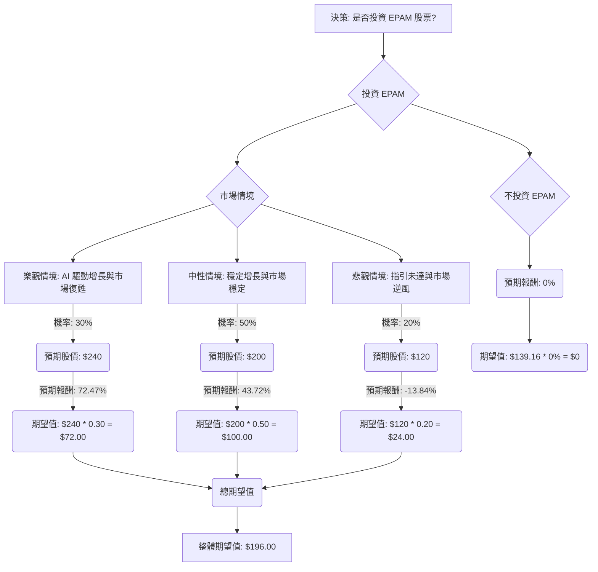

根據對 EPAM 股票基本面數據和最新市場資訊的綜合分析，以下是基於決策樹分析和期望值分析的投資評估。

### 核心假設

在進行決策樹分析之前，我們基於所提供的數據和網路搜尋結果，建立以下核心假設：

*   **市場趨勢：** 2026 年 IT 服務市場預計將持續增長，主要受數位轉型、AI 採用加速以及對靈活消費模式的需求驅動。AI-native 平台、安全可擴展的 AI 自動化、預測性網路安全和雲端運算將是主要趨勢。
*   **公司財務狀況：** EPAM 在 2025 年第四季度和全年表現強勁，營收和非 GAAP 每股盈餘均超出預期。公司預計 2026 年營收增長 4.5% 至 7.5%，非 GAAP 每股盈餘為 $12.60 至 $12.90。EPAM 積極投資 AI 創新，預計 2026 年 AI 相關營收將超過 6 億美元。
*   **產業競爭與風險：** 儘管 EPAM 表現良好，但分析師對其 2026 年的「軟性指引」表示擔憂，導致目標價下調。公司面臨來自主要客戶的營收下降（NEORIS 最大客戶對 2026 年有機增長率產生 1% 的負面影響）、地緣政治衝突、激烈的市場競爭以及客戶採購流程延長等挑戰。
*   **分析師情緒：** 華爾街分析師對 EPAM 的共識評級為「適度買入」(Moderate Buy)，平均目標價約為 $197.81 至 $213.44，顯示出顯著的潛在上升空間。然而，近期股價表現不佳，過去一年下跌超過 30%。

### 決策樹分析

**決策點：投資 EPAM 股票**

*   **當前股價 (Close):** $139.16

#### 計算過程

**1. 預期報酬計算 (基於當前股價 $139.16)**

*   **樂觀情境 (Optimistic Scenario):**
    *   預期股價：$240 (參考分析師高目標價 $243-$275 及 Simply Wall St 估值)
    *   預期報酬率 = ($240 - $139.16) / $139.16 = 0.7247 = 72.47%
    *   期望值貢獻 = $240 * 0.30 = $72.00

*   **中性情境 (Neutral Scenario):**
    *   預期股價：$200 (參考分析師平均目標價 $197.81-$213.44)
    *   預期報酬率 = ($200 - $139.16) / $139.16 = 0.4372 = 43.72%
    *   期望值貢獻 = $200 * 0.50 = $100.00

*   **悲觀情境 (Pessimistic Scenario):**
    *   預期股價：$120 (考慮近期股價下跌趨勢 及最低分析師目標價 $140-$146，並假設進一步下跌)
    *   預期報酬率 = ($120 - $139.16) / $139.16 = -0.1384 = -13.84%
    *   期望值貢獻 = $120 * 0.20 = $24.00

**2. 整體期望值計算**

*   整體期望值 = (樂觀情境期望值貢獻) + (中性情境期望值貢獻) + (悲觀情境期望值貢獻)
*   整體期望值 = $72.00 + $100.00 + $24.00 = $196.00

### 最終結論

根據上述決策樹分析和期望值計算，投資 EPAM 股票的整體期望值為 **$196.00**。

由於整體期望值 ($196.00) 高於當前股價 ($139.16)，這表示從期望值分析的角度來看，**EPAM 目前適合投資**。

**簡短理由：**
儘管 EPAM 近期股價表現不佳且 2026 年財測指引偏軟，但公司在 2025 年第四季度和全年表現強勁，並積極投入 AI 相關服務，預計 2026 年 AI 營收將大幅增長。華爾街分析師普遍給予「適度買入」評級，且平均目標價顯著高於當前股價。在考慮了樂觀、中性和悲觀三種市場情境及其對應的機率後，投資 EPAM 預期能帶來正向的報酬。因此，儘管存在風險，但其潛在的 AI 驅動增長和分析師的看好情緒使其成為一個具有吸引力的投資標的。