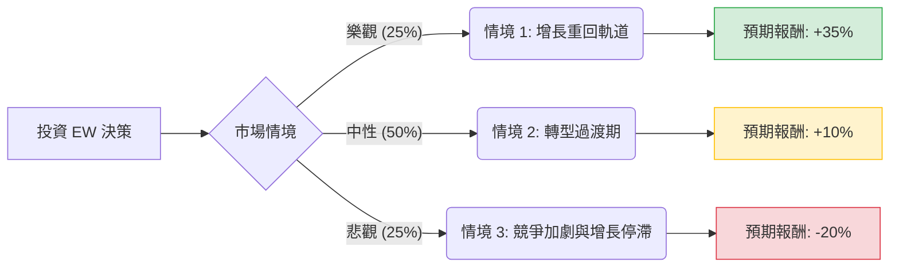

針對美股公司 **Edwards Lifesciences (EW)**，我已結合您提供的基本面數據與最新的市場動態（包含 2024 年 Q2 財報後的市場反應、業務拆分與收購計畫）進行深度分析。

以下是基於**決策樹分析**與**期望值分析**的投資評估報告。

---

### 一、 核心背景與市場動態（最新資訊補充）

在進行計算前，必須納入以下關鍵市場變數：
1.  **財報衝擊**：EW 在 2024 年 7 月底發布的 Q2 財報中，下調了核心產品 **TAVR（經導管主動脈瓣膜置換術）** 的增長預期，導致股價單日大跌約 30%。
2.  **業務轉型**：公司決定將「重症監護（Critical Care）」業務以 42 億美元出售給 BD (Becton Dickinson)，並轉而收購 JenaValve 和 Endotronix，顯示其正全力押注於**結構性心臟病**的高增長領域。
3.  **競爭壓力**：面臨來自 Medtronic 與 Abbott 的激烈競爭，且醫院端因人力短缺影響了手術量的增長。

---

### 二、 決策樹分析 (Decision Tree Analysis)

我們以未來 **12 個月** 為預測週期，設定三種可能的情境：

#### 節點詳細說明：

| 節點名稱 | 發生機率 (P) | 預期報酬 (R) | 說明 |
| :--- | :--- | :--- | :--- |
| **情境 1：樂觀** | 25% | **+35%** | TMTT 業務（二尖瓣/三尖瓣）超預期增長，收購案整合順利，TAVR 需求回升至雙位數。 |
| **情境 2：中性** | 50% | **+10%** | 業務拆分後現金流充沛，但 TAVR 僅維持個位數增長，股價隨大盤緩步回升至分析師目標價。 |
| **情境 3：悲觀** | 25% | **-20%** | 競爭對手市佔擴大，手術量持續受限，新產品研發或審核進度不如預期。 |

---

### 三、 期望值分析 (Expected Value Analysis)

#### 1. 計算過程
期望值 (EV) = $\sum (機率 \times 預期報酬)$

*   **EV** = $(0.25 \times 35\%) + (0.50 \times 10\%) + (0.25 \times -20\%)$
*   **EV** = $8.75\% + 5.0\% - 5.0\%$
*   **EV** = **8.75%**

#### 2. 核心假設
*   **估值修復**：目前 Forward P/E 為 22.87，遠低於歷史平均（約 30-40 倍），顯示市場已部分消化利空。
*   **目標價參考**：數據顯示 Target Price 為 96.93，較目前 75.87 有約 27% 的潛在漲幅。但在中性情境下，我們保守估計僅回升至 83-85 左右。
*   **財務體質**：Debt/Eq 僅 0.06，且 Gross Margin 高達 79.7%，顯示公司有極強的抗風險能力與定價權。

---

### 四、 綜合評估與最終結論

#### **最終判斷：適合投資 (適量佈局 / 逢低買進)**

#### **理由如下：**

1.  **期望值為正 (8.75%)**：雖然短期面臨 TAVR 增長放緩的陣痛，但計算出的期望報酬率仍為正值，且下行風險在 7 月的大跌中已得到顯著釋放。
2.  **財務結構極其穩健**：
    *   **低負債 (0.06)** 與 **高毛利 (79.7%)** 確保了公司在轉型期間有足夠的容錯空間。
    *   **Current Ratio (4.0)** 顯示流動性極佳，足以支撐其收購戰略。
3.  **戰略轉型明確**：出售重症監護業務並收購 JenaValve，顯示管理層果斷放棄低增長部門，專注於高門檻的結構性心臟醫療器械。這通常是長期股價回升的催化劑。
4.  **估值吸引力**：Forward P/E 降至 22.87 倍，對於一家在細分領域擁有壟斷地位的醫療科技公司而言，目前的價格處於相對合理的區間（52W Range 偏低位）。

#### **風險提示：**
*   **短期波動**：SMA20/50/200 均為負值，顯示技術面仍處於空頭排列，短期內股價可能在底部震盪。
*   **EPS 增長壓力**：EPS Q/Q 下跌 75.99% 是一個警訊，需關注下一季財報是否能止跌回穩。

**建議策略**：建議採取「分批進場」策略，利用目前股價處於 52 週低位附近的機會建立基本倉位，並觀察 TMTT 業務的後續營收貢獻。