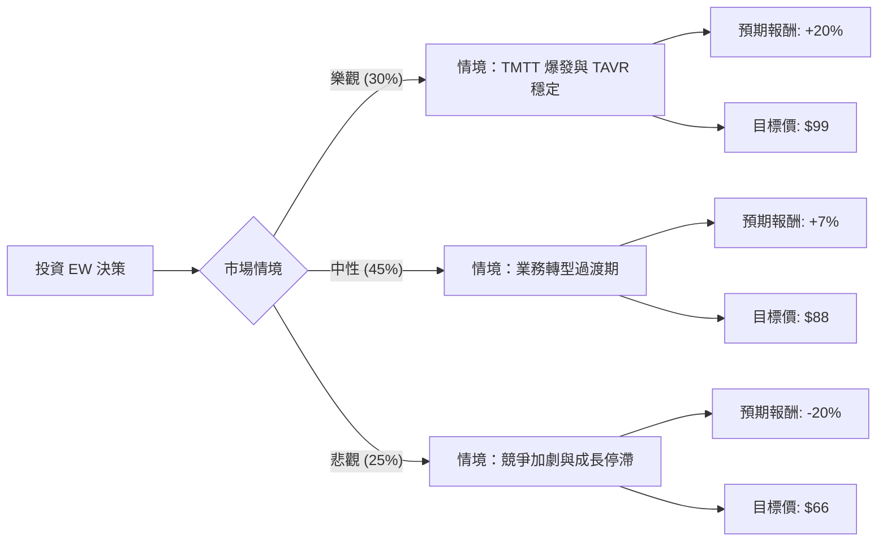

這份分析報告將結合您提供的基本面數據，以及最新的市場動態（特別是 2024 年 Q2 財報後的結構性變化），利用**決策樹（Decision Tree）**與**期望值分析（Expected Value Analysis）**來評估 Edwards Lifesciences (EW) 的投資價值。

---

### 一、 核心背景與市場動態（網路搜尋補充）

在進行計算前，必須納入以下關鍵的最新資訊：
1.  **TAVR 成長放緩**：EW 的核心產品 TAVR（經導管主動脈瓣置換術）在最近一季顯示出成長壓力，公司下修了全年銷售指引。
2.  **業務剝離與轉型**：EW 正在將其「關鍵照護（Critical Care）」部門出售給 Becton Dickinson (BD)，並收購了 JenaValve 和 Endotronix，顯示公司正全力轉向「結構性心臟病」的高成長領域。
3.  **TMTT 的潛力**：經導管二尖瓣和三尖瓣療法（TMTT）表現強勁，是未來的成長引擎。
4.  **估值修正**：股價在 7 月底財報後出現大幅跳空缺口，目前處於相對低位，Forward P/E 已降至約 24.86 倍。

---

### 二、 決策樹分析 (Decision Tree)

我們預測未來一年的三種主要情境：

#### 節點詳細說明：

1.  **樂觀情境 (Bull Case) - 30% 機率**：
    *   **條件**：TMTT 營收成長超過 50%，TAVR 在美國市場因手術流程優化恢復高個位數成長，新收購公司整合順利。
    *   **預期報酬**：+20%（回升至分析師平均目標價 $97-$100 區間）。

2.  **中性情境 (Base Case) - 45% 機率**：
    *   **條件**：TAVR 維持 5-7% 的低速成長，Critical Care 出售後的現金流尚未轉化為高 EPS 貢獻，股價隨大盤波動。
    *   **預期報酬**：+7%（反映 Forward P/E 的合理修復）。

3.  **悲觀情境 (Bear Case) - 25% 機率**：
    *   **條件**：競爭對手（如 Medtronic, Abbott）奪取市佔，醫療人力短缺持續限制手術量，EPS 成長率低於預期。
    *   **預期報酬**：-20%（回測 52 週低點 $65.94 附近）。

---

### 三、 期望值分析 (Expected Value Analysis)

#### 1. 核心假設
*   **當前股價**：$82.46 (參考提供數據)
*   **無風險利率**：4.0% (美債 10 年期參考)
*   **持有期限**：12 個月
*   **EPS 成長**：參考數據中 EPS next Y 為 11.8%，但需扣除業務剝離的短期陣痛。

#### 2. 計算過程
期望值 (EV) = Σ (各情境機率 × 各情境報酬率)

*   **樂觀情境貢獻**：$0.30 \times 20\% = 6.0\%$
*   **中性情境貢獻**：$0.45 \times 7\% = 3.15\%$
*   **悲觀情境貢獻**：$0.25 \times (-20\%) = -5.0\%$

**總期望報酬率 (Total EV)** = $6.0\% + 3.15\% - 5.0\% = \mathbf{4.15\%}$

#### 3. 考慮目標價的期望價值
*   **期望股價** = $(0.30 \times 99) + (0.45 \times 88) + (0.25 \times 66)$
*   **期望股價** = $29.7 + 39.6 + 16.5 = \mathbf{\$85.8}$
*   相對於現價 $82.46 的潛在漲幅約為 **4.05%**。

---

### 四、 綜合評估與最終結論

#### 數據亮點與隱憂：
*   **優勢**：Gross Margin 高達 **77.91%**，顯示產品具備極強競爭護城河；Debt/Eq 僅 **0.07**，財務極其穩健。
*   **劣勢**：EPS Q/Q 下跌 **-83.09%**（受一次性項目或業務調整影響），PEG **1.86** 顯示相對於目前的成長速度，股價並不便宜。

#### 最終判斷：**目前不適合投資 (觀望 / Underperform)**

#### 理由：
1.  **期望值過低**：計算出的期望報酬率僅為 **4.15%**，甚至低於或僅等同於目前的無風險利率（美債收益率）以及標普 500 指數的平均預期回報。從風險收益比（Risk-Reward Ratio）來看，為了追求 4% 的回報而承擔 20% 的下行風險並不划算。
2.  **成長動能轉換期**：EW 正處於從 TAVR 單一引擎轉向 TMTT 多引擎的陣痛期。在 TAVR 成長確認止跌回升前，市場信心難以完全恢復。
3.  **技術面壓力**：SMA20 與 SMA50 均顯示短期趨勢偏弱，且 EPS Q/Q 的大幅下滑會令機構投資者在短期內持謹慎態度。

**建議**：建議等待股價回落至 **$70 - $75** 區間（增加安全邊際），或觀察連續兩季 TMTT 營收是否有超預期表現後，再行介入。