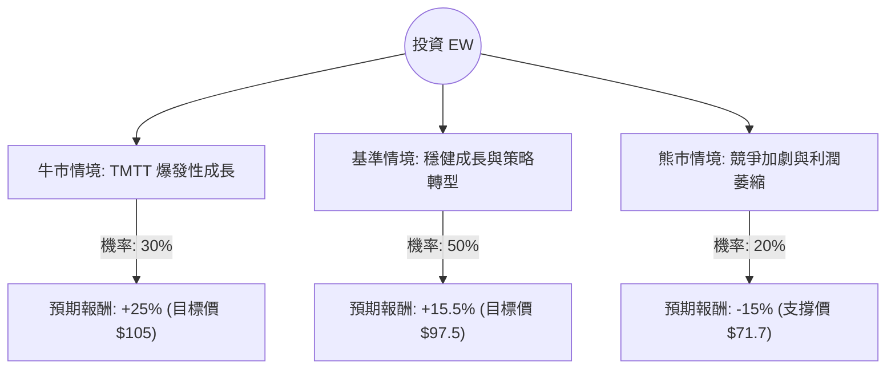

這份分析報告將結合您提供的基本面數據，以及最新的市場動態（特別是 Edwards Lifesciences 近期將 Critical Care 事業部出售給 BD 的重大策略轉向），透過**決策樹（Decision Tree）**與**期望值（Expected Value）**進行投資評估。

---

### 1. 最新市場動態與核心假設

在進行計算前，我們必須納入最新的外部資訊：
*   **策略轉型：** EW 於 2024 年 6 月宣布以 42 億美元現金將其「重症監護（Critical Care）」業務出售給 Becton Dickinson (BD)。這意味著公司將全力專注於「結構性心臟病」的高成長領域（TAVR 與 TMTT）。
*   **產品進展：** EVOQUE 三尖瓣置換系統獲得 FDA 批准，成為市場首創，這將是未來 1-2 年的重要成長引擎。
*   **競爭壓力：** 儘管 EW 是 TAVR 領導者，但面臨 Medtronic 與 Boston Scientific 的激烈競爭，市場滲透率已進入成熟期，成長速度有所放緩。
*   **財務狀況：** 負債比極低 (0.07)，現金流充沛，出售業務後的資金可能用於併購或股票回購。

---

### 2. 決策樹分析 (Decision Tree)

以下決策樹模擬未來 12 個月內 EW 可能面臨的三種情境：

#### 節點詳細說明：

1.  **牛市情境 (Bull Case) - 30% 機率：**
    *   **描述：** EVOQUE 銷售遠超預期，TAVR 在低風險患者群體滲透率提升。出售業務後的資金成功收購高成長標的。
    *   **預期報酬：** 參考分析師最高目標價，預計股價可達 $105。
    *   **計算：** $(105 - 84.35) / 84.35 \approx +25\%$

2.  **基準情境 (Base Case) - 50% 機率：**
    *   **描述：** 公司達到分析師平均預期。TAVR 保持個位數至低雙位數成長，TMTT 穩步貢獻營收。
    *   **預期報酬：** 參考數據中的 Target Price $97.48。
    *   **計算：** $(97.48 - 84.35) / 84.35 \approx +15.5\%$

3.  **熊市情境 (Bear Case) - 20% 機率：**
    *   **描述：** 競爭對手奪取市場份額，手術量受宏觀經濟或醫療人力短缺影響。本益比 (P/E) 回調至歷史低位。
    *   **預期報酬：** 股價回測 52 週低點附近或 SMA200 以下。
    *   **計算：** 預估跌至 $71.7，$(71.7 - 84.35) / 84.35 \approx -15\%$

---

### 3. 期望值分析 (Expected Value Analysis)

#### 核心計算過程：
期望值 (EV) = $\sum (\text{機率} \times \text{預期報酬率})$

*   **牛市貢獻：** $0.30 \times 25\% = 7.5\%$
*   **基準貢獻：** $0.50 \times 15.5\% = 7.75\%$
*   **熊市貢獻：** $0.20 \times (-15\%) = -3.0\%$

**總期望報酬率 (Total EV) = $7.5\% + 7.75\% - 3.0\% = 12.25\%$**

#### 財務數據支持點：
*   **Forward P/E (29.07)：** 低於目前的 P/E (35.89)，顯示市場預期未來盈利將增長。
*   **Gross Margin (77.9%)：** 極高的毛利率顯示其產品具有強大的護城河與定價權。
*   **PEG (2.91)：** 略高，顯示目前股價相對於純盈餘成長來說並不便宜，這解釋了為何期望值並非極高。

---

### 4. 最終結論

**評估結果：適合投資 (Moderate Buy)**

#### 判斷理由：
1.  **正向期望值：** 12.25% 的預期報酬率優於美股長期平均回報（約 8-10%），且在醫療設備龍頭股中屬於穩健表現。
2.  **策略聚焦：** 出售重症監護業務雖然短期減少營收，但長期能提升利潤率並專注於高門檻的結構性心臟手術市場，這通常會帶來本益比（P/E Ratio）的重估（Re-rating）。
3.  **財務穩健：** 負債比極低 (0.07) 且流動比率高 (4.0)，在當前高利率環境下具有極強的抗風險能力。
4.  **技術面支撐：** 目前股價 ($84.35) 距離 52 週高點僅跌約 4%，且位於 SMA200 ($78.7) 之上，顯示中期趨勢偏多。

**建議操作：**
由於 PEG 較高且近期股價表現平平（Perf Month -1.18%），建議**分批進場**。若股價回測 $80-$82 區間（靠近 SMA50/200 支撐），投資價值將更為顯著。

---
*免責聲明：本分析僅供參考，不構成具體投資建議。投資股票具有風險，請根據個人風險承受能力做出決策。*