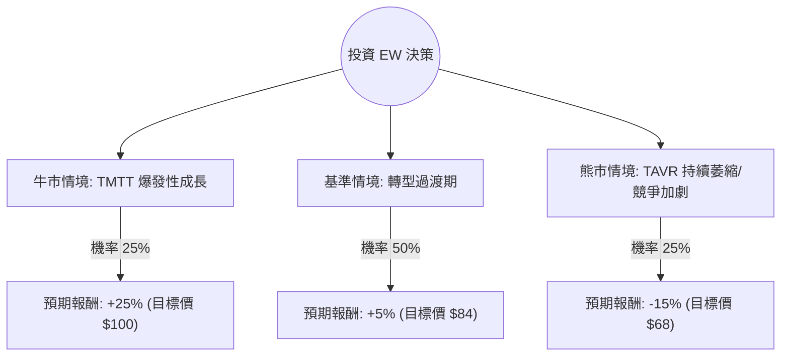

這份分析報告將結合您提供的基本面數據，以及針對 **Edwards Lifesciences (EW)** 的最新市場動態（特別是 2024 年第二季財報後的劇烈波動與策略轉型）進行綜合評估。

---

### 一、 核心背景與市場動態（網路搜尋補充）

在進行決策樹分析前，必須納入以下關鍵即時資訊：
1.  **財報衝擊**：EW 在 2024 年 7 月底發布財報後，股價曾單日大跌約 30%。主因是核心產品 **TAVR（經導管主動脈瓣膜置換術）** 的成長指引從 8-10% 下調至 5-7%。
2.  **業務剝離與收購**：公司已將「重症監護（Critical Care）」業務以 42 億美元賣給 BD (Becton Dickinson)，並轉向收購 JenaValve 和 Endotronix，顯示其正全力押注於 **TMTT（經導管二尖瓣與三尖瓣療法）**。
3.  **估值修復**：目前 Forward P/E 約 24x，相較於過去五年均值（約 35-40x）處於歷史低位，反映了市場對其成長放緩的擔憂。

---

### 二、 決策樹分析（Decision Tree）

我們以 **「未來 12 個月的投資回報」** 為核心節點，設定三種可能的情境：

#### 節點詳細說明：

1.  **牛市情境 (Bull Case) - 25% 機率**：
    *   **條件**：TMTT 業務（如 Evoque 瓣膜）成長超預期，成功彌補 TAVR 的放緩；新收購公司整合順利。
    *   **預期報酬**：股價回升至分析師平均目標價 $97-$100 區間。
2.  **基準情境 (Base Case) - 50% 機率**：
    *   **條件**：TAVR 維持 5-7% 的低速成長；市場對其剝離重症業務後的利潤結構持觀望態度。
    *   **預期報酬**：股價在 $75-$85 區間震盪，小幅跑贏或持平大盤。
3.  **熊市情境 (Bear Case) - 25% 機率**：
    *   **條件**：競爭對手（如 Medtronic, Abbott）奪取更多市場份額；醫院人力短缺持續限制手術量。
    *   **預期報酬**：股價回測 52 週低點（約 $68）。

---

### 三、 期望值分析（Expected Value Analysis）

#### 1. 核心假設
*   **當前股價 ($P_0$)**：$79.71
*   **牛市目標價 ($P_{high}$)**：$100 (回歸歷史估值中位數)
*   **基準目標價 ($P_{mid}$)**：$84 (反映當前 Forward P/E 24x)
*   **熊市目標價 ($P_{low}$)**：$68 (52 週低點支撐)

#### 2. 計算過程
*   **牛市報酬率 ($R_{bull}$)**：$(100 - 79.71) / 79.71 = +25.46\%$
*   **基準報酬率 ($R_{base}$)**：$(84 - 79.71) / 79.71 = +5.38\%$
*   **熊市報酬率 ($R_{bear}$)**：$(68 - 79.71) / 79.71 = -14.69\%$

**期望值 (EV) 計算公式：**
$$EV = (P_{bull} \times R_{bull}) + (P_{base} \times R_{base}) + (P_{bear} \times R_{bear})$$
$$EV = (0.25 \times 25.46\%) + (0.50 \times 5.38\%) + (0.25 \times -14.69\%)$$
$$EV = 6.365\% + 2.69\% - 3.67\% = \mathbf{5.385\%}$$

---

### 四、 綜合基本面評估

*   **財務健康度（優勢）**：
    *   **Debt/Eq 0.07**：極低的負債率，財務結構非常穩健。
    *   **Current Ratio 3.72**：流動性極佳，有充足現金進行併購轉型。
    *   **Gross Margin 77.9%**：極高的毛利率，顯示產品具備強大的技術護城河。
*   **成長性（隱憂）**：
    *   **EPS Q/Q -83%**：這是一個警訊，反映了近期業務調整與市場環境惡化。
    *   **PEG 1.78**：相對於其放緩的成長率，目前的估值不算極度便宜。

---

### 五、 最終結論

**判斷：適合投資（但僅限於「中長期價值投資者」，且需分批建倉）**

#### 理由：
1.  **期望值為正 (5.39%)**：雖然短期內面臨 TAVR 成長失速的陣痛，但期望值分析顯示，目前的股價已部分反映了利空，下行風險相對受控。
2.  **結構性轉型**：EW 正在經歷從單一產品（TAVR）向多產品（TMTT + 心衰竭監測）的轉型。雖然短期 EPS 受壓，但剝離低毛利業務並收購高成長潛力資產，長期有利於 ROE 提升。
3.  **技術領先地位**：77.9% 的毛利率證明其在結構性心臟病領域的壟斷力並未消失，只是市場滲透進入高原期。
4.  **估值吸引力**：Forward P/E 24x 是多年來的低位，對於一家擁有高護城河的醫療器材龍頭而言，具備安全邊際。

**建議操作：**
*   **進場點**：目前 $79 附近可建立基本倉位。
*   **加碼點**：若股價回測 $70-$72 區間且 TMTT 數據向好，可大幅加碼。
*   **風險監控**：需密切關注下一季 TAVR 的銷售數據是否止跌回穩，以及 TMTT 業務的營收佔比是否提升。