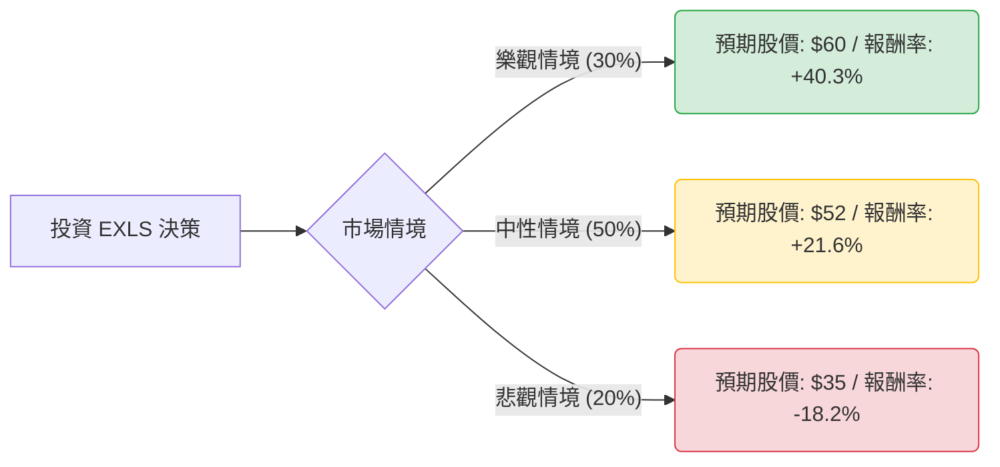

這份分析報告將結合您提供的基本面數據與最新的市場動態（包含 2024 年第一季財報表現與 AI 產業趨勢），利用**決策樹（Decision Tree）**與**期望值分析（Expected Value Analysis）**評估 ExlService Holdings, Inc. (EXLS) 的投資價值。

---

### 一、 核心背景與市場動態分析

在進入模型前，我們先整合最新資訊：
1.  **最新財報表現 (Q1 2024)**：EXLS 營收達 4.4 億美元（年增 9%），調整後 EPS 為 0.38 美元，優於市場預期。公司上調了全年營收指引。
2.  **AI 轉型紅利**：EXLS 正從傳統的業務流程外包 (BPO) 轉型為「數據驅動與 AI 導向」的解決方案商。其數據分析部門（Analytics）貢獻了約 45% 的營收，是主要增長引擎。
3.  **財務穩健度**：ROE 高達 25.96%，顯示極佳的資本效率；Forward P/E 為 19.5，相較於其歷史平均與行業增長率，估值尚屬合理。
4.  **市場共識**：分析師平均目標價約為 **$52.14**，較目前股價 ($42.77) 有約 **22%** 的上漲空間。

---

### 二、 決策樹分析 (Decision Tree)

我們將未來一年的投資情境分為三種：**樂觀（AI 爆發）**、**中性（穩健增長）**與**悲觀（宏觀衰退/競爭加劇）**。

#### 節點詳細說明：

1.  **樂觀情境 (Bull Case) - 30% 機率**：
    *   **描述**：生成式 AI 專案落地速度超預期，數據分析業務營收增速突破 15%，利潤率因自動化提升。
    *   **預期報酬**：股價挑戰 $60（對應 P/E 約 28x）。
2.  **中性情境 (Base Case) - 50% 機率**：
    *   **描述**：符合公司指引，營收穩定增長 9-11%。AI 轉型穩步進行，維持現有市場份額。
    *   **預期報酬**：股價達到分析師目標價 $52（對應 Forward P/E 約 24x）。
3.  **悲觀情境 (Bear Case) - 20% 機率**：
    *   **描述**：全球經濟衰退導致企業縮減數位轉型支出；AI 競爭導致價格戰，毛利受壓。
    *   **預期報酬**：股價回測 52 週低點附近 $35（對應 P/E 約 16x）。

---

### 三、 期望值計算 (Expected Value Calculation)

#### 1. 核心假設
*   **當前股價 ($P_0$)**：$42.77
*   **持有期限**：12 個月
*   **股利**：0 (根據數據 Dividend % 為 "-")

#### 2. 各情境報酬率計算 ($R$)
*   $R_{Bull} = (60 - 42.77) / 42.77 = +40.28\%$
*   $R_{Base} = (52 - 42.77) / 42.77 = +21.58\%$
*   $R_{Bear} = (35 - 42.77) / 42.77 = -18.17\%$

#### 3. 期望報酬率 (Expected Return) 計算
$$E(R) = (P_{Bull} \times R_{Bull}) + (P_{Base} \times R_{Base}) + (P_{Bear} \times R_{Bear})$$
$$E(R) = (0.30 \times 40.28\%) + (0.50 \times 21.58\%) + (0.20 \times -18.17\%)$$
$$E(R) = 12.08\% + 10.79\% - 3.63\%$$
$$E(R) = \mathbf{19.24\%}$$

#### 4. 期望價值 (Expected Value)
$$EV = \$42.77 \times (1 + 19.24\%) = \mathbf{\$51.00}$$

---

### 四、 最終結論

**判斷：適合投資 (Buy / Overweight)**

#### 理由：
1.  **正向期望值**：計算出的預期報酬率為 **19.24%**，遠高於無風險利率（美債約 4.5%）及標普 500 指數的歷史平均回報。
2.  **基本面強韌**：
    *   **高 ROE (25.96%)** 顯示公司在同業中具有極強的競爭優勢與獲利能力。
    *   **低負債比 (Debt/Eq 0.46)** 讓公司在升息環境下仍具備財務彈性。
    *   **估值合理**：Forward P/E 19.5 倍對於一個處於 AI 與大數據賽道且持續成長的公司來說並不昂貴（PEG 1.32 顯示增長與估值匹配）。
3.  **技術面支撐**：目前股價處於 SMA50 ($41.08) 之上，且距離 52 週高點仍有約 18% 的修復空間，下行風險相對受控。
4.  **產業趨勢**：EXLS 成功從勞動力密集型轉向技術密集型，這使其在生成式 AI 浪潮中不僅不會被淘汰，反而成為協助其他企業導入 AI 的關鍵服務商。

**風險提示**：需留意短期內美股宏觀情緒波動，以及大客戶是否因經濟放緩而延遲數據專案的簽署。建議分批佈局，停損點可設在 52 週低點支撐位約 $37 附近。