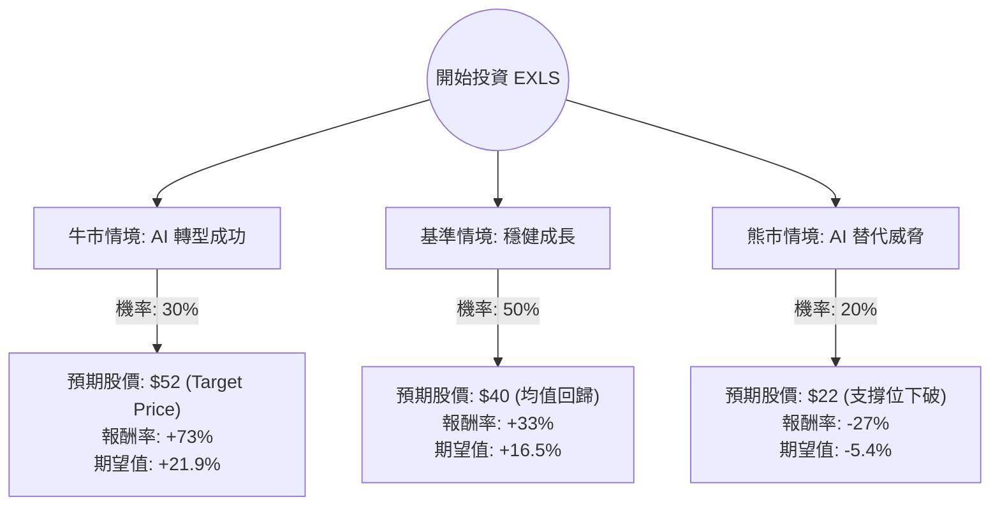

這份分析報告將結合您提供的基本面數據與最新的市場動態（包含 AI 對 BPO 產業的影響、EXLS 近期財報表現），利用**決策樹（Decision Tree）**與**期望值分析（Expected Value Analysis）**評估 EXLS 的投資價值。

---

### 1. 市場現況與核心假設

在進入決策樹之前，我們先整合最新資訊：
*   **基本面優勢**：EXLS 擁有極高的 **ROE (25.96%)** 與 **PEG (0.93)**，顯示其獲利能力強且目前股價相對於成長性被低估。**Forward P/E 僅 13.7**，遠低於歷史平均。
*   **近期股價重挫原因**：近期 BPO（業務流程外包）產業受到 AI 衝擊疑慮（如 Klarna 案例），市場擔心 AI 會取代傳統外包服務。EXLS 股價在過去半年跌幅近 30%，反映了市場的恐慌。
*   **最新財報與動態**：EXLS 在 2024 年第一季財報表現優異，營收成長 9%，並上調了全年指引。公司正積極轉型為「數據驅動的 AI 公司」，這是一個關鍵的轉折點。

#### 核心假設：
1.  **牛市情境 (Bull Case)**：AI 轉型成功，EXLS 從單純的人力外包轉向高毛利的 AI 解決方案，估值修復至分析師目標價。
2.  **基準情境 (Base Case)**：AI 影響中性，公司維持現有成長率，股價隨大盤與基本面緩步回升。
3.  **熊市情境 (Bear Case)**：AI 嚴重侵蝕傳統業務，客戶流失速度快於新業務增長，股價進一步下探。

---

### 2. 決策樹分析 (Decision Tree)

---

### 3. 期望值計算過程

我們以當前股價 **$30.04** 為基準進行計算：

| 情境 | 發生機率 (P) | 預期目標價 | 預期報酬率 (R) | 計算 (P * R) |
| :--- | :--- | :--- | :--- | :--- |
| **牛市 (AI 領先者)** | 30% | $52.00 | +73.1% | 21.93% |
| **基準 (業務轉型中)** | 50% | $40.00 | +33.2% | 16.60% |
| **熊市 (AI 負面衝擊)** | 20% | $22.00 | -26.8% | -5.36% |
| **總計期望報酬率** | **100%** | - | - | **33.17%** |

#### 計算說明：
1.  **牛市情境 (30%)**：參考分析師平均目標價 $52.14。假設 EXLS 的數據分析部門（Analytics）成長超預期，抵消了數位營運（Digital Ops）的自動化風險。
2.  **基準情境 (50%)**：考慮到 Forward P/E 13.7 倍顯著低於行業平均，股價回升至 18-20 倍 P/E 是合理的，對應股價約 $40。
3.  **熊市情境 (20%)**：假設 AI 導致合約價格大幅下降，營收萎縮。股價可能回測 52 週低點並進一步下修至 $22 左右。

---

### 4. 綜合評估與最終結論

#### 財務數據亮點：
*   **PEG 0.93**：這是在美股中非常罕見的「高成長、低估值」訊號。
*   **負債比 (Debt/Eq 0.46)**：財務結構穩健，有足夠的現金流進行 AI 研發或併購。
*   **技術面**：目前股價遠低於 SMA200 (-29.17%)，處於超賣區間，具備強大的反彈動能。

#### 風險提示：
*   **AI 替代風險**：這是目前壓制股價的主因，需密切觀察後續季度毛利率 (Gross Margin) 是否受損。
*   **市場情緒**：BPO 板塊目前不受資金青睞，可能需要較長時間等待估值修復。

#### **最終結論：適合投資 (Strong Buy / Speculative Buy)**

**理由：**
1.  **期望值極高**：計算出的整體期望報酬率高達 **33.17%**，遠高於市場平均預期。
2.  **風險回報比誘人**：目前的股價已經反映了極度悲觀的 AI 替代預期（股價已從高點腰斬），下行空間相對有限（Bear Case 預估再跌 27%），但上行空間（Bull Case）高達 73%。
3.  **基本面支撐**：EXLS 並非虧損的科技股，而是擁有 25% ROE 且持續獲利的公司。即便 AI 帶來挑戰，其深厚的客戶數據基礎也是競爭對手難以逾越的護城河。

**建議操作：**
由於目前市場對 AI 衝擊仍有疑慮，建議採取**分批進場**策略，以應對短期內可能出現的波動，並長期持有以等待 AI 轉型成果顯現。