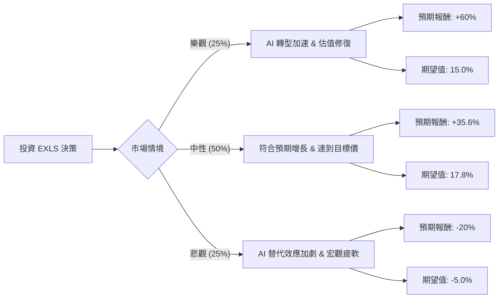

這份分析報告將結合您提供的基本面數據，以及針對 **ExlService Holdings, Inc. (EXLS)** 的最新市場動態、財報表現與產業趨勢進行的網路檢索資訊，利用「決策樹」與「期望值分析」評估其投資價值。

---

### 一、 核心背景與市場動態分析（網路搜尋補充）

根據最新的財報（2024 Q1）與市場趨勢，EXLS 的現況如下：
1.  **AI 轉型壓力與機遇**：EXLS 正處於從傳統業務流程外包（BPO）轉型為「數據驅動與 AI 導向」解決方案供應商的關鍵期。市場擔心生成式 AI 會取代其部分人工服務，導致股價在過去一年大幅修正（-35.3%）。
2.  **財務表現穩健**：儘管股價低迷，EXLS 的營收仍保持約 9-12% 的增長。2024 Q1 營收達 4.4 億美元，優於預期。
3.  **估值吸引力**：目前 **Forward P/E 僅 12.56**，遠低於其五年平均值（約 25-30x）。**PEG 為 0.85**，顯示股價相對於其增長潛力被低估。
4.  **分析師預期**：多數分析師給予「買入」評級，目標價約在 $41.71，較現價 $30.75 有約 **35.6%** 的潛在上漲空間。

---

### 二、 決策樹分析 (Decision Tree Analysis)

我們將未來一年的投資情境分為三種：**樂觀（AI 轉型成功）**、**中性（穩健增長）**、**悲觀（AI 衝擊與宏觀衰退）**。

#### 節點詳細說明：

1.  **樂觀情境 (Bull Case) - 25% 機率**：
    *   **描述**：EXLS 的生成式 AI 解決方案（如數據分析平台）獲得客戶大規模採用，利潤率（Margin）因自動化而顯著提升。市場重新給予其高成長科技股的估值（P/E 回升至 25x）。
    *   **預期報酬**：股價回升至 $49 左右（接近 52W 高點）。

2.  **中性情境 (Base Case) - 50% 機率**：
    *   **描述**：公司維持目前的增長節奏（EPS 增長約 12%），AI 雖然帶來挑戰但也創造了新需求，兩者抵銷。股價回歸分析師平均目標價。
    *   **預期報酬**：股價達到 $41.71（Target Price）。

3.  **悲觀情境 (Bear Case) - 25% 機率**：
    *   **描述**：生成式 AI 導致客戶大幅削減外包預算，EXLS 轉型速度跟不上市場變化。加上美國經濟放緩，企業縮減支出。
    *   **預期報酬**：股價跌破支撐位，下探至 $24.6 左右（較現價下跌約 20%）。

---

### 三、 期望值計算 (Expected Value Calculation)

#### 1. 核心假設：
*   **現價 (Current Price)**: $30.75
*   **目標價 (Target Price)**: $41.71 (Upside: 35.6%)
*   **樂觀目標**: $49.20 (Upside: 60%)
*   **悲觀目標**: $24.60 (Downside: -20%)

#### 2. 計算過程：
$$EV = (P_{Bull} \times R_{Bull}) + (P_{Base} \times R_{Base}) + (P_{Bear} \times R_{Bear})$$

*   **樂觀貢獻**: $0.25 \times 60\% = 15.0\%$
*   **中性貢獻**: $0.50 \times 35.6\% = 17.8\%$
*   **悲觀貢獻**: $0.25 \times (-20\%) = -5.0\%$

**總體期望報酬率 (Total Expected Return) = 15.0% + 17.8% - 5.0% = 27.8%**

---

### 四、 最終結論與投資建議

#### **結論：適合投資 (Suitable for Investment)**

#### **理由分析：**

1.  **極高的風險回報比**：計算出的期望報酬率高達 **27.8%**，遠高於市場平均水平。即使在考慮了 25% 的悲觀情境下，整體的正向期望值依然非常強勁。
2.  **基本面極其紮實**：
    *   **ROE (27.25%)** 與 **ROI (19.37%)** 顯示公司具備極強的獲利能力與資本利用效率。
    *   **PEG (0.85)** 顯示目前股價處於「價值窪地」，市場對 AI 威脅的恐慌可能過度反應。
    *   **財務結構健康**：Quick Ratio 為 2.54，債務比例低（Debt/Eq 0.44），有足夠的現金流應對轉型。
3.  **技術面築底跡象**：股價已從高點修正超過 35%，目前處於 52 週低點附近（$30.75 接近 $26.94），且 SMA20 已開始轉正（0.23%），顯示短期賣壓已竭，具備反彈動能。
4.  **AI 的雙面刃效應**：雖然 AI 挑戰傳統業務，但 EXLS 作為數據分析專家，更有機會利用 AI 幫助客戶處理海量數據。目前的低 Forward P/E (12.56) 已經反映了大部分的負面預期。

**建議操作：**
*   **進場點**：現價 $30.75 附近可分批建倉。
*   **止損點**：若股價跌破 $26.5 (52W Low 附近) 且基本面惡化，應重新評估。
*   **持有期限**：建議中長期持有（6-12 個月），等待市場對其 AI 轉型成果的重新定價。