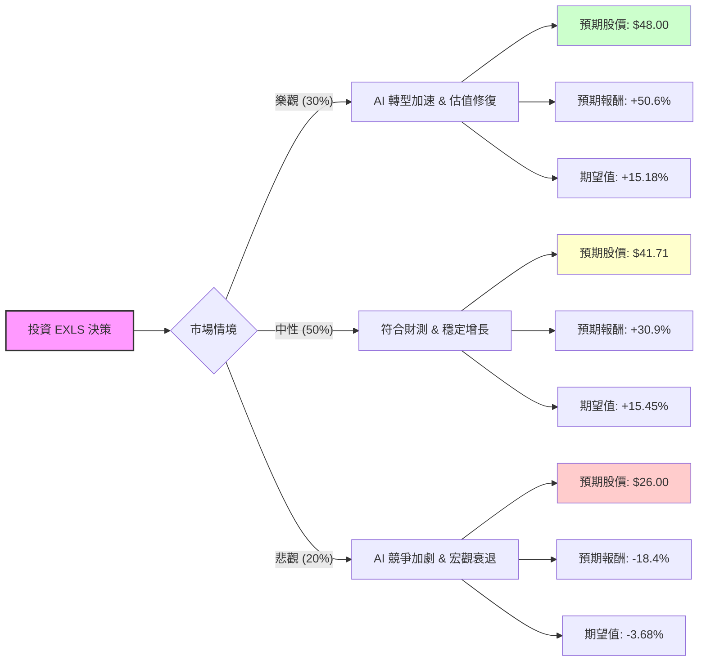

這份分析報告將結合您提供的基本面數據，以及針對 **ExlService Holdings, Inc. (EXLS)** 的最新市場動態（包含 2024 年第二季財報與 AI 產業趨勢）進行綜合評估。

---

### 一、 核心假設與市場背景分析

在建立決策樹之前，我們基於最新資訊設定以下核心假設：

1.  **財務表現強勁**：EXLS 最近一季（2024 Q2）營收達 4.48 億美元（年增 11%），調整後 EPS 為 0.40 美元，優於市場預期，並上修了全年財測。
2.  **AI 轉型紅利**：公司正積極轉型為「AI 第一」的數據分析公司。雖然市場擔心 AI 會取代傳統 BPO（業務流程外包），但 EXLS 的數據分析業務（佔比高）反而受益於企業對數據清洗與 AI 整合的需求。
3.  **估值吸引力**：目前 **PEG 為 0.88**（小於 1 代表低估），**Forward P/E 僅 13.03**，遠低於其歷史平均與行業平均，顯示股價在經歷 YTD -24.9% 的修正後，已具備安全邊際。
4.  **技術面回溫**：股價已站上 SMA20 與 SMA50，顯示短期動能轉強，正從 52 週低點反彈。

---

### 二、 決策樹分析 (Decision Tree Analysis)

我們將未來一年的投資預期分為三種情境：**樂觀（Bull）**、**中性（Base）**、**悲觀（Bear）**。

---

### 三、 期望值計算過程 (Expected Value Calculation)

#### 1. 參數設定
*   **當前股價 (Current Price)**: $31.86
*   **情境 1：樂觀 (Bull Case) - 機率 30%**
    *   **假設**：GenAI 專案貢獻超出預期，營收成長率回升至 15% 以上，市場給予 Forward P/E 20x 的評價（回歸歷史均值）。
    *   **目標價**：$48.00 (接近 52W High)
    *   **報酬率**：($48.00 - $31.86) / $31.86 = **+50.6%**
*   **情境 2：中性 (Base Case) - 機率 50%**
    *   **假設**：公司達到上修後的財測目標，分析師目標價 $41.71 達成。
    *   **目標價**：$41.71 (分析師平均目標價)
    *   **報酬率**：($41.71 - $31.86) / $31.86 = **+30.9%**
*   **情境 3：悲觀 (Bear Case) - 機率 20%**
    *   **假設**：AI 導致傳統客戶流失速度加快，或美國經濟硬著陸導致企業縮減 IT 支出。
    *   **目標價**：$26.00 (略低於 52W Low)
    *   **報酬率**：($26.00 - $31.86) / $31.86 = **-18.4%**

#### 2. 總期望報酬率計算
$$EV = (P_{Bull} \times R_{Bull}) + (P_{Base} \times R_{Base}) + (P_{Bear} \times R_{Bear})$$
$$EV = (0.30 \times 50.6\%) + (0.50 \times 30.9\%) + (0.20 \times -18.4\%)$$
$$EV = 15.18\% + 15.45\% - 3.68\% = \mathbf{26.95\%}$$

---

### 四、 最終結論

**判斷：適合投資 (Strong Buy / Accumulate)**

#### 理由：
1.  **極高的期望報酬率**：計算出的年度期望報酬率高達 **26.95%**，遠高於標普 500 的平均預期回報。
2.  **估值極具吸引力**：PEG 0.88 顯示市場目前過度擔憂 AI 對其業務的負面衝擊，而忽略了 EXLS 在數據分析領域的護城河。Forward P/E 13x 對於一個 ROE 高達 27% 且持續成長的公司來說非常廉價。
3.  **基本面穩健**：
    *   **獲利能力**：ROE (27.25%) 與 ROI (19.37%) 表現優異，顯示管理層資本配置效率高。
    *   **財務結構**：Debt/Eq 0.44，負債比率低，財務穩健。
    *   **成長性**：EPS Q/Q 成長 21.84%，顯示獲利動能並未消失。
4.  **風險可控**：下行風險（悲觀情境）預估約 -18.4%，但上行空間（中性+樂觀）的機率合計達 80%，盈虧比（Risk/Reward Ratio）非常理想。

**建議操作：**
目前股價 $31.86 處於相對低位且剛啟動反彈（SMA20/50 黃金交叉預備），建議可於此價位分批布局，首要目標價看 $41.71，若突破則長期持有至 $48 附近。